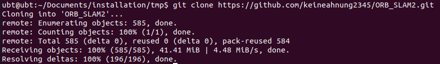
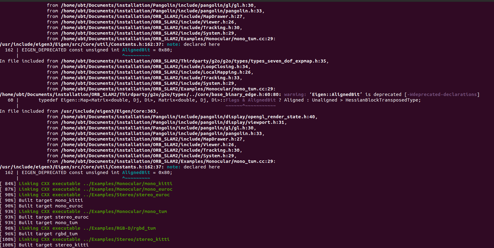

# HW1

作业使用的环境为Ubuntu 20.04。

## 熟悉Linux

1. 如何在 Ubuntu 中安装软件（命令⾏界⾯）？它们通常被安装在什么地⽅？  

   安装包的命令如下：

   ```sh
   sudo apt install <package-name>
   ```

   依照文件的性质，一个包的不同部分通常被安装在以下几个路径：

   ```sh
   /usr/bin     #executable
   /usr/lib     #library
   /usr/include #header files
   /usr/share   #documentation
   ```

   注：可用`dpkg -L <package-name>`来查看包的安装路径。

2. linux 的环境变量是什么？我如何定义新的环境变量？

   摘自[维基百科](https://en.wikipedia.org/wiki/Environment_variable)：

   ```
   An environment variable is a dynamic-named value that can affect the way running processes will behave on a computer. They are part of the environment in which a process runs.
   ```

   环境变量是环境中的一个值，它们可以影响程序运行的方式。

   参考[How do I add environment variables?](https://askubuntu.com/questions/58814/how-do-i-add-environment-variables)，可用如下命令定义新环境变量：

   ```sh
   export VARNAME="my value"
   ```

3. linux 根⽬录下⾯的⽬录结构是什么样的？⾄少说出 3 个⽬录的⽤途

   linux根⽬录下⾯的⽬录结构：

   ```sh
   bin  boot  cdrom  dev  etc  home  lib  lib32  lib64  libx32  lost+found  media  mnt  opt  proc  root  run  sbin  snap  srv  swapfile  sys  tmp  usr  var
   ```

   - `bin`存放可执行文件
   - `lib`存放库文件，如：`*.so`，`*.a`

4. 假设我要给 a.sh 加上可执⾏权限，该输⼊什么命令？

   ```sh
   chmod +x a.sh
   ```

5. 假设我要将 a.sh ⽂件的所有者改成 xiang:xiang，该输⼊什么命令？  

   ```sh
   chown xiang:xiang a.sh
   ```


## SLAM 综述文献阅读

1. SLAM 会在哪些场合中⽤到？⾄少列举三个⽅向。

   摘自Visual simultaneous localization and mapping: a survey：

   ```
   Important applications of SLAM are oriented towards automatic car piloting on unrehearsed off-road terrains (Thrun et al. 2005a); rescue tasks for high-risk or difficult-navigation environments (Thrun 2003; Piniés et al. 2006); planetary, aerial, terrestrial and oceanic exploration (Olson et al. 2007; Artieda et al. 2009; Steder et al. 2008; Johnson et al. 2010); augmented reality applications where virtual objects are included in real-world scenes (Chekhlov et al. 2007; Klein and Murray 2007); visual surveillance systems (Mei et al. 2011); medicine (Auat et al. 2010; Grasa et al. 2011), and so forth.
   ```

   SLAM的应用场景包括：无人车，救援任务，空中/海洋探索，增强现实，监控系统，药学等。

2. SLAM 中定位与建图是什么关系？为什么在定位的同时需要建图？ 

   摘自Visual simultaneous localization and mapping: a survey：

   ```
   Initially, mapping and localization were studied independently, later it was recognized that they are dependent. This means that, for being precisely localized in an environment, a correct map is necessary, but in order to construct a good map it is necessary to be properly localized when elements are added to the map. 
   ```

   定位与建图是相依的。要准确定位，我们就需要有一个准确的地图；要建构一个准确的地图，我们就必须知道自己当前的位置，才能准确地把当前获取的资讯加入地图中。

3. SLAM 发展历史如何？我们可以将它划分成哪⼏个阶段？ 

   根据论文Past, Present, and Future of Simultaneous Localization And Mapping: Towards the Robust-Perception Age，SLAM发展历史可划分为以下三个阶段：

   - classical age (1986-2004)
     - introduction of the main probabilistic formulations for SLAM, including approaches based on Extended Kalman Filters, RaoBlackwellised Particle Filters, and maximum likelihood estimation
     - it delineated the basic challenges connectedto efficiency and robust data association
   - algorithmic-analysis age (2004-2015)
     - fundamental properties of SLAM, including observability,
       convergence, and consistency. 
     - the key role of sparsity towards efficient SLAM solvers was also understood
     - the main open-source SLAM libraries were developed
   -  robust-perception age(2016-)
     - robust performance
     - high-level understanding
     - resource awareness
     - task-driven inference

4. 列举三篇在 SLAM 领域的经典⽂献

   - [Simultaneous Localisation and Mapping (SLAM):Part I The Essential Algorithms](https://people.eecs.berkeley.edu/~pabbeel/cs287-fa09/readings/Durrant-Whyte_Bailey_SLAM-tutorial-I.pdf)
   - [Simultaneous localization and mapping (SLAM): part II](https://ieeexplore.ieee.org/document/1678144)
   - [Visual Place Recognition: A Survey](https://ieeexplore.ieee.org/document/7339473)

## CMake 练习

CMake练习的目录结构如下：

```sh
.                               
├── build
├── CMakeLists.txt             
├── include                
│   └── hello.h           
└── src                 
    ├── hello.cpp     # it's hello.c originally
    └── useHello.cpp  # it's useHello.c originally
```

编译：

```sh
cd build
cmake ..
make
```

此时会出现以下错误：

```
Scanning dependencies of target hello
[ 25%] Building C object CMakeFiles/hello.dir/src/hello.c.o
/home/ubt/Documents/SLAMCourse/cmake_practice/src/hello.c:2:10: fatal error: iostream: No such file or directory
    2 | #include <iostream>
      |          ^~~~~~~~~~
compilation terminated.
make[2]: *** [CMakeFiles/hello.dir/build.make:63: CMakeFiles/hello.dir/src/hello.c.o] Error 1
make[1]: *** [CMakeFiles/Makefile2:105: CMakeFiles/hello.dir/all] Error 2
make: *** [Makefile:84: all] Error 2
```

根据[Fatal error: iostream: No such file or directory in compiling C program using GCC](https://stackoverflow.com/questions/30543286/fatal-error-iostream-no-such-file-or-directory-in-compiling-c-program-using-gc)，`iostream`是C++中的函数，所以需要将文件名称改为`cpp`结尾，并记得修改`CMakeLists.txt`里的内容，最终版本的`CMakeLists.txt`如下：

```cmake
project(cmake_practice)

cmake_minimum_required(VERSION 3.14)

set(CMAKE_CXX_STANDARD 11)

IF(NOT CMAKE_BUILD_TYPE)
  SET(CMAKE_BUILD_TYPE Release)
ENDIF()

include_directories(include)
add_library(hello src/hello.cpp)

add_executable(sayHello src/useHello.cpp)
target_link_libraries(sayHello hello)

install(TARGETS hello DESTINATION lib)
install(TARGETS sayHello DESTINATION bin)
```

编译成功后生成以下文件：

```sh
CMakeCache.txt  CMakeFiles  cmake_install.cmake  install_manifest.txt  libhello.a  Makefile  sayHello
```

安装：

```sh
sudo make install
```

输出如下：

```sh
[ 50%] Built target hello
[100%] Built target sayHello
Install the project...
-- Install configuration: "Release"
-- Installing: /usr/local/lib/libhello.a
-- Installing: /usr/local/bin/sayHello
```

## 理解 ORB-SLAM2 框架

1. 下载完成后，请给出终端截图。

   从我自己的fork下载：

   

2. 阅读 ORB-SLAM2 代码⽬录下的 CMakeLists.txt，回答问题：  

   1. ORB-SLAM2 将编译出什么结果？有⼏个库⽂件和可执⾏⽂件？ 

      共生成三个库文件，分别来自`CMakeLists.txt`，`Thirdparty/g2o/CMakeLists.txt`及`Thirdparty/DBoW2/CMakeLists.txt`：

      `CMakeLists.txt`

      ```cmake
      set(CMAKE_LIBRARY_OUTPUT_DIRECTORY ${PROJECT_SOURCE_DIR}/lib)
      
      add_library(${PROJECT_NAME} SHARED
      src/System.cc
      src/Tracking.cc
      src/LocalMapping.cc
      src/LoopClosing.cc
      src/ORBextractor.cc
      src/ORBmatcher.cc
      src/FrameDrawer.cc
      src/Converter.cc
      src/MapPoint.cc
      src/KeyFrame.cc
      src/Map.cc
      src/MapDrawer.cc
      src/Optimizer.cc
      src/PnPsolver.cc
      src/Frame.cc
      src/KeyFrameDatabase.cc
      src/Sim3Solver.cc
      src/Initializer.cc
      src/Viewer.cc
      )
      ```

      `Thirdparty/g2o/CMakeLists.txt`：

      ```cmake
      IF(WIN32)
        SET(g2o_LIBRARY_OUTPUT_DIRECTORY ${g2o_SOURCE_DIR}/bin CACHE PATH "Target for the libraries")
      ELSE(WIN32)
        SET(g2o_LIBRARY_OUTPUT_DIRECTORY ${g2o_SOURCE_DIR}/lib CACHE PATH "Target for the libraries")
      ENDIF(WIN32)
      #...
      SET(CMAKE_LIBRARY_OUTPUT_DIRECTORY ${g2o_LIBRARY_OUTPUT_DIRECTORY})
      
      ADD_LIBRARY(g2o ${G2O_LIB_TYPE}
      #types
      g2o/types/types_sba.h
      #...
      #core
      g2o/core/base_edge.h
      #...
      #stuff
      g2o/stuff/string_tools.h
      #...
      )
      ```

      `Thirdparty/DBoW2/CMakeLists.txt`：

      ```cmake
      set(LIBRARY_OUTPUT_PATH ${PROJECT_SOURCE_DIR}/lib)
      
      add_library(DBoW2 SHARED ${SRCS_DBOW2} ${SRCS_DUTILS})
      ```

      生成：

      ```sh
      ./lib/libORB_SLAM2.so
      ./Thirdparty/g2o/lib/libg2o.so
      ./Thirdparty/DBoW2/lib/libDBoW2.so
      ```

      如果忽略`Thirdparty/g2o/build/CMakeFiles`，`Thirdparty/DBoW2/build/CMakeFile`和`build/CMakeFiles`中的可执行文件，编译后共生成六个可执行文件。来自`CMakeLists.txt`：

      ```cmake
      # Build examples
      
      set(CMAKE_RUNTIME_OUTPUT_DIRECTORY ${PROJECT_SOURCE_DIR}/Examples/RGB-D)
      
      add_executable(rgbd_tum
      Examples/RGB-D/rgbd_tum.cc)
      target_link_libraries(rgbd_tum ${PROJECT_NAME})
      
      set(CMAKE_RUNTIME_OUTPUT_DIRECTORY ${PROJECT_SOURCE_DIR}/Examples/Stereo)
      
      add_executable(stereo_kitti
      Examples/Stereo/stereo_kitti.cc)
      target_link_libraries(stereo_kitti ${PROJECT_NAME})
      
      add_executable(stereo_euroc
      Examples/Stereo/stereo_euroc.cc)
      target_link_libraries(stereo_euroc ${PROJECT_NAME})
      
      
      set(CMAKE_RUNTIME_OUTPUT_DIRECTORY ${PROJECT_SOURCE_DIR}/Examples/Monocular)
      
      add_executable(mono_tum
      Examples/Monocular/mono_tum.cc)
      target_link_libraries(mono_tum ${PROJECT_NAME})
      
      add_executable(mono_kitti
      Examples/Monocular/mono_kitti.cc)
      target_link_libraries(mono_kitti ${PROJECT_NAME})
      
      add_executable(mono_euroc
      Examples/Monocular/mono_euroc.cc)
      target_link_libraries(mono_euroc ${PROJECT_NAME})
      ```

      生成：

      ```sh
      ./Examples/RGB-D/rgbd_tum
      ./Examples/Stereo/stereo_euroc
      ./Examples/Stereo/stereo_kitti
      ./Examples/Monocular/mono_kitti
      ./Examples/Monocular/mono_euroc
      ./Examples/Monocular/mono_tum
      ```

   2. ORB-SLAM2 中的 include, src, Examples 三个⽂件夹中都含有什么内容？

      - include：`.h`文件
      - src：`.cc`文件
      - Examples：范例程序

   3. ORB-SLAM2 中的可执⾏⽂件链接到了哪些库？它们的名字是什么？

      从CMakeLists.txt中的`target_link_libraries(rgbd_tum ${PROJECT_NAME})`可以看出，可执行文件链接到了名为`${PROJECT_NAME}`的库，也就是`lib/libORB_SLAM2.so`。

## ORB-SLAM2

### 安装依赖

使用环境:Ubuntu 20.04。

以下是作业文档中给出的依赖安装命令：

```sh
sudo apt-get install libopencv-dev libeigen3-dev libqt4-dev qt4-qmake libqglviewer-dev libsuitesparse-dev libcxsparse3.1.2 libcholmod-dev
```

但该命令于Ubuntu 20.04下并不一定管用，所以以下将分别探讨各个依赖的安装。

#### opencv 4.2.0

在Ubuntu 20.04下使用`apt`安装，会得到OpenCV 4.2.0版。

```
libopencv-dev
```

#### eigen 3.3.7

在Ubuntu 20.04下使用`apt`安装，会得到eigen 3.3.7版。

```sh
libeigen3-dev
```

#### qt5-default, qt5-qmake, libqglviewer-dev-qt5

在Ubuntu 20.04下无法用`apt`直接安装`libqt4-dev`，参考[How to Install Qt4 Libraries in Ubuntu 20.04 LTS](https://ubuntuhandbook.org/index.php/2020/07/install-qt4-ubuntu-20-04/)，改用以下命令安装：

```sh
sudo add-apt-repository ppa:rock-core/qt4
sudo apt update -y
sudo apt install libqt4-dev -y
```

但后来参考https://packages.ubuntu.com/search?keywords=qglviewer，发现Ubuntu 20.04下没有`libqglviewer-dev-qt4`，，故而安装：

```sh
sudo apt install libqglviewer-dev-qt5
```

因此qt的版本也要跟着更新。所以改装qt5，参考[Install Qt on Ubuntu](https://stackoverflow.com/questions/48147356/install-qt-on-ubuntu)：

```sh
sudo apt install qt5-default
sudo apt install qt5-qmake
```

#### libsuitesparse-dev

```sh
sudo apt install libsuitesparse-dev
```

#### libcxsparse 3.1.2

```sh
sudo apt install libcxsparse3
```

#### libcholmod-dev

```sh
sudo apt install libcholmod3
```

#### Pangolin

从ORB-SLAM2的README来看，它还有一个依赖`Pangolin`。

```sh
git clone https://github.com/stevenlovegrove/Pangolin.git
```

##### 安装依赖

参考https://github.com/stevenlovegrove/Pangolin，安装以下依赖。

###### OpenGL

```sh
sudo apt install libgl1-mesa-dev
```

###### Glew

```sh
sudo apt install libglew-dev
```

###### Python3

```sh
git submodule init && git submodule update
sudo python -m pip install numpy pyopengl Pillow pybind11
sudo apt install pkg-config
```

###### Wayland

```sh
sudo apt install libegl1-mesa-dev libwayland-dev libxkbcommon-dev wayland-protocols
```

##### 编译

```sh
git clone https://github.com/stevenlovegrove/Pangolin.git
cd Pangolin
mkdir build
cd build
cmake ..
cmake --build .
```

### 编译

安装好ORB-SLAM2的依赖后，开始编译：

```sh
cd ORB_SLAM2
chmod +x build.sh
./build.sh
```

但是从CMakeLists.txt中可以看出，它要求OpenCV是3.0版的：

```cmake
find_package(OpenCV 3.0 QUIET)
if(NOT OpenCV_FOUND)
   find_package(OpenCV 2.4.3 QUIET)
   if(NOT OpenCV_FOUND)
      message(FATAL_ERROR "OpenCV > 2.4.3 not found.")
   endif()
endif()
```

参考[FIX: fix compling error in ubuntu 20.04](https://github.com/raulmur/ORB_SLAM2/pull/970)，修改了CMakeLists.txt及部分代码后，可成功在使用OpenCV 4.2.0编译：



### myslam, myvideo

目录结构：

```
.
├── Examples/Myslam/
│   ├── myslam
│   ├── myslam.cpp
│   ├── myvideo
│   └── myvideo.cpp
├── myslam.yaml
├── myvideo.mp4
├── myvideo.yaml
└── Vocabulary
    ├── ORBvoc.txt
    └── ORBvoc.txt.tar.gz
```

修改CMakeLists.txt，将myslam和myvideo加到ORB-SLAM2工程中：

```cmake
set(CMAKE_RUNTIME_OUTPUT_DIRECTORY ${PROJECT_SOURCE_DIR}/Examples/Myslam)

add_executable(myslam
Examples/Myslam/myslam.cpp)
target_link_libraries(myslam ${PROJECT_NAME})

add_executable(myvideo
Examples/Myslam/myvideo.cpp)
target_link_libraries(myvideo ${PROJECT_NAME})
```

因为`myslam.cpp`是依赖于OpenCV3，参考[OpenCV4 error: ‘CV_CAP_PROP_FRAME_WIDTH’ was not declared in this scope](https://stackoverflow.com/questions/56572665/opencv4-error-cv-cap-prop-frame-width-was-not-declared-in-this-scope)，将它修改为OpenCV4的写法。由：

```cpp
cap.set(CV_CAP_PROP_FRAME_WIDTH, 640);
cap.set(CV_CAP_PROP_FRAME_HEIGHT, 480);
```

修改成：

```cpp
cap.set(cv::CAP_PROP_FRAME_WIDTH, 640);
cap.set(cv::CAP_PROP_FRAME_HEIGHT, 480);
```

编译后在`Examples/Myslam/`目录生成两个可执行文件`myslam`和`myvideo`。

分别使用以下命令运行：

```sh
./Examples/Myslam/myslam
./Examples/Myslam/myvideo
```

### 使用视频运行ORG-SLAM2

体会：从右侧可以看出ORG-SLAM2是透过寻找特征点，作匹配后在左侧显示出重建得到的稀疏点云，并且能从左侧看出相机的运动轨迹。

