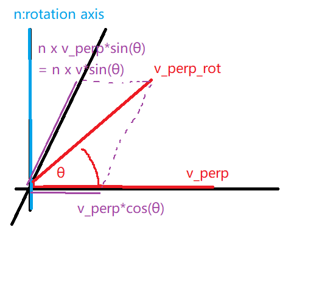

# HW2

## 熟悉 Eigen 矩阵运算

设线性⽅程 Ax = b，在 A 为⽅阵的前提下，请回答以下问题： 

1. 在什么条件下， x 有解且唯⼀？  

   A是可逆矩阵，即A是full-rank的。

2. ⾼斯消元法的原理是什么？  

   参考[高斯消去法](https://ccjou.wordpress.com/2013/02/20/高斯消去法/)，高斯消元法的原理如下：将方程组表示为增广矩阵，然后使用取代、伸缩、交换三种操作使得矩阵变为梯形阵式（echelon form），再用反向代入法（back-substitution）求解。

3. QR 分解的原理是什么？

   参考[Gram-Schmidt 正交化與 QR 分解](https://ccjou.wordpress.com/2010/04/22/gram-schmidt-正交化與-qr-分解/)及[線代膠囊──QR 分解](https://ccjou.wordpress.com/2013/05/06/%e7%b7%9a%e4%bb%a3%e8%86%a0%e5%9b%8a%e2%94%80%e2%94%80qr-%e5%88%86%e8%a7%a3/)。有一组基底$X = \{x_1,...,x_n\}$，其中$\{x_1,...,x_n\}$互为线性独立。我们可以用一个$m \times n$的矩阵$A = \begin{bmatrix} x_1 & x_2 & ... & x_n\end{bmatrix}$表示它。QR分解的目的是找到一组Q矩阵跟R矩阵使得$A = QR$成立，其中$Q = \begin{bmatrix}q_1 & q_2 & ... & q_n\end{bmatrix}$，由$Q$的各column构成的集合$\{q_1,...,q_n\}$是为单范正交基底，$R$则为一个上三角矩阵，表示系数。

   矩阵$Q$的计算分为正交化和单位化两步：

   - 正交化：

     先选取$x_1$作为正交基底的第一个向量，即$y_1$。然后选取$x_2$，从中减去$x_2$在$y_1$方向上的投影，得到与$y_1$正交的$y_2$。接着选取$x_3$，从中减去$x_3$在$y_2$及$y_1$方向上的投影，得到与$y_1$及$y_2$正交的$y_3$。以此类推，写成数学式如下：

     $y_1 = x_1$

     $y_2 = x_2 - \frac{y_1^Tx_2}{y_1^Ty_1}y_1$

     $y_3 = x_3 - \frac{y_2^Tx_3}{y_2^Ty_2}y_2 - \frac{y_1^Tx_3}{y_1^Ty_1}y_1$

     $y_n = x_n - \frac{y_{n-1}^Tx_n}{y_{n-1}^Ty_{n-1}}y_{n-1} - ... - \frac{y_2^Tx_n}{y_2^Ty_2}y_2 - \frac{y_1^Tx_n}{y_1^Ty_1}y_1$

   - 单位化：

     将$\{y_1,...,y_n\}$单位化得$\{q_1,...,q_n\}$。写成数学式如下：$q_i = \frac{y_i}{||y_i||}$。

   矩阵$Q = \begin{bmatrix}q_1 & q_2 & ... & q_n\end{bmatrix}$。

   矩阵$R$的计算：

   $x_1 = y_1$

   $x_2 = \frac{y_1^Tx_2}{y_1^Ty_1}y_1 + y_2 = (q_1^Tx_2)q_1 + y_2$

   $x_3 = \frac{y_1^Tx_3}{y_1^Ty_1}y_1 + \frac{y_2^Tx_3}{y_2^Ty_2}y_2 + y_3 = (q_1^Tx_3)q_1 + (q_2^Tx_3)q_2 + y_2$

   $x_n = \frac{y_1^Tx_n}{y_1^Ty_1}y_1 + \frac{y_2^Tx_n}{y_2^Ty_2}y_2 + ... + \frac{y_{n-1}^Tx_n}{y_{n-1}^Ty_{n-1}}y_{n-1} + y_n = (q_1^Tx_n)q_1 + (q_2^Tx_n)q_2 + ... + (q_{n-1}^Tx_n)q_{n-1} + y_n$

   用矩阵的形式改写如下：

   $A = \begin{bmatrix} x_1 & x_2 & ... & x_n\end{bmatrix} = \begin{bmatrix}q_1 & q_2 & ... & q_n\end{bmatrix} \begin{bmatrix}r_{11} & r_{12} & ... & r_{1n} \\ 0 & r_{22} & ... & r_{2n} \\ ...\\ 0 & 0 & ... & r_{nn} \end{bmatrix}$

   $R = \begin{bmatrix}r_{11} & r_{12} & ... & r_{1n} \\ 0 & r_{22} & ... & r_{2n} \\ ...\\ 0 & 0 & ... & r_{nn} \end{bmatrix}$，其中$r_{ii} = ||y_i||$，$r_{ij} = q_i^Tx_j$。

4. Cholesky 分解的原理是什么？

   参考[Cholesky 分解](https://ccjou.wordpress.com/2010/09/16/cholesky-分解/)，Cholesky 分解的作用是将实对称正定矩阵A分解为$GG^T$，其中$G$是包含正主对角元的下三角矩阵。

   推导如下：

   首先使用LDU分解：$A = LDU$，其中$L$为下三角矩阵，$D$为对角矩阵，$U$为上三角矩阵。

   因为$A$为对称矩阵：$A = A^T$，所以$U = L^T$，故$A = LDL^T = LD^{1/2}D^{1/2}L^T = GG^T$，其中$G = LD^{1/2}$，为一包含正主对角元的下三角矩阵。

   $L$和$U$的主对角元皆为1，$D$的主对角元为正的证明如下：

   因为$A$是正定矩阵，对于所有非零实向量$x$，都有$x^TAx = x^TLDL^Tx = y^TDy = \Sigma_{i = 1}^n d_{ii}y_i^2 > 0$。

   令$y = e_i$代入上式，可知对所有的$i$，都有$d_i > 0$。

5. 编程实现 A 为 100 × 100 随机矩阵时，⽤ QR 和 Cholesky 分解求 x 的程序。你可以参考本次课
   ⽤到的 useEigen 例程。  
   
   ```cmake
   cmake_minimum_required(VERSION 2.8)
   project(qrCholeskySolver)
   
   set(CMAKE_BUILD_TYPE "Release")
   set(CMAKE_CXX_FLAGS "-O3")
   
   include_directories("/usr/include/eigen3")
   add_executable(qr_cholesky_solver qr_cholesky_solver.cpp)
   ```
   
   ```cpp
   #include <iostream>
   #include <ctime>
   #include <Eigen/Core>
   #include <Eigen/Dense>
   
   using namespace std;
   
   int main(int argc, char** argv){
       //https://stackoverflow.com/questions/21292881/matrixxfrandom-always-returning-same-matrices
       srand((unsigned int) time(0));
   
       Eigen::Matrix<double, 100, 100> A = Eigen::Matrix<double, 100, 100>::Random(100, 100);
       Eigen::Matrix<double, 100, 1> b = Eigen::Matrix<double, 100, 1>::Random(100, 1);
       Eigen::Matrix<double, 100, 1> x;
   
       // make sure it's positive semidefinite so that we can use Cholesky decomposition
       A = A * A.transpose();
   
       cout << "A's determinant: " << A.determinant() << endl;
       assert(A.determinant() && "A is not invertable!");
   
       clock_t time_stt = clock();
       x = A.colPivHouseholderQr().solve(b);
       cout << "time of Qr decomposition is "
           << 1000 * (clock() - time_stt) / (double) CLOCKS_PER_SEC << "ms" << endl;
       cout << "x = " << x.transpose() << endl;
   
       time_stt = clock();
       // Eigen::LDLT: Robust Cholesky decomposition of a matrix with pivoting.
       x = A.ldlt().solve(b);
       cout << "time of ldlt decomposition is "
           << 1000 * (clock() - time_stt) / (double) CLOCKS_PER_SEC << "ms" << endl;
       cout << "x = " << x.transpose() << endl;
       return 0;
   }
   ```
   
   注意方阵A必须是可逆的，否则QR分解不存在。另外A还必须是半正定的，否则Cholesky分解不存在（如果A是正定的，Cholesky分解会是唯一的；如果A是半正定的，Cholesky分解则不唯一）。
   
   ```
   time of Qr decomposition is 0.788ms
   x =  -20.7235  -20.1356   48.8593   -8.1957   30.5987  -3.38946  -31.9302  -28.8417   18.6479   -26.264   9.04201   40.1469  -3.53872   14.1034   25.6966   1.93048   44.7731   6.05393  -47.2274  -15.7575  -14.7651  -21.7064  -7.75796   7.08602  -71.5187   37.2391  -31.0925  -51.7064  -20.0919   24.9179   6.02891  -19.1708   8.35958    8.5062   15.0035    -28.96    -5.475    -1.392  -16.1192   9.55985   17.2311  -21.2848   44.1294  -26.6648   43.8467  -7.41734   102.712   1.22598   -49.113   29.1474  -2.27802   6.00318  -13.3337  -56.2563    45.161  -8.98912  -4.06643  -3.57936  -2.37825   13.7729   43.5508   27.2633  -53.7091   31.0985  -40.7033  -7.18753   3.41159   3.93298  -28.9697  -39.8546   10.1777  -6.19336   14.5372   -9.5197  -43.0358  -7.25094   14.4673   -16.256  -10.6062   29.2168  -3.77016   24.6636  -23.3916  -53.9983  -28.2648  -13.6257    52.823   4.50248  -13.4704  -36.0144   25.8894  -11.0147   67.7987  -14.2976 -0.866671   3.51995  -30.6121   18.6867  -42.8642    2.6009
   time of ldlt decomposition is 0.12ms
   x =  -20.7235  -20.1356   48.8593   -8.1957   30.5987  -3.38946  -31.9302  -28.8417   18.6479   -26.264   9.04201   40.1469  -3.53872   14.1034   25.6966   1.93048   44.7731   6.05393  -47.2274  -15.7575  -14.7651  -21.7064  -7.75796   7.08602  -71.5187   37.2391  -31.0925  -51.7064  -20.0919   24.9179   6.02891  -19.1708   8.35958    8.5062   15.0035    -28.96    -5.475    -1.392  -16.1192   9.55985   17.2311  -21.2848   44.1294  -26.6648   43.8467  -7.41734   102.712   1.22598   -49.113   29.1474  -2.27802   6.00318  -13.3337  -56.2563    45.161  -8.98912  -4.06643  -3.57936  -2.37825   13.7729   43.5508   27.2633  -53.7091   31.0985  -40.7033  -7.18753   3.41159   3.93298  -28.9697  -39.8546   10.1777  -6.19336   14.5372   -9.5197  -43.0358  -7.25094   14.4673   -16.256  -10.6062   29.2168  -3.77016   24.6636  -23.3916  -53.9983  -28.2648  -13.6257    52.823   4.50248  -13.4704  -36.0144   25.8894  -11.0147   67.7987  -14.2976 -0.866671   3.51995  -30.6121   18.6867  -42.8642    2.6009
   ```
   
   注：如果A不是半正定矩阵，那么算出来的x将会是错的。
   
   作业文档上说Eigen固定大小矩阵最大支持到50，所以会用到动态大小的矩阵。但实际试起来似乎没这个问题。
   

## 几何运算练习

首先推导使用四元数做旋转的公式。

参考旋转矩阵正向及反向的公式：

$a' = Ra+t$

$a = R^Ta'-R^Tt$

四元数的正向及反向公式为：

$p' = qpq^{-1} + t$

$p = q^{-1}(p'-t)q = q^{-1}p'q-q^{-1}tq$


题目：$p_1$为点在坐标系1里的表达，求它在坐标系2的表达。

公式推导：

首先将$q_1$和$q_2$归一化：

$q_{1n} = \frac{q_1}{||q_1||}$

$q_{2n} = \frac{q_2}{||q_2||}$

$p_1$在世界坐标系里的表达：

$\begin{align}p_w &= q_{1n}^{-1}p_1q_{1n} - q_{1n}^{-1}t_1q_{1n} \end{align}$

$p_1$在坐标系2里的表达：

$p_2 = q_{2n}p_wq_{2n}^{-1}+t_2$

```cmake
cmake_minimum_required( VERSION 2.8 )
project( coordinateTransformation )

# 添加Eigen头文件
include_directories( "/usr/include/eigen3" )

add_executable(coordinate_transformation coordinate_transformation.cpp)
```

初始化变量：

```cpp
    Eigen::Quaterniond q1(0.55, 0.3, 0.2, 0.2);
    Eigen::Quaterniond q2(-0.1,0.3,-0.7,0.2);

    Eigen::Vector3d t1(0.7, 1.1, 0.2);
    Eigen::Vector3d t2(-0.1, 0.4, 0.8);

    Eigen::Vector3d p_in_1(0.5, -0.1, 0.2);
```

记得要对四元数归一化，否则算出来的答案会是错的。

```cpp
    // they are required!
    q1.normalize();
    q2.normalize();
```

第一种方法：将四元数转换为旋转矩阵再运算。

```cpp
    // rotation matrix
    Eigen::Vector3d p_in_w = q1.toRotationMatrix().inverse() * (p_in_1 - t1);
    Eigen::Vector3d p_in_2 = q2.toRotationMatrix() * p_in_w + t2;
    cout << "p2: " << p_in_2.transpose() << endl;
```

第二种方法：使用四元数overload过的算子*。

```cpp
    // quaternion overoaded * as rotation operator
    p_in_w = q1.inverse() * (p_in_1 - t1);
    p_in_2 = q2 * p_in_w + t2;
    cout << "p2: " << p_in_2.transpose() << endl;
```

第三种方法：使用数学公式计算。

```cpp
    // quaternion, pure math
    Eigen::Quaterniond p1_quat(0, 0.5, -0.1, 0.2);
    Eigen::Quaterniond t1_quat(0, 0.7, 1.1, 0.2);
    Eigen::Quaterniond t2_quat(0, -0.1, 0.4, 0.8);
    Eigen::Quaterniond p_in_w_quat = Eigen::Quaterniond((q1.inverse() * p1_quat * q1).coeffs() - (q1.inverse() * t1_quat * q1).coeffs());
    Eigen::Quaterniond p_in_2_quat = Eigen::Quaterniond((q2 * p_in_w_quat * q2.inverse()).coeffs() + t2_quat.coeffs());
    cout << "p2: " << p_in_2_quat.coeffs().transpose() << endl;
```

三种方法的输出如下。

```
p2:  1.08228 0.663509 0.686957
p2:  1.08228 0.663509 0.686957
p2:     1.08228    0.663509    0.686957 5.55112e-17
```

与参考答案一致。

## 旋转的表达

1. 设有旋转矩阵$R$，证明 $R^T R = I$ 且 $det R = +1$。  

   首先证明几个关于正交矩阵的特性：

   1. $A^TA = I$

      参考[Why is the inverse of an orthogonal matrix equal to its transpose?](https://math.stackexchange.com/questions/1936020/why-is-the-inverse-of-an-orthogonal-matrix-equal-to-its-transpose)，对于一个正交矩阵$A = \begin{bmatrix}e_1 & e_2 & e_3\end{bmatrix}$，其中$e_1$，$e_2$，$e_3$互为正交向量。$A^TA = \begin{bmatrix}e_1^T \\ e_2^T \\ e_3^T \end{bmatrix}\begin{bmatrix}e_1 & e_2 & e_3\end{bmatrix} = \begin{bmatrix}e_1^Te_1 & e_1^Te_2 & e_1^Te_3 \\ e_2^Te_1 & e_2^Te_2 & e_2^Te_3 \\ e_3^Te_1 & e_3^Te_2 & e_3^Te_3\end{bmatrix}$。

      套用$e_1$，$e_2$，$e_3$互相正交的特性，可知$A^TA = I$。

   2. $\det(A) = \pm1$

      参考[正交矩陣](https://zh.wikipedia.org/wiki/%E6%AD%A3%E4%BA%A4%E7%9F%A9%E9%98%B5)。

      因为$A^TA = I$，所以$1 = \det(I) = \det(A^TA) = \det(A^T)\det(A) = (\det(A))^2$，故$\det(A) = \pm1$。

   接下来证明旋转矩阵$R$是正交矩阵，也就证明了$R^T R = I$ 且 $det R = +1$。  

   有两个坐标系：坐标系1$(e_1,e_2,e_3)$及坐标系2$(e_1',e_2',e_3')$，它们之间的坐标转换如下。

   $\begin{bmatrix}e_1 & e_2 & e_3\end{bmatrix}\begin{bmatrix}a_1 \\ a_2 \\ a_3\end{bmatrix} = \begin{bmatrix}e_1' & e_2' & e_3'\end{bmatrix}\begin{bmatrix}a_1' \\ a_2' \\ a_3'\end{bmatrix} \\ \Rightarrow \begin{bmatrix}a_1 \\ a_2 \\ a_3\end{bmatrix} = \begin{bmatrix}e_1^T \\ e_2^T \\ e_3^T\end{bmatrix}\begin{bmatrix}e_1' & e_2' & e_3'\end{bmatrix}\begin{bmatrix}a_1' \\ a_2' \\ a_3'\end{bmatrix} = \begin{bmatrix}e_1^Te_1' & e_1^Te_2' & e_1^Te_3' \\ e_2^Te_1' & e_2^Te_2' & e_2^Te_3' \\ e_3^Te_1' & e_3^Te_2' & e_3^Te_3'\end{bmatrix}\begin{bmatrix}a_1' \\ a_2' \\ a_3'\end{bmatrix}$

   $R \triangleq \begin{bmatrix}e_1^Te_1' & e_1^Te_2' & e_1^Te_3' \\ e_2^Te_1' & e_2^Te_2' & e_2^Te_3' \\ e_3^Te_1' & e_3^Te_2' & e_3^Te_3'\end{bmatrix}$，因为$\begin{bmatrix}e_1^T \\ e_2^T \\ e_3^T\end{bmatrix}$与$\begin{bmatrix}e_1' & e_2' & e_3'\end{bmatrix}$皆为正交矩阵，所以$R$亦为正交矩阵。

   套用$R$是正交矩阵的特性，可知$R^TR=I$及$\det R = +1$。

2. 设有四元数$q$，我们把虚部记为$\epsilon$，实部记为$\eta$，那么$q = (\epsilon, \eta)$。请说明$\epsilon$和$\eta$的维度。 

   $\epsilon$是长度为3的向量；$\eta$是长度为1的向量。

3. 请证明对任意单位四元数 q1, q2，四元数乘法可写成矩阵乘法：   

   $q_1 = \begin{bmatrix} \epsilon_1 \\ \eta_1 \end{bmatrix}$，$q_2 = \begin{bmatrix} \epsilon_2 \\ \eta_2 \end{bmatrix}$

   $q^+ = \begin{bmatrix}\eta\boldsymbol{1}+\epsilon^\times & \epsilon \\ -\epsilon^T & \eta \end{bmatrix}$，$q^\bigoplus = \begin{bmatrix}\eta\boldsymbol{1}-\epsilon^\times & \epsilon \\ -\epsilon^T & \eta \end{bmatrix}$

   已知四元数乘法公式为：$q_1q_2 = \begin{bmatrix} \eta_1\epsilon_2+ \eta_2\epsilon_1+\epsilon_1 \times \epsilon_2 \\ \eta_1\eta_2 -\epsilon_1^T\epsilon_2 \end{bmatrix}$。
   
   以下证明$q_1^+q_2$及$q_2^\bigoplus q_1$皆与$q_1q_2$相等：
   
   $\begin{align}q_1^+q_2 &= \begin{bmatrix}\eta_1\boldsymbol{1}+\epsilon_1^\times & \epsilon_1 \\ -\epsilon_1^T & \eta_1 \end{bmatrix}\begin{bmatrix} \epsilon_2 \\ \eta_2 \end{bmatrix} \\&= \begin{bmatrix} (\eta_1\boldsymbol{1}+\epsilon_1^\times)\epsilon_2+ \epsilon_1\eta_2 \\ -\epsilon_1^T\epsilon_2+\eta_1\eta_2 \end{bmatrix} \\&= \begin{bmatrix} \eta_1\epsilon_2+\epsilon_1 \times \epsilon_2+ \epsilon_1\eta_2 \\ -\epsilon_1^T\epsilon_2+\eta_1\eta_2 \end{bmatrix} \\&= \begin{bmatrix} \eta_1\epsilon_2+ \eta_2\epsilon_1+\epsilon_1 \times \epsilon_2 \\ \eta_1\eta_2 -\epsilon_1^T\epsilon_2 \end{bmatrix} \\&= q_1q_2\end{align}$
   
   $\begin{align}q_2^\bigoplus q_1 &= \begin{bmatrix}\eta_2\boldsymbol{1}-\epsilon_2^\times & \epsilon_2 \\ -\epsilon_2^T & \eta_2 \end{bmatrix}\begin{bmatrix} \epsilon_1 \\ \eta_1 \end{bmatrix} \\&= \begin{bmatrix}(\eta_2\boldsymbol{1}-\epsilon_2^\times)\epsilon_1 + \epsilon_2 \eta_1 \\ -\epsilon_2^T\epsilon_1+\eta_2\eta_1\end{bmatrix} \\&= \begin{bmatrix}\eta_2\epsilon_1-\epsilon_2 \times\epsilon_1 + \epsilon_2 \eta_1 \\ - \epsilon_2^T \epsilon_1 + \eta_2\eta_1 \end{bmatrix} \\&= \begin{bmatrix}\eta_2\epsilon_1 + \eta_1\epsilon_2 -\epsilon_2 \times\epsilon_1 \\ \eta_2\eta_1 - \epsilon_2^T \epsilon_1 \end{bmatrix} \\&= \begin{bmatrix}\eta_1\epsilon_2 + \eta_2\epsilon_1 + \epsilon_1 \times\epsilon_2 \\ \eta_1\eta_2 - \epsilon_1^T \epsilon_2 \end{bmatrix}\\&= q_1q_2 \end{align}$

## 罗德里格斯公式的证明

设旋转向量长度为$\theta$，⽅向为$n$，那么旋转矩阵$R$为：
$R = \cos\theta I + (1 - \cos\theta)nn^T + \sin\theta n\hat{}$


参考[Rodrigues' rotation formula](https://en.wikipedia.org/wiki/Rodrigues%27_rotation_formula)

使用旋转向量对向量$v$进行旋转。

将向量$v$拆分成与旋转轴平行的分量$v_\parallel$及与旋转轴垂直的分量$v_\perp$：$v = v_\parallel + v_\perp$。

与旋转轴平行的分量经旋转后仍保持不变：$v_{\parallel rot} = v_\parallel$。

对与旋转轴垂直的分量进行旋转，参考下图，可得$v_{\perp rot} = \cos(\theta)v_\perp + \sin(\theta) n \times v_\perp  = \cos(\theta)v_\perp + \sin(\theta) n \times v $。

<p align="center">
  
</p>
所以：

$\begin{align}v_{rot} &= v_{\parallel rot} + v_{\perp rot} \\&= v_{\parallel} + \cos(\theta)v_\perp + \sin(\theta) n \times v\end{align}$

接下来希望将$v_{\parallel}$，$v_\perp$改写成由$n$，$v$及$\theta$构成的表达式：

$v_\parallel = (n \cdot v)n$

$v_\perp = v - v_\parallel$

将以上二式代入$v_{rot}$，得：

$\begin{align}v_{rot} &= v_{\parallel rot} + v_{\perp rot} \\&= v_{\parallel} + \cos(\theta)v_\perp + \sin(\theta) n \times v \\&=  v_\parallel + \cos(\theta)(v - v_\parallel) + \sin(\theta) n \times v \\&= \cos(\theta)v + (1-\cos(\theta))v_\parallel + \sin(\theta) n \times v \\&= \cos(\theta)v + (1-\cos(\theta))(n \cdot v)n + \sin(\theta) n \times v\end{align}$

因为：

$\begin{align}(n \cdot v)n &= (n_1v_1 + n_2v_2 + n_3v_3)\begin{bmatrix}n_1 \\ n_2 \\ n_3\end{bmatrix} \\&= \begin{bmatrix}n_1^2v_1 + n_1n_2v_2 + n_1n_3v_3 \\ n_1n_2v_1 + n_2^2v_2 + n_2n_3v_3 \\ n_1n_3v_1 + n_2n_3v_2 + n_3^2v_3\end{bmatrix} \\&= \begin{bmatrix}n_1^2 & n_1n_2 & n_1n_3 \\ n_1n_2 & n_2^2 & n_2n_3 \\ n_1n_3 & n_2n_3 & n_3^2 \end{bmatrix}\begin{bmatrix}v_1 \\ v_2 \\ v_3\end{bmatrix} \\&= (n n^T)v\end{align}$

且：

$n \times v = n^{\times}v = \begin{bmatrix}0 & -n_3 & n_2 \\ n_3 & 0 & -n_1 \\ -n_2 & n_1 & 0\end{bmatrix}v$

将上述二式代入$v_{rot}$，得：

$\begin{align}v_{rot} &= \cos(\theta)v + (1-\cos(\theta))(n \cdot v)n + \sin(\theta) n \times v \\&= \cos(\theta)v + (1-\cos(\theta))(n n^T)v + \sin(\theta) n^{\times}v\end{align}$

可以将上式表示成矩阵乘法的形式：

$\begin{align}v_{rot} &= \cos(\theta)v + (1-\cos(\theta))(n n^T)v + \sin(\theta) n^{\times}v \\&= \cos(\theta)Iv + (1-\cos(\theta))(n n^T)v + \sin(\theta) n^{\times}v \\&= Rv\end{align}$

其中$R = \cos(\theta)I + (1-\cos(\theta))(n n^T) + \sin(\theta) n^{\times}$。

参考[proof of Rodrigues’ rotation formula](https://planetmath.org/proofofrodriguesrotationformula)，可以进一步将$R$仅用$n^\times$和$\theta$表达。

因为使用$n^\times$对与$n$垂直的平面上的向量做旋转相当于对它逆时针转90度，所以有$-v_\perp = {n^\times}^2  v_\perp$，即：使用$n^\times$对$v_\perp$转90+90=180度。

因为$n^\times v_\parallel = 0$，所以：$-v_\perp = {n^\times}^2 v_\perp = {n^\times}^2 v$。

$v-(nn^T)v = v-(n \cdot v)n = v-v_\parallel = v_\perp = -{n^\times}^2 v$

可以将$v_{rot}$重新表达成：

$\begin{align}v_{rot} &= \cos(\theta)v + (1-\cos(\theta))(n n^T)v + \sin(\theta) n^{\times}v \\&= \cos(\theta)(v - (n n^T)v) + (n n^T)v + \sin(\theta) n^{\times}v \\&= -\cos(\theta){n^\times}^2 v + (n n^T)v + \sin(\theta) n^{\times}v \\&= -\cos(\theta){n^\times}^2 v + (v + {n^{\times}}^2v) + \sin(\theta) n^{\times}v \\&=  (1-\cos(\theta)){n^\times}^2 v + v + \sin(\theta) n^{\times}v \end{align}$

故$R$也可以表达成：$I + (1-\cos(\theta)){n^\times}^2 + \sin(\theta) n^{\times}$。

## 四元数运算性质的验证

1. $p′ = qpq^{-1}$，得到的$p′$必定为虚四元数（实部为零）

   $p = [s_p, v_p]$

   $q = [s_q, v_q]$

   $q^{-1} = [s_q, -v_q]$

   $\begin{align}pq^{-1} &= [s_ps_q - v_p^T(-v_q), s_p(-v_q) + s_qv_p + v_p \times (-v_q)] \\&= [s_ps_q + v_p^Tv_q, -s_pv_q + s_qv_p - v_p \times v_q]\end{align}$

   $\begin{align}qpq^{-1} &= [s_q(s_ps_q + v_p^Tv_q) - v_q^T(-s_pv_q + s_qv_p - v_p \times v_q), ...] \\&= [s_qs_ps_q + s_qv_p^Tv_q + v_q^Ts_pv_q - v_q^Ts_qv_p + v_q^T(v_p \times v_q), ...] \\&= [s_ps_q^2 + s_pv_q^Tv_q + v_q^T(v_p \times v_q), ...] \\&= [s_p(s_q^2 + v_q^Tv_q) + v_q^T(v_p \times v_q), ...]\end{align}$

   因为$p$为纯虚的四元数，故$s_p$为0。又$v_p \times v_q$同时与$v_p$及$v_q$垂直，所以$v_q^T(v_p \times v_q) = 0$。两者之和亦为0。

2. 写成矩阵运算：$p′ = Qp$。

   $p' = qpq^{-1} = q^+pq^{-1} = q^+{q^{-1}}^{\bigoplus}p$

   $q^+ = \begin{bmatrix}\eta\boldsymbol{1}+\epsilon^\times & \epsilon \\ -\epsilon^T & \eta \end{bmatrix}$

   ${q^{-1}}^{\bigoplus} = \begin{bmatrix}-\epsilon \\ \eta\end{bmatrix}^{\bigoplus} = \begin{bmatrix}\eta\boldsymbol{1}-(-\epsilon)^\times & (-\epsilon) \\ -(-\epsilon)^T & \eta \end{bmatrix} = \begin{bmatrix}\eta\boldsymbol{1}+\epsilon^\times & -\epsilon \\ \epsilon^T & \eta \end{bmatrix}$

   $\begin{align}q^+{q^{-1}}^{\bigoplus} &= \begin{bmatrix}\eta\boldsymbol{1}+\epsilon^\times & \epsilon \\ -\epsilon^T & \eta \end{bmatrix}\begin{bmatrix}\eta\boldsymbol{1}+\epsilon^\times & -\epsilon \\ \epsilon^T & \eta \end{bmatrix} \\&= \begin{bmatrix}(\eta\boldsymbol{1}+\epsilon^\times)(\eta\boldsymbol{1}+\epsilon^\times) + \epsilon\epsilon^T & —(\eta\boldsymbol{1}+\epsilon^\times)\epsilon + \epsilon\eta \\ —\epsilon^T(\eta\boldsymbol{1}+\epsilon^\times) + \eta\epsilon^T & \epsilon^T\epsilon + \eta^2 \end{bmatrix} \\&= \begin{bmatrix}\eta^2\boldsymbol{1}+2\eta\epsilon^\times +\epsilon^\times\epsilon^\times + \epsilon\epsilon^T & —\epsilon \times\epsilon \\ —\epsilon^T\epsilon^\times & \epsilon^T\epsilon + \eta^2 \end{bmatrix}\end{align}$

   将左上角展开：

   $\begin{align}Q &= q^+{q^{-1}}^{\bigoplus} \\&= \eta^2\boldsymbol{1}+2\eta\epsilon^\times +\epsilon^\times\epsilon^\times + \epsilon\epsilon^T \\&= \eta^2\boldsymbol{1} + 2\eta\begin{bmatrix}0 & -\epsilon_3 & \epsilon_2 \\ \epsilon_3 & 0 & -\epsilon_1 \\ -\epsilon_2 & \epsilon_1 & 0 \end{bmatrix} + \begin{bmatrix}0 & -\epsilon_3 & \epsilon_2 \\ \epsilon_3 & 0 & -\epsilon_1 \\ -\epsilon_2 & \epsilon_1 & 0 \end{bmatrix}^2 + \begin{bmatrix} \epsilon_1 \\ \epsilon_2 \\ \epsilon_3 \end{bmatrix} \begin{bmatrix} \epsilon_1 & \epsilon_2 & \epsilon_3 \end{bmatrix} \\&= \eta^2\boldsymbol{1} + 2\eta\begin{bmatrix}0 & -\epsilon_3 & \epsilon_2 \\ \epsilon_3 & 0 & -\epsilon_1 \\ -\epsilon_2 & \epsilon_1 & 0 \end{bmatrix} + \begin{bmatrix}-\epsilon_2^2-\epsilon_3^2 & \epsilon_1\epsilon_2 & \epsilon_1\epsilon_3 \\ \epsilon_1\epsilon_2 & -\epsilon_1^2-\epsilon_3^2 & \epsilon_2\epsilon_3 \\ \epsilon_1\epsilon_3 & \epsilon_2\epsilon_3 & -\epsilon_1^2-\epsilon_2^2 \end{bmatrix} + \begin{bmatrix} \epsilon_1^2 & \epsilon_1\epsilon_2 & \epsilon_1\epsilon_3 \\ \epsilon_1\epsilon_2 & \epsilon_2^2 & \epsilon_2\epsilon_3 \\ \epsilon_1\epsilon_3 & \epsilon_2\epsilon_3 & \epsilon_3^2 \end{bmatrix} \\&= \begin{bmatrix} \eta^2 -\epsilon_2^2-\epsilon_3^2 + \epsilon_1^2 & -2\eta\epsilon_3 + 2\epsilon_1\epsilon_2 & 2\eta\epsilon_2 + 2\epsilon_1\epsilon_3 \\ 2\eta\epsilon_3 + 2\epsilon_1\epsilon_2 & \eta^2 - \epsilon_1^2-\epsilon_3^2 +\epsilon_2^2 & -2\eta\epsilon_1 + 2\epsilon_2\epsilon_3 \\ -2\eta\epsilon_2 + 2\epsilon_1\epsilon_3 & 2\eta\epsilon_1 + 2\epsilon_2\epsilon_3 & \eta^2 -\epsilon_1^2-\epsilon_2^2 + \epsilon_3^2 \end{bmatrix} \\&= \begin{bmatrix} 1 -2\epsilon_2^2-2\epsilon_3^2 & 2\epsilon_1\epsilon_2 -2\eta\epsilon_3 & 2\epsilon_1\epsilon_3 + 2\eta\epsilon_2 \\ 2\epsilon_1\epsilon_2 + 2\eta\epsilon_3 & 1 - 2\epsilon_1^2-2\epsilon_3^2 & 2\epsilon_2\epsilon_3 -2\eta\epsilon_1 \\ 2\epsilon_1\epsilon_3 -2\eta\epsilon_2  & 2\epsilon_2\epsilon_3 + 2\eta\epsilon_1 & 1 -2\epsilon_1^2-2\epsilon_2^2 \end{bmatrix} \end{align}$

   可与[Maths - Orthogonal Properties of Quaternions](https://www.euclideanspace.com/maths/algebra/realNormedAlgebra/quaternions/geometric/orthogonal/index.htm)给出的旋转矩阵相呼应。

## 熟悉C++11

```cpp
#include <iostream>
#include <vector>
#include <algorithm>

using namespace std;

class A {
public:
    A(const int& i ) : index(i) {}
    int index = 0;
};

int main() {
    A a1(3), a2(5), a3(9);
    vector<A> avec{a1, a2, a3};
    std::sort(avec.begin(), avec.end(), [](const A&a1, const A&a2) {return a1.index<a2.index;});
    for ( auto& a: avec ) cout<<a.index<<" ";
    cout<<endl;
    return 0;
}
```

### Range-based for loop

```cpp
for (auto& a: avec) cout << a.index << “ ”；
```

参考[Range-based for loop  (since C++11)](https://en.cppreference.com/w/cpp/language/range-for)：

```
Executes a for loop over a range.

Used as a more readable equivalent to the traditional for loop operating over a range of values, such as all elements in a container. 
```

语法如下：

```
attr(optional) for ( range_declaration : range_expression ) loop_statement
```

### Placeholder type specifiers

```cpp
auto& a: avec
```

参考[Placeholder type specifiers (since C++11)](https://en.cppreference.com/w/cpp/language/auto)：

```
For variables, specifies that the type of the variable that is being declared will be automatically deduced from its initializer. 
```

### Lambda expressions

```cpp
[](const A& a1, const A& a2){return a1.index < a2.index;}
```

参考[Lambda expressions (since C++11)](https://en.cppreference.com/w/cpp/language/lambda)

```
Constructs a closure: an unnamed function object capable of capturing variables in scope. 
```

语法如下：

```
[ captures ] ( params ) trailing-return-type { body } 	(2) 	
[ captures ] ( params ) { body } 	(3) 	
```

