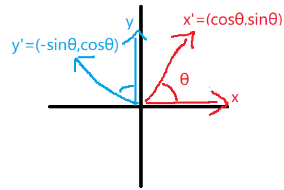

### backup

参考[proof of Rodrigues’ rotation formula](https://planetmath.org/proofofrodriguesrotationformula)

令向量$\vec{n} = a\vec{x}+b\vec{y}+c\vec{z}$。现令它沿z轴旋转$\theta$角度，只有x,y方向的分量会变，表示为$\vec{n'} = a\vec{x'}+b\vec{y'} + c\vec{z}$。

  

由上图可知：$x' = \cos\theta x + \sin\theta y$，$y' = -\sin\theta x + \cos \theta y$。

所以：

$\begin{align}n' &= ax' + by' + cz  \\ &= a(\cos\theta x + \sin\theta y) + b(-\sin\theta x + \cos \theta y) + cz \\ &= (ax+by) \cos\theta + (ay - bx)\sin\theta + cz\end{align}$

接下来希望将$ax+by$，$ay - bx$及$c$改写成由$n$与$z$构成的表达式：

$n-(n \cdot z)z = n - cz = ax+by$

$z \times n = z \times (ax+by+cz) = a(z \times x) + b(z \times y) = ay -bx$

$c = n \cdot z$

将上面三式代入$n'$，得：

$\begin{align}n' &= (ax+by) \cos\theta + (ay - bx)\sin\theta + cz \\ &= (n-(n \cdot z)z)\cos \theta + (z \times n)\sin \theta + (n \cdot z)z \\ &= (\cos \theta -1)(n-(n \cdot z)z) + (n - (n \cdot z)z) + \sin \theta(z \times n) + (n \cdot z)z \\ &= (\cos \theta -1)(n-(n \cdot z)z) + n + \sin \theta(z \times n) \\ &= n + \sin \theta(z \times n) + (\cos \theta -1)(n-(n \cdot z)z)\end{align}$

接下来希望将$(z \times n)$及$(n-(n \cdot z)z)$改写成矩阵的形式：

定义矩阵$Z$为向量$z$的反对称矩阵：

$\begin{align}z \times v &= \begin{bmatrix}-z_1v_2+z_2v_3 \\ z_3v_1-z_1v_3 \\ -z_2v_1+z_1v_2\end{bmatrix} \\&= \begin{bmatrix}0 & -z_3 & z_2 \\ z_3 & 0 & -z_1 \\ -z_2 & z_1 & 0\end{bmatrix}v = Zv\end{align}$

