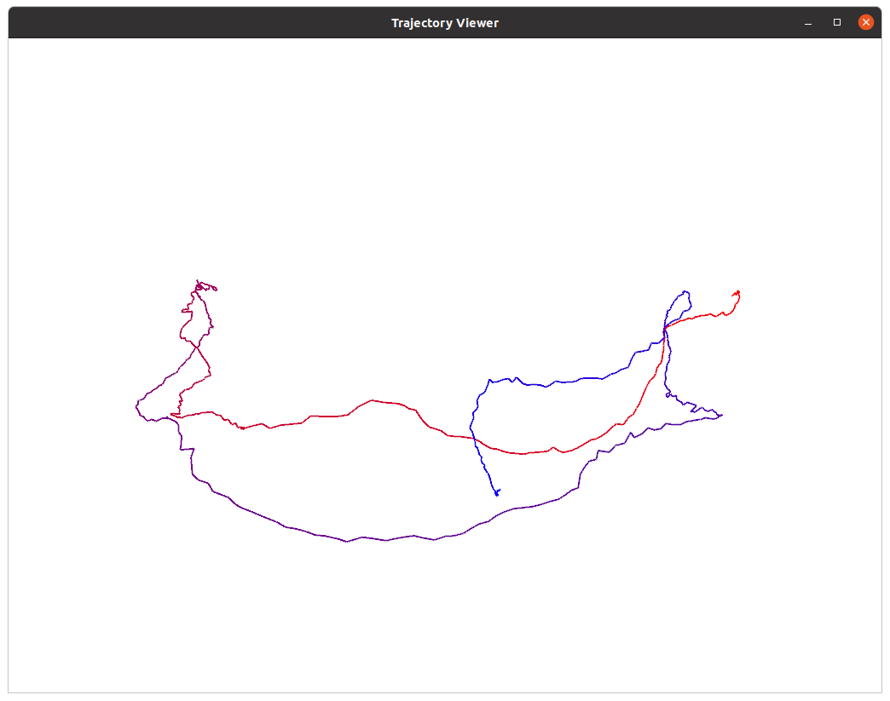
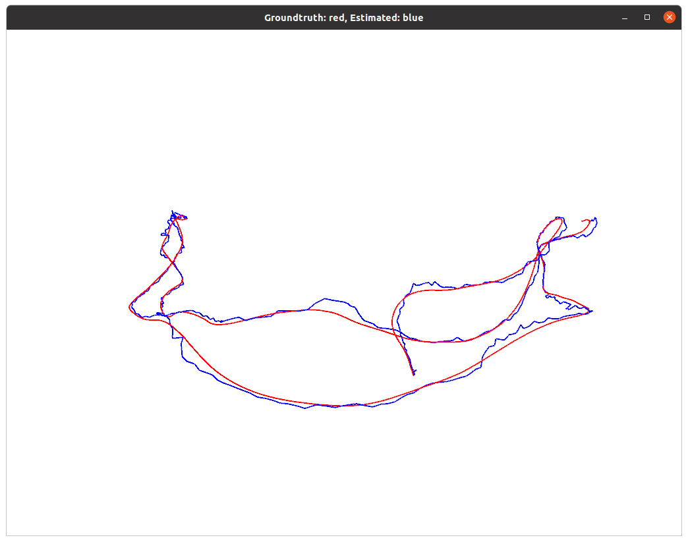

# HW3

## 群的性质

因为证明$\{\Z, +\}$ 为群时会用到$\{\N, +\}$的部分性质，所以交换了$\{\Z, +\}$，$\{\N, +\}$两题的顺序。

1. $\{\N, +\}$是否为群？若是，验证其满⾜群定义；若不是，说明理由。N 为⾃然数集。 

   不是。

   1. 封闭性：

      根据[How can one prove that the integers are closed under addition and multiplication? It seems so obvious, but is there a clean proof?](https://www.quora.com/How-can-one-prove-that-the-integers-are-closed-under-addition-and-multiplication-It-seems-so-obvious-but-is-there-a-clean-proof)及[Peano axioms](https://en.wikipedia.org/wiki/Peano_axioms)，有以下的公理：

      ```
      S: single-valued "successor" function S
      
      For every natural number n, S(n) is a natural number. That is, the natural numbers are closed under S.
      ```

      可以把$S$想成$S(x) = x+1$，这个公理是说，$\forall x \in \N, x+1 \in \N$。

      对于任何自然数$a$，可以分以下两种情况证明它与任何自然数$b$的和皆为自然数：

      $\forall a \in \N, b = 0, a+b = a+0 = a \in \N$（0是幺元）

      $\forall a \in \N, b \in \Z^+, a+b = a+(1+...+1) = ((((a+1)+1)+1)...+1) \in \N$

   2. 结合律：

      参考[Proofs involving the addition of natural numbers](https://en.wikipedia.org/wiki/Proofs_involving_the_addition_of_natural_numbers#Proof_of_associativity)：

      有以下两条公理：

      ```
      A1:	a + 0 = a
      A2:	a + S(b) = S(a + b)
      ```

      $a_1, a_2, a_3 \in \N$。使用归纳法证明如下：

      - base case，即$a_3 = 0$：$(a_1 + a_2) + 0 = a_1 + a_2 = a_1 + (a_2 + 0)$

      - 在$a_3 \in \Z$的情况下，假设$(a_1 + a_2) + a_3 = a_1 + (a_2 + a_3)$，那么$(a_1 + a_2) + S(a_3) = S((a_1 + a_2) + a_3) = S(a_1 + (a_2 + a_3)) = a_1 + S(a_2 + a_3) = a_1 + (a_2 + S(a_3))$

        这代表在假定$a_3$满足结合律的情况下，$S(a_3)$亦满足结合律。所以结合律对任何$a_3 \in \N$皆成立，至此证毕。

   3. 幺元：$0 \in \N, s.t. \forall a \in \N, 0+a = a+0 = a$

   4. 逆：$\forall a \in \Z^{+} \subset \N, -a \notin \N$。故此项不成立。

2. $\{\Z, +\}$ 是否为群？若是，验证其满⾜群定义；若不是，说明理由。Z 为整数集。

   是。

   1. 封闭性：

      对于整数$a$,$b$，分以下几种情况讨论：

      - 对于$b$是0的情况：$a +b = a+0 = a \in \Z$。$a$是0的情况同理可证。

      - $a \in \Z^+ \sub \N, b \in \Z^+ \sub \N$：直接套用自然数对于加法的封闭性。

      - $a \in \Z^-, b \in \Z^-$：

        $-a \in \Z^+, -b \in \Z^+ \Rightarrow (-a) + (-b) = -(a+b) \in \Z^+ \Rightarrow (a+b) \in \Z^-$

      - $a \in \Z^-, b \in \Z^+$：根据Peano Axiom，$\forall x \in \Z^+ \sub \N, x+1 \in \Z^+ \sub \N$。

        扩展到负数，有$\forall x \in \Z^-, S'(x) = x-1 \in \Z^-$，因此：

        $a + b = (-1-1...-1)+(1+1+...1)$

        分以下三种情况讨论（此处的化简套用了整数的结合律）：

        - $|a| < |b|$：$a + b = 1+1...+1 = ((((0+1)+1)+1)...+1) \in \Z$
        - $|a| = |b|：a+b = 0 \in \Z$
        - $|a| > |b|：a+b = -1-1...-1 = ((((0-1)-1)-1)...-1) \in \Z$

      - $a \in \Z^+, b \in \Z^-$：同理可证。

   2. 结合律：

      参考[Integer Addition is Associative](https://proofwiki.org/wiki/Integer_Addition_is_Associative)，套用[整数的formal definition](https://en.wikipedia.org/wiki/Integer#Construction)，将三个整数$a_1, a_2, a_3 \in \Z$写成：$a_1 = \left[\!\left[{a, b}\right]\!\right], a_2 = \left[\!\left[{c, d}\right]\!\right], a_3 = \left[\!\left[{e, f}\right]\!\right] $，其中$a,b,c,d,e,f \in \N$。

      证明如下：

      $\begin{align}a_1 + (a_2 + a_3) &= \left[\!\left[{a, b}\right]\!\right]+( \left[\!\left[{c, d}\right]\!\right]+ \left[\!\left[{e, f}\right]\!\right]) \\&= \left[\!\left[{a, b}\right]\!\right] + \left[\!\left[{c+e, d+f}\right]\!\right] \\&= \left[\!\left[{a+(c+e), b+(d+f)}\right]\!\right] \\&=  \left[\!\left[{(a+c)+e, (b+d)+f}\right]\!\right] \\&= \left[\!\left[{a+c, b+d}\right]\!\right] + \left[\!\left[{e, f}\right]\!\right] \\&= (\left[\!\left[{a, b}\right]\!\right]+\left[\!\left[{c, d}\right]\!\right]) + \left[\!\left[{e, f}\right]\!\right] \\&= (a_1 + a_2) + a_3\end{align}$

   3. 幺元：$0 \in \Z, s.t. \forall a \in \Z, 0+a = a+0 = a$

   4. 逆：$\forall a \in \Z, \exist -a \in \Z, s.t. a+(-a) = 0$

## 验证向量叉乘的李代数性质

验证$g = (\R^3,\R, \times)$构成李代数

1. 封闭性：

   $X = X_ii+X_jj+X_kk \in \R^3$

   $Y = Y_ii+Y_jj+Y_kk \in \R^3$

   $[X, Y] = X \times Y = \begin{vmatrix}i & j & k \\ X_i & X_j & X_k \\ Y_i & Y_j & Y_k\end{vmatrix} = (X_jYk-X_kY_j)i + (X_kY_i-X_iY_k)j + (X_iY_j-X_jY_i)k \in \R^3$

2. 双线性

   参考[Vector Cross Product Operator is Bilinear](https://proofwiki.org/wiki/Vector_Cross_Product_Operator_is_Bilinear)。

   $X = X_ii+X_jj+X_kk \in \R^3$

   $Y = Y_ii+Y_jj+Y_kk \in \R^3$

   $Z = Z_ii+Z_jj+Z_kk \in \R^3$

   $\begin{align}[aX+bY, Z] &= (aX+bY) \times Z \\&= \begin{vmatrix}i & j & k \\ aX_i+bY_i & aX_j+bY_j & aX_k+bY_k \\ Z_i & Z_j & Z_k\end{vmatrix} \\&= \begin{vmatrix}i & j & k \\ aX_i & aX_j & aX_k \\ Z_i & Z_j & Z_k\end{vmatrix}+\begin{vmatrix}i & j & k \\ bY_i & bY_j & bY_k \\ Z_i & Z_j & Z_k\end{vmatrix} \\&= a\begin{vmatrix}i & j & k \\ X_i & X_j & X_k \\ Z_i & Z_j & Z_k\end{vmatrix}+b\begin{vmatrix}i & j & k \\ Y_i & Y_j & Y_k \\ Z_i & Z_j & Z_k\end{vmatrix}\\&= aX \times Z + bY \times Z \\&= a[X, Z] + b[Y, Z] \end{align}$

   $\begin{align}[Z， aX+bY] &= Z \times (aX+bY) \\&= \begin{vmatrix}i & j & k \\ Z_i & Z_j & Z_k \\ aX_i+bY_i & aX_j+bY_j & aX_k+bY_k\end{vmatrix} \\&= \begin{vmatrix}i & j & k  \\ Z_i & Z_j & Z_k\\ aX_i & aX_j & aX_k\end{vmatrix}+\begin{vmatrix}i & j & k  \\ Z_i & Z_j & Z_k \\ bY_i & bY_j & bY_k\end{vmatrix} \\&= a\begin{vmatrix}i & j & k \\ Z_i & Z_j & Z_k \\ X_i & X_j & X_k\end{vmatrix}+b\begin{vmatrix}i & j & k \\ Z_i & Z_j & Z_k \\ Y_i & Y_j & Y_k\end{vmatrix}\\&= aZ \times X +bZ  \times Y\\&= a[Z, X] + b[Z, Y]   \end{align}$

3. 自反性：

   $\begin{align}\forall X \in \R^3, X \times X &= \begin{vmatrix}i & j & k \\ X_i & X_j & X_k \\ X_i & X_j & X_k\end{vmatrix} \\&= (X_jX_k-X_jX_k)i + (X_iX_k-X_iX_k)j + (X_iX_j-X_iX_j)k \\&= 0i + 0j + 0k \\&= 0\end{align}$

4. 雅可比等价

   $\forall X, Y, Z \in V, [X, [Y,Z]]+[Y,[Z,X]]+[Z,[X,Y]] = 0$

   根据[Vector Cross Product satisfies Jacobi Identity](https://proofwiki.org/wiki/Vector_Cross_Product_satisfies_Jacobi_Identity)，套用[Lagrange's Formula](https://proofwiki.org/wiki/Lagrange%27s_Formula)：

   $\begin{align}[X, [Y,Z]]+[Y,[Z,X]]+[Z,[X,Y]] &= (X \times (Y \times Z) + Y \times (Z \times X) + Z \times (X \times Y) \\&= (X \cdot Z)Y - (X \cdot Y)Z \\&+ (Y \cdot X)Z -(Y \cdot Z)X \\&+ (Z \cdot Y)X - (Z \cdot X)Y \\&= 0\end{align}$

## 推导 SE(3) 的指数映射

$\xi = [\rho, \phi]^T \in se(3)$，其指数映射为$\exp(\xi^\text{^}) = \begin{bmatrix}\sum\limits_{n=0}^\infty \frac{1}{n!}(\phi^\text{^})^n & \sum\limits_{n=0}^\infty \frac{1}{(n+1)!}(\phi^\text{^})^n\rho \\ 0^T & 1\end{bmatrix}$。

另$\rho = \theta a$，那么$\sum\limits_{n=0}^\infty \frac{1}{(n+1)!}(\phi^\text{^})^n = \frac{\sin\theta}{\theta}I +(1-\frac{\sin\theta}{\theta})aa^T+\frac{1-\cos\theta}{\theta}a^\text{^} \triangleq J$，证明如下：

$\begin{align}\sum\limits_{n=0}^\infty \frac{1}{(n+1)!}(\phi^\text{^})^n &= \sum\limits_{n=0}^\infty \frac{1}{(n+1)!}(\theta a^\text{^})^n \\&= (I + \frac{1}{2!}\theta a^\text{^} + \frac{1}{3!}(\theta a^\text{^})^2 + \frac{1}{4!}(\theta a^\text{^})^3+ \frac{1}{5!}(\theta a^\text{^})^4+...) \\&= (aa^T-a^\text{^}a^\text{^})+\frac{1}{2!}\theta a^\text{^}+\frac{1}{3!}\theta^2(a^\text{^}a^\text{^})+\frac{1}{4!}\theta^3(-a^\text{^})+\frac{1}{5!}\theta^4(-a^\text{^}a^\text{^})+...) \\&= (aa^T+(\frac{1}{2!}\theta -\frac{1}{4!}\theta^3+...)a^\text{^}+(-1+\frac{1}{3!}\theta^2-\frac{1}{5!}\theta^4+...)a^\text{^}a^\text{^}) \\&= (aa^T+\frac{1+(-1+\frac{1}{2!}\theta^2 -\frac{1}{4!}\theta^4+...)}{\theta}a^\text{^}+\frac{(-\theta+\frac{1}{3!}\theta^3-\frac{1}{5!}\theta^5+...)}{\theta}a^\text{^}a^\text{^}) \\&= (aa^T+\frac{1-\cos\theta}{\theta}a^\text{^}+\frac{-\sin\theta}{\theta}(aa^T-I)) \\&= ((1-\frac{\sin\theta}{\theta})aa^T+\frac{1-\cos\theta}{\theta}a^\text{^}+\frac{\sin\theta}{\theta}I) \\&= J\end{align}$

## 伴随

首先证明$Ra \times Rb = R(a \times b)$，参考[Rotational invariance of cross product](https://math.stackexchange.com/a/1879986/621758)：

$\begin{align}(R(a \times b))_i &= e_i \cdot R(a \times b) \\&= e_i^TR(a \times b) \\&= (R^Te_i)^T \cdot (a \times b) \\&= \det(R^Te_i, a, b) \\&= \det(R)\det(R^Te_i, a, b) \\&= \det(RR^Te_i, Ra, Rb)\\&= \det(e_i, Ra, Rb)\\&= e_i \cdot  (Ra \times Rb)  \\&= (Ra \times Rb)_i\end{align}$

同理$(R(a \times b))_j = (Ra \times Rb)_j$，$(R(a \times b))_k = (Ra \times Rb)_i$，故$R(a \times b) = Ra \times Rb$。

接着利用以上等式来证明$\forall a \in \R^3, Ra^\text{^}R^T = (Ra)^\text{^}$，参考[Derivation of Adjoint for SO(3)](https://math.stackexchange.com/a/2470049/621758)：

令$v \in \R^3$，那么：

$\begin{align}(Ra)^\text{^}v &= (Ra) \times v \\&= (Ra) \times (RR^Tv) \\&= R(a \times (R^Tv)) \\&= Ra^\text{^}R^Tv\end{align}$

故$(Ra)^\text{^} = Ra^\text{^}R^T$。

接着利用以上等式以及罗德里格公式：$\exp(p^\text{^}) = \exp(\theta a^\text{^}) = \cos\theta I + (1-\cos\theta)aa^T + \sin\theta a^\text{^} = I + (1 - \cos\theta){a^\text{^}}^2 + \sin\theta a^\text{^}$

来证明$SO(3)$的伴随性质：$R\exp(p^\text{^})R^T = \exp((Rp)^\text{^})$。

$\begin{align}R\exp(p^\text{^})R^T &= RIR^T + (1 - \cos\theta)R{a^\text{^}}^2R^T + \sin\theta R a^\text{^}R^T \\&= I + (1 - \cos\theta)R{a^\text{^}}R^TR{a^\text{^}}R^T +\sin\theta (Ra)^\text{^} \\&= I + (1 - \cos\theta)((Ra)^\text{^})^2 +\sin\theta (Ra)^\text{^} \\&= \exp(\theta(Ra)^\text{^}) \\&= \exp((Rp)^\text{^})\end{align}$

$SE(3)$的伴随性质：

$T \exp(\xi) T^{-1} = \exp((Ad(T)\xi)^T)$

$Ad(T) = \begin{bmatrix}R & t^\text{^}R \\ 0 & R\end{bmatrix}$

## Sophus安装

参考[ubuntu18.04下的sophus安装](https://blog.csdn.net/qq_41647175/article/details/103093074)：

安装Sophus的依赖`fmt`：

```sh
sudo apt install libfmt-dev
```

安装`Sophus`：

```sh
git clone https://github.com/strasdat/Sophus.git
mkdir build
cd build/
cmake ..
make -j8
sudo make install
```

## 轨迹的描绘

1. 事实上， $T_{WC}$的平移部分即构成了机器⼈的轨迹。它的物理意义是什么？为何画出$T_{WC}$的平移
   部分就得到了机器⼈的轨迹？

   $T_{WC}$代表由机器人坐标系到世界坐标系的转换矩阵；$T_{WC}$的平移部分表示由机器人坐标系到世界坐标系的平移向量。$T_{WC}I_4$表示实际对机器人所在的位置做转换，其中$I_4$是机器人的位置在机器人坐标系下的表达，因为机器人相对于自身一定是不动的。$T_{WC}I_4 = T_{WC}$，它的平移部分即机器人在世界坐标系下的位置，画出它也就得到了机器人的轨迹。

2. 完成数据读取部分的代码，然后书写 CMakeLists.txt 以让此程序运⾏起来

   `CMakeLists.txt`：

   ```cmake
   cmake_minimum_required(VERSION 3.0)
   project(draw_trajectory)
   
   find_package(Sophus REQUIRED)
   #find_package(fmt REQUIRED)
   find_package(Pangolin REQUIRED)
   
   #set(CMAKE_CXX_FLAGS "-std=c++11")
   # set(CMAKE_BUILD_TYPE "Release")
   # set(CMAKE_CXX_FLAGS "-O3")
   
   #message(STATUS "Pangolin_INCLUDE_DIRS dir: ${Pangolin_INCLUDE_DIRS}")
   #message(STATUS "Pangolin_LIBRARIES dir: ${Pangolin_LIBRARIES}")
   
   include_directories("/usr/include/eigen3")
   #include_directories(${Pangolin_INCLUDE_DIRS})
   
   add_executable(draw_trajectory draw_trajectory.cpp)
   target_link_libraries(draw_trajectory Sophus::Sophus ${Pangolin_LIBRARIES} fmt::fmt) 
   ```

   注意程序的依赖除了Sophus和Pangolin外还有fmt。

   以下是修改过的`draw_trajectory.cpp`：

   ```cpp
   #include <string>
   #include <iostream>
   #include <fstream>
   #include <unistd.h> //usleep
   
   // need pangolin for plotting trajectory
   #include <pangolin/pangolin.h>
   
   //cannot include sophus before pangolin?!
   #include <sophus/se3.hpp>
   
   using namespace std;
   
   // path to trajectory file
   string trajectory_file = "./trajectory.txt";
   
   // function for plotting trajectory, don't edit this code
   // start point is red and end point is blue
   void DrawTrajectory(vector<Sophus::SE3f, Eigen::aligned_allocator<Sophus::SE3f>>);
   
   int main(int argc, char **argv) {
   
       vector<Sophus::SE3f, Eigen::aligned_allocator<Sophus::SE3f>> poses;
   
       /// implement pose reading code
       // start your code here (5~10 lines)
       std::ifstream infile(trajectory_file);
       float t, tx, ty, tz, qx, qy, qz, qw;
       while(infile >> t >> tx >> ty >> tz >> qx >> qy >> qz >> qw){
           poses.push_back(Sophus::SE3f(Eigen::Quaternionf(qw, qx, qy, qz), Eigen::Vector3f(tx, ty, tz)));
       }
       // end your code here
   
       // draw trajectory in pangolin
       DrawTrajectory(poses);
   
       return 0;
   }
   
   /*******************************************************************************************/
   void DrawTrajectory(vector<Sophus::SE3f, Eigen::aligned_allocator<Sophus::SE3f>> poses) {
       if (poses.empty()) {
           cerr << "Trajectory is empty!" << endl;
           return;
       }
   
       // create pangolin window and plot the trajectory
       pangolin::CreateWindowAndBind("Trajectory Viewer", 1024, 768);
       glEnable(GL_DEPTH_TEST);
       glEnable(GL_BLEND);
       glBlendFunc(GL_SRC_ALPHA, GL_ONE_MINUS_SRC_ALPHA);
   
       pangolin::OpenGlRenderState s_cam(
               pangolin::ProjectionMatrix(1024, 768, 500, 500, 512, 389, 0.1, 1000),
               pangolin::ModelViewLookAt(0, -0.1, -1.8, 0, 0, 0, 0.0, -1.0, 0.0)
       );
   
       pangolin::View &d_cam = pangolin::CreateDisplay()
               .SetBounds(0.0, 1.0, pangolin::Attach::Pix(175), 1.0, -1024.0f / 768.0f)
               .SetHandler(new pangolin::Handler3D(s_cam));
   
   
       while (pangolin::ShouldQuit() == false) {
           glClear(GL_COLOR_BUFFER_BIT | GL_DEPTH_BUFFER_BIT);
   
           d_cam.Activate(s_cam);
           glClearColor(1.0f, 1.0f, 1.0f, 1.0f);
   
           glLineWidth(2);
           for (size_t i = 0; i < poses.size() - 1; i++) {
               glColor3f(1 - (float) i / poses.size(), 0.0f, (float) i / poses.size());
               glBegin(GL_LINES);
               auto p1 = poses[i], p2 = poses[i + 1];
               glVertex3d(p1.translation()[0], p1.translation()[1], p1.translation()[2]);
               glVertex3d(p2.translation()[0], p2.translation()[1], p2.translation()[2]);
               glEnd();
           }
           pangolin::FinishFrame();
           usleep(5000);   // sleep 5 ms
       }
   
   }
   ```

   需要注意的有以下几点：

   - 引入unistd.h

     ```cpp
     #include <unistd.h>
     ```

     用以解决以下问题

     ```
     error: ‘usleep’ was not declared in this scope
     ```

   - 另外一个比较奇怪的错误是，必须先引入`pangolin/pangolin.h`再引入`sophus/se3.hpp`，否则会出现如下错误（节录）：

     ```
     [ 50%] Building CXX object CMakeFiles/draw_trajectory.dir/draw_trajectory.cpp.o
     In file included from /usr/local/include/sophus/common.hpp:43,
                      from /usr/local/include/sophus/types.hpp:8,
                      from /usr/local/include/sophus/rotation_matrix.hpp:10,
                      from /usr/local/include/sophus/so3.hpp:7,
                      from /usr/local/include/sophus/se3.hpp:7,
                      from /home/ubt/Documents/SLAMCourse/shenlan-visual-slam/HW3/trajectory/draw_trajectory.cpp:7:
     /home/ubt/Documents/installation/Pangolin/include/pangolin/image/typed_image.h: In constructor ‘pangolin::TypedImage::TypedImage(size_t, size_t, const pangolin::PixelFormat&)’:
     /home/ubt/Documents/installation/Pangolin/include/pangolin/image/typed_image.h:45:34: error: expected identifier before ‘[’ token
        45 |         : Base(w,h,w*fmt.bpp/8), fmt(fmt)
           |                                  ^~~
     /home/ubt/Documents/installation/Pangolin/include/pangolin/image/typed_image.h:45:34: error: expected ‘{’ before ‘[’ token
     /home/ubt/Documents/installation/Pangolin/include/pangolin/image/typed_image.h: In constructor ‘pangolin::TypedImage::TypedImage(size_t, size_t, const pangolin::PixelFormat&, size_t)’:
     /home/ubt/Documents/installation/Pangolin/include/pangolin/image/typed_image.h:50:29: error: expected identifier before ‘[’ token
        50 |         : Base(w,h, pitch), fmt(fmt)
           |                             ^~~
     /home/ubt/Documents/installation/Pangolin/include/pangolin/image/typed_image.h:50:29: error: expected ‘{’ before ‘[’ token
     /home/ubt/Documents/installation/Pangolin/include/pangolin/gl/gl.hpp: In member function ‘void pangolin::GlTexture::Load(const pangolin::TypedImage&, bool)’:
     /home/ubt/Documents/installation/Pangolin/include/pangolin/gl/gl.hpp:230:17: error: structured binding declaration cannot have type ‘pangolin::GlPixFormat’
       230 |     GlPixFormat fmt(image.fmt);
           |                 ^~~
     /home/ubt/Documents/installation/Pangolin/include/pangolin/gl/gl.hpp:230:17: note: type must be cv-qualified ‘auto’ or reference to cv-qualified ‘auto’
     /home/ubt/Documents/installation/Pangolin/include/pangolin/gl/gl.hpp:230:17: error: empty structured binding declaration
     /home/ubt/Documents/installation/Pangolin/include/pangolin/gl/gl.hpp:230:17: error: expected primary-expression before ‘struct’
       230 |     GlPixFormat fmt(image.fmt);
           |                 ^~~
     /home/ubt/Documents/installation/Pangolin/include/pangolin/gl/gl.hpp:230:17: error: expected ‘}’ before ‘struct’
     /home/ubt/Documents/installation/Pangolin/include/pangolin/gl/gl.hpp:230:17: error: ‘result’ was not declared in this scope
       230 |     GlPixFormat fmt(image.fmt);
           |                 ^~~
     /home/ubt/Documents/installation/Pangolin/include/pangolin/gl/gl.hpp:230:17: error: template argument 1 is invalid
       230 |     GlPixFormat fmt(image.fmt);
           |                 ^~~
     /home/ubt/Documents/installation/Pangolin/include/pangolin/gl/gl.hpp:230:17: error: expected ‘>’ before ‘(’ token
       230 |     GlPixFormat fmt(image.fmt);
           |                 ^~~
     /home/ubt/Documents/installation/Pangolin/include/pangolin/gl/gl.hpp:230:17: error: return-statement with a value, in function returning ‘void’ [-fpermissive]
       230 |     GlPixFormat fmt(image.fmt);
           |                 ^~~
     /home/ubt/Documents/installation/Pangolin/include/pangolin/gl/gl.hpp: At global scope:
     /home/ubt/Documents/installation/Pangolin/include/pangolin/gl/gl.hpp:230:17: error: expected unqualified-id before ‘)’ token
       230 |     GlPixFormat fmt(image.fmt);
           |                 ^~~
     In file included from /home/ubt/Documents/installation/Pangolin/include/pangolin/gl/gl.h:273,
                      from /home/ubt/Documents/installation/Pangolin/include/pangolin/pangolin.h:33,
                      from /home/ubt/Documents/SLAMCourse/shenlan-visual-slam/HW3/trajectory/draw_trajectory.cpp:9:
     /home/ubt/Documents/installation/Pangolin/include/pangolin/gl/gl.hpp:231:17: error: expected constructor, destructor, or type conversion before ‘(’ token
       231 |     Reinitialise((GLint)image.w, (GLint)image.h, GL_RGBA32F, sampling_linear, 0, fmt.glformat, fmt.gltype, image.ptr );
           |                 ^
     /home/ubt/Documents/installation/Pangolin/include/pangolin/gl/gl.hpp:234:13: error: ‘GlTexture’ has not been declared
       234 | inline void GlTexture::LoadFromFile(const std::string& filename, bool sampling_linear)
           |             ^~~~~~~~~
     ```

   - `Sophus::SE3`是一个模板类，应该要改用`Sophus::SE3f`或`Sophus::SE3d`。修改前错误如下：

     ```
     Scanning dependencies of target draw_trajectory
     [ 50%] Building CXX object CMakeFiles/draw_trajectory.dir/draw_trajectory.cpp.o
     /home/ubt/Documents/SLAMCourse/shenlan-visual-slam/HW3/trajectory/draw_trajectory.cpp: In function ‘int main(int, char**)’:
     /home/ubt/Documents/SLAMCourse/shenlan-visual-slam/HW3/trajectory/draw_trajectory.cpp:27:58: error: type/value mismatch at argument 1 in template parameter list for ‘template<class T> class Eigen::aligned_allocator’
        27 |     vector<Sophus::SE3, Eigen::aligned_allocator<Sophus::SE3>> poses;
           |                                                          ^~~
     /home/ubt/Documents/SLAMCourse/shenlan-visual-slam/HW3/trajectory/draw_trajectory.cpp:27:58: note:   expected a type, got ‘SE3’
     /home/ubt/Documents/SLAMCourse/shenlan-visual-slam/HW3/trajectory/draw_trajectory.cpp:27:61: error: type/value mismatch at argument 1 in template parameter list for ‘template<class _Tp, class _Alloc> class std::vector’
        27 |     vector<Sophus::SE3, Eigen::aligned_allocator<Sophus::SE3>> poses;
           |                                                             ^~
     /home/ubt/Documents/SLAMCourse/shenlan-visual-slam/HW3/trajectory/draw_trajectory.cpp:27:61: note:   expected a type, got ‘SE3’
     /home/ubt/Documents/SLAMCourse/shenlan-visual-slam/HW3/trajectory/draw_trajectory.cpp:27:61: error: template argument 2 is invalid
     /home/ubt/Documents/SLAMCourse/shenlan-visual-slam/HW3/trajectory/draw_trajectory.cpp:36:15: error: request for member ‘push_back’ in ‘poses’, which is of non-class type ‘int’
        36 |         poses.push_back(Sophus::SE3f(Eigen::Quaternionf(qw, qx, qy, qz), Eigen::Vector3f(tx, ty, tz)));
           |               ^~~~~~~~~
     /home/ubt/Documents/SLAMCourse/shenlan-visual-slam/HW3/trajectory/draw_trajectory.cpp:38:35: error: request for member ‘size’ in ‘poses’, which is of non-class type ‘int’
        38 |     cout << "There are " << poses.size() << " timestamps." << endl;
           |                                   ^~~~
     /home/ubt/Documents/SLAMCourse/shenlan-visual-slam/HW3/trajectory/draw_trajectory.cpp:42:20: error: could not convert ‘poses’ from ‘int’ to ‘std::vector<Sophus::SE3<float>, Eigen::aligned_allocator<Sophus::SE3<float> > >’
        42 |     DrawTrajectory(poses);
           |                    ^~~~~
           |                    |
           |                    int
     make[2]: *** [CMakeFiles/draw_trajectory.dir/build.make:63: CMakeFiles/draw_trajectory.dir/draw_trajectory.cpp.o] Error 1
     make[1]: *** [CMakeFiles/Makefile2:76: CMakeFiles/draw_trajectory.dir/all] Error 2
     make: *** [Makefile:84: all] Error 2
     
     ```

   运行结果如下：

   红色为起点，蓝色为终点，中间用渐变的颜色表示。

   

## 轨迹的误差

完整代码如下：

```cpp
#include <string>
#include <iostream>
#include <fstream>
#include <unistd.h> //usleep

// need pangolin for plotting trajectory
#include <pangolin/pangolin.h>

//cannot include sophus before pangolin?!
#include <sophus/se3.hpp>

using namespace std;

// path to trajectory file
string trajectory_file = "./trajectory.txt";
string groundtruth_file = "./groundtruth.txt";
string estimated_file = "./estimated.txt";

// function for plotting trajectory, don't edit this code
// start point is red and end point is blue
void DrawTrajectory(vector<Sophus::SE3f, Eigen::aligned_allocator<Sophus::SE3f>>);
void DrawTwoTrajectories(vector<Sophus::SE3f, Eigen::aligned_allocator<Sophus::SE3f>>,
    vector<Sophus::SE3f, Eigen::aligned_allocator<Sophus::SE3f>>);

int main(int argc, char **argv) {

    vector<Sophus::SE3f, Eigen::aligned_allocator<Sophus::SE3f>> poses;
    vector<Sophus::SE3f, Eigen::aligned_allocator<Sophus::SE3f>> groundtruth;
    vector<Sophus::SE3f, Eigen::aligned_allocator<Sophus::SE3f>> estimated;

    /// implement pose reading code
    // start your code here (5~10 lines)
    std::ifstream infile(trajectory_file);
    float t, tx, ty, tz, qx, qy, qz, qw;
    while(infile >> t >> tx >> ty >> tz >> qx >> qy >> qz >> qw){
        poses.push_back(Sophus::SE3f(Eigen::Quaternionf(qw, qx, qy, qz), Eigen::Vector3f(tx, ty, tz)));
    }
    cout << "There are " << poses.size() << " timestamps." << endl;
    // end your code here

    // draw trajectory in pangolin
    DrawTrajectory(poses);

    infile = std::ifstream(groundtruth_file);
    while(infile >> t >> tx >> ty >> tz >> qx >> qy >> qz >> qw){
        groundtruth.push_back(Sophus::SE3f(Eigen::Quaternionf(qw, qx, qy, qz), Eigen::Vector3f(tx, ty, tz)));
    }

    infile = std::ifstream(estimated_file);
    while(infile >> t >> tx >> ty >> tz >> qx >> qy >> qz >> qw){
        estimated.push_back(Sophus::SE3f(Eigen::Quaternionf(qw, qx, qy, qz), Eigen::Vector3f(tx, ty, tz)));
    }

    float error = 0.0f, rmse = 0.0f;
    for(size_t i = 0; i < groundtruth.size(); ++i){
        error = (groundtruth[i].inverse() * estimated[i]).log().norm();
        rmse += error * error;
    }
    rmse /= groundtruth.size();
    rmse = sqrt(rmse);
    cout << "rmse: " << rmse << endl;

    //groundtruth: red, estimated: blue
    DrawTwoTrajectories(groundtruth, estimated);

    return 0;
}

/*******************************************************************************************/
void DrawTrajectory(vector<Sophus::SE3f, Eigen::aligned_allocator<Sophus::SE3f>> poses) {
    if (poses.empty()) {
        cerr << "Trajectory is empty!" << endl;
        return;
    }

    // create pangolin window and plot the trajectory
    pangolin::CreateWindowAndBind("Trajectory Viewer", 1024, 768);
    glEnable(GL_DEPTH_TEST);
    glEnable(GL_BLEND);
    glBlendFunc(GL_SRC_ALPHA, GL_ONE_MINUS_SRC_ALPHA);

    pangolin::OpenGlRenderState s_cam(
            pangolin::ProjectionMatrix(1024, 768, 500, 500, 512, 389, 0.1, 1000),
            pangolin::ModelViewLookAt(0, -0.1, -1.8, 0, 0, 0, 0.0, -1.0, 0.0)
    );

    pangolin::View &d_cam = pangolin::CreateDisplay()
            .SetBounds(0.0, 1.0, pangolin::Attach::Pix(175), 1.0, -1024.0f / 768.0f)
            .SetHandler(new pangolin::Handler3D(s_cam));


    while (pangolin::ShouldQuit() == false) {
        glClear(GL_COLOR_BUFFER_BIT | GL_DEPTH_BUFFER_BIT);

        d_cam.Activate(s_cam);
        glClearColor(1.0f, 1.0f, 1.0f, 1.0f);

        glLineWidth(2);
        for (size_t i = 0; i < poses.size() - 1; i++) {
            glColor3f(1 - (float) i / poses.size(), 0.0f, (float) i / poses.size());
            glBegin(GL_LINES);
            auto p1 = poses[i], p2 = poses[i + 1];
            glVertex3d(p1.translation()[0], p1.translation()[1], p1.translation()[2]);
            glVertex3d(p2.translation()[0], p2.translation()[1], p2.translation()[2]);
            glEnd();
        }
        pangolin::FinishFrame();
        usleep(5000);   // sleep 5 ms
    }

}

void DrawTwoTrajectories(vector<Sophus::SE3f, Eigen::aligned_allocator<Sophus::SE3f>> poses1,
    vector<Sophus::SE3f, Eigen::aligned_allocator<Sophus::SE3f>> poses2) {
    if (poses1.empty() || poses2.empty()) {
        cerr << "Trajectory is empty!" << endl;
        return;
    }

    if (poses1.size() != poses2.size()){
        cerr << "The two trajectories' size are not equal!" << endl;
        return;
    }

    // create pangolin window and plot the trajectory
    pangolin::CreateWindowAndBind("Groundtruth: red, Estimated: blue", 1024, 768);
    glEnable(GL_DEPTH_TEST);
    glEnable(GL_BLEND);
    glBlendFunc(GL_SRC_ALPHA, GL_ONE_MINUS_SRC_ALPHA);

    pangolin::OpenGlRenderState s_cam(
            pangolin::ProjectionMatrix(1024, 768, 500, 500, 512, 389, 0.1, 1000),
            pangolin::ModelViewLookAt(0, -0.1, -1.8, 0, 0, 0, 0.0, -1.0, 0.0)
    );

    pangolin::View &d_cam = pangolin::CreateDisplay()
            .SetBounds(0.0, 1.0, pangolin::Attach::Pix(175), 1.0, -1024.0f / 768.0f)
            .SetHandler(new pangolin::Handler3D(s_cam));


    while (pangolin::ShouldQuit() == false) {
        glClear(GL_COLOR_BUFFER_BIT | GL_DEPTH_BUFFER_BIT);

        d_cam.Activate(s_cam);
        glClearColor(1.0f, 1.0f, 1.0f, 1.0f);

        glLineWidth(2);
        for (size_t i = 0; i < poses1.size() - 1; i++) {
            glColor3f(1.0f, 0.0f, 0.0f);
            glBegin(GL_LINES);
            auto p1 = poses1[i], p2 = poses1[i + 1];
            glVertex3d(p1.translation()[0], p1.translation()[1], p1.translation()[2]);
            glVertex3d(p2.translation()[0], p2.translation()[1], p2.translation()[2]);
            glEnd();
            glColor3f(0.0f, 0.0f, 1.0f);
            glBegin(GL_LINES);
            p1 = poses2[i], p2 = poses2[i + 1];
            glVertex3d(p1.translation()[0], p1.translation()[1], p1.translation()[2]);
            glVertex3d(p2.translation()[0], p2.translation()[1], p2.translation()[2]);
            glEnd();
        }
        pangolin::FinishFrame();
        usleep(5000);   // sleep 5 ms
    }

}
```

代码里使用了两个函数来绘图，一个是已有的`DrawTrajectory`，另一个是新加的`DrawTwoTrajectories`，两个函数都调用了`pangolin::CreateWindowAndBind`。要注意的是，不能给两个函数里的`pangolin::CreateWindowAndBind`函数都传入相同的字串，否则会出现以下错误：

```
terminate called after throwing an instance of 'std::runtime_error'
  what():  Context already exists.
Aborted (core dumped)
```

运行结果如下：



程序输出如下：

```
There are 620 timestamps.
rmse: 2.20728
```

