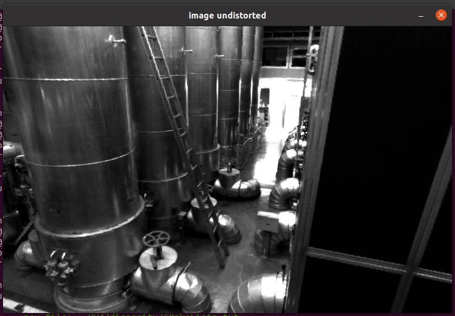
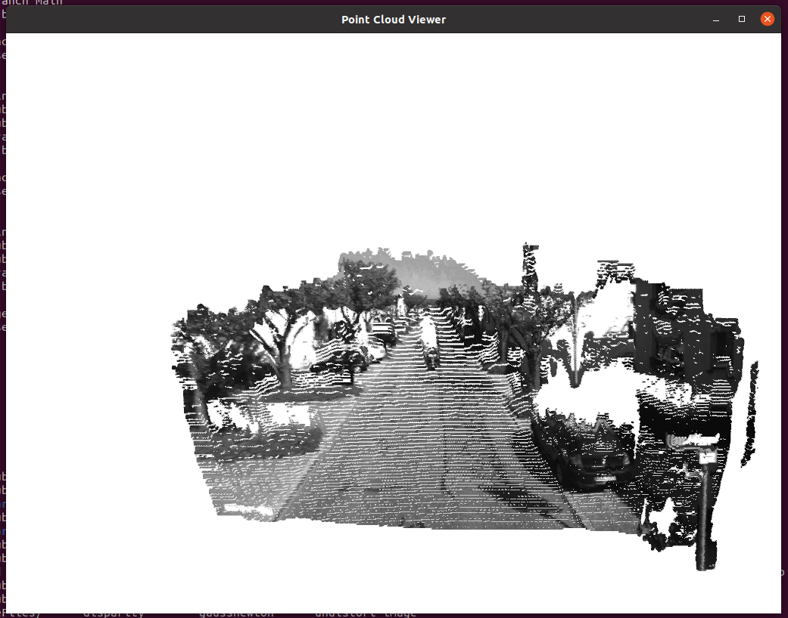

# HW4

非线性优化的作业需要用到`ceres`和`g2o`两个包，这两个包的安装步骤如下。

## ceres安装

參考[ceres文档](http://ceres-solver.org/installation.html)

安装Prerequisite：

```sh
sudo apt install libgoogle-glog-dev libgflags-dev -y
sudo apt install libatlas-base-dev -y
sudo apt install libsuitesparse-dev -y
```

安装ceres-solver：

```sh
git clone https://ceres-solver.googlesource.com/ceres-solver
cd ceres-solver/
mkdir build
cd build/
cmake ..
make -j8
make test
sudo make install
```

测试：

```sh
bin/simple_bundle_adjuster ../data/problem-16-22106-pre.txt
```

输出：

```
iter      cost      cost_change  |gradient|   |step|    tr_ratio  tr_radius  ls_iter  iter_time  total_time
   0  4.185660e+06    0.00e+00    1.09e+08   0.00e+00   0.00e+00  1.00e+04        0    7.52e-02    2.06e-01
   1  1.062590e+05    4.08e+06    8.99e+06   5.36e+02   9.82e-01  3.00e+04        1    1.36e-01    3.42e-01
   2  4.992817e+04    5.63e+04    8.32e+06   3.19e+02   6.52e-01  3.09e+04        1    1.30e-01    4.72e-01
   3  1.899774e+04    3.09e+04    1.60e+06   1.24e+02   9.77e-01  9.26e+04        1    1.29e-01    6.02e-01
   4  1.808729e+04    9.10e+02    3.97e+05   6.39e+01   9.51e-01  2.78e+05        1    1.29e-01    7.31e-01
   5  1.803399e+04    5.33e+01    1.48e+04   1.23e+01   9.99e-01  8.33e+05        1    1.29e-01    8.61e-01
   6  1.803390e+04    9.02e-02    6.35e+01   8.00e-01   1.00e+00  2.50e+06        1    1.28e-01    9.89e-01

Solver Summary (v 2.0.0-eigen-(3.3.7)-lapack-suitesparse-(5.7.1)-cxsparse-(3.2.0)-eigensparse-no_openmp)

                                     Original                  Reduced
Parameter blocks                        22122                    22122
Parameters                              66462                    66462
Residual blocks                         83718                    83718
Residuals                              167436                   167436

Minimizer                        TRUST_REGION

Dense linear algebra library            EIGEN
Trust region strategy     LEVENBERG_MARQUARDT

                                        Given                     Used
Linear solver                     DENSE_SCHUR              DENSE_SCHUR
Threads                                     1                        1
Linear solver ordering              AUTOMATIC                 22106,16
Schur structure                         2,3,9                    2,3,9

Cost:
Initial                          4.185660e+06
Final                            1.803390e+04
Change                           4.167626e+06

Minimizer iterations                        7
Successful steps                            7
Unsuccessful steps                          0

Time (in seconds):
Preprocessor                         0.130726

  Residual only evaluation           0.092829 (7)
  Jacobian & residual evaluation     0.389659 (7)
  Linear solver                      0.346584 (7)
Minimizer                            0.929677

Postprocessor                        0.003877
Total                                1.064283

Termination:                      CONVERGENCE (Function tolerance reached. |cost_change|/cost: 1.769764e-09 <= 1.000000e-06)
```

## g2o安装

安装Prerequisite：

```sh
sudo apt install cmake -y
sudo apt install libeigen3-dev -y
sudo apt install libsuitesparse-dev -y
sudo apt install qtdeclarative5-dev -y
sudo apt install qt5-qmake -y
sudo apt install libqglviewer-dev-qt5 -y
```

安装g2o：

```sh
git clone https://github.com/RainerKuemmerle/g2o.git
cd g2o/
mkdir build
cd build
cmake ..
make -j8
sudo make install
```

## 图像去畸变

`CMakeLists.txt`：由`disparity.cpp`，`undistort_image.cpp`，`guassnewton.cpp`三个程序共用。

```cmake
cmake_minimum_required(VERSION 3.0)
project(disparity)

# set(CMAKE_BUILD_TYPE "Release")
# set(CMAKE_CXX_FLAGS "-std=c++11 -O2")

find_package(OpenCV REQUIRED)
find_package(Pangolin REQUIRED)

include_directories("/usr/include/eigen3")
include_directories(${OpenCV_INCLUDE_DIRS})

add_executable(disparity disparity.cpp)
target_link_libraries(disparity ${Pangolin_LIBRARIES} ${OpenCV_LIBS})

add_executable(undistort_image undistort_image.cpp)
target_link_libraries(undistort_image ${OpenCV_LIBS})

add_executable(gaussnewton gaussnewton.cpp)
target_link_libraries(gaussnewton)
```

`undistort_image.cpp`

```cpp
double u_distorted = 0, v_distorted = 0;
// TODO 按照公式，计算点(u,v)对应到畸变图像中的坐标(u_distorted, v_distorted) (~6 lines)
// start your code here
// normalized, undistorted
double nux = (u-cx)/fx;
double nuy = (v-cy)/fy;
// distort it on normalized plane
// r^2 = nux^2 + nuy^2
double r2 = nux*nux + nuy*nuy;
double r4 = r2 * r2;
// ndx = nux(1+k1*r^2+k2*r^4) + 2*p1*nux*nuy + p2*(r^2+2*nux^2)
double ndx = nux*(1+k1*r2+k2*r4) + 2*p1*nux*nuy + p2*(r2+2*nux*nux);
// ndy = nuy(1+k1*r^2+k2*r^4) + 2*p2*nux*nuy + p1*(r^2+2*nuy^2)
double ndy = nuy*(1+k1*r2+k2*r4) + 2*p2*nux*nuy + p1*(r2+2*nuy*nuy);
// map normalized distorted point to image plane
// u = fx*ndx+cx
u_distorted = fx*ndx+cx;
// v = fy*ndy+cy
v_distorted = fy*ndy+cy;
// end your code here
```



## 双目视差的使用

`disparity.cpp`

```cpp
Vector4d point(0, 0, 0, left.at<uchar>(v, u) / 255.0); // 前三维为xyz,第四维为颜色

// start your code here (~6 lines)
// 根据双目模型计算 point 的位置
// depth = focal_length*baseline/disparity
point[2] = fx * d / disparity.at<uchar>(v, u); // because CV_8U from the hint
// u = fx * nx + cx -> nx = (u - cx)/fx
// v = fy * ny + cy -> ny = (v - cy)/fy
point[0] = (u - cx)/fx * point[2];
point[1] = (v - cy)/fy * point[2];
pointcloud.push_back(point);
// end your code here
```



## 矩阵运算微分

设变量为$x \in \R^N$，那么：

1. 矩阵$A \in \R^{N \times N}$，那么$\frac{d(Ax)}{dx}$是什么？

   $\frac{d(Ax)}{dx} = \frac{dA}{dx}x+A\frac{dx}{dx} = 0*x+A*1 = A$

2. 矩阵$A \in \R^{N \times N}$，那么$\frac{d(x^TAx)}{dx}$是什么？

   参考[Differentiate f(x)=xTAx](https://math.stackexchange.com/questions/312077/differentiate-fx-xtax/312083#312083)。

   在$A$为对称矩阵的情况下，假设$f(x) = x^TAx$，根据导数的定义：

   $\begin{align}\frac{df}{dx} &= \lim_{h \rightarrow 0} \frac{(x+h)^TA(x+h) - x^TAx}{h} \\&= \lim_{h \rightarrow 0} \frac{(x^TAx+x^TAh+h^TAx+h^TAh)-x^TAx}{h} \\&= \lim_{h \rightarrow 0} \frac{x^TAh+h^TAx+h^TAh}{h} \end{align}$

   因为$AB = (B^TA^T)^T$，且$h^TAx$为纯量，为对称矩阵，又$A$为对称矩阵，所以：

   $h^TAx = h^T(Ax) = ((Ax)^T(h^T)^T)^T = (Ax)^T(h^T)^T = x^TA^Th = x^TAh$

   $\begin{align}\frac{df}{dx} &= \lim_{h \rightarrow 0} \frac{x^TAh+h^TAx+h^TAh}{h} \\&= \lim_{h \rightarrow 0} \frac{2x^TAh+h^TAh}{h} \\&= 2x^TA \end{align}$

3. 证明：$x^TAx = tr(Axx^T)$

   参考[To Prove x′Ax=tr(xAx′)=tr(Axx′)=tr(xx′A)](https://math.stackexchange.com/questions/722299/to-prove-xax-mathrmtrxax-mathrmtraxx-mathrmtrxxa)及[矩阵求导公式的数学推导（矩阵求导——进阶篇）](https://zhuanlan.zhihu.com/p/288541909)。

   因为$x^TAx$是一个纯量，故$x^TAx = tr(x^TAx)$。

   又因为$tr(AB) = tr(BA), A_{m \times n}, B_{n \times m}$，所以：$tr(x^TAx) = tr(x^T(Ax)) = tr((Ax)x^T) = tr(Axx^T)$。

## 高斯牛顿法的曲线拟合实验

`gaussnewton.cpp`

```cpp
double error = 0;   // 第i个数据点的计算误差
error = yi - exp(ae*xi*xi + be*xi + ce); // 填写计算error的表达式
Vector3d J; // 雅可比矩阵
J[0] = -xi*xi*exp(ae*xi*xi + be*xi + ce);  // de/da
J[1] = -xi*exp(ae*xi*xi + be*xi + ce);  // de/db
J[2] = -exp(ae*xi*xi + be*xi + ce);  // de/dc


H += J * J.transpose(); // GN近似的H
b += -error * J;
```

```cpp
Vector3d dx;
dx = H.ldlt().solve(b);
```

运行结果：

```
total cost: 3.19575e+06
total cost: 376785
total cost: 35673.6
total cost: 2195.01
total cost: 174.853
total cost: 102.78
total cost: 101.937
total cost: 101.937
total cost: 101.937
cost: 101.937, last cost: 101.937
estimated abc = 0.890912, 2.1719, 0.943629
```

参考答案：$a = 0.890912, b = 2.1719, c = 0.943629$

## 批量最大似然估计

$x_k = x_{k-1} + v_k + w_k, \omega \text{~} N(0,Q)$

$y_k = x_k + n_k, n_k \text{~} n(0,R)$

$\bold{x} = [x_0, x_1, x_2, x_3]^T$

$\bold{z} = [v_1, v_2, v_3, y_1, y_2, y_3]^T$

1. 可以定义矩阵$\bold{H}$，使得批量误差为$\bold{e} = \bold{z} − \bold{H}\bold{x}$。请给出此处$\bold{H}$的具体形式。
2. 据上问，最大似然估计可转换为最小二乘问题：
   $\bold{x}^∗ = \arg \min \frac{1}{2}(\bold{z} − \bold{H}\bold{x})^T\bold{W}^{−1}(\bold{z} − \bold{H}\bold{x})$
   其中$\bold{W}$为此问题的信息矩阵，可以从最大似然的概率定义给出。请给出此问题下$\bold{W}$的具体取值。
3. 假设所有噪声相互无关，该问题存在唯一的解吗？若有，唯一解是什么？若没有，说明理由。

