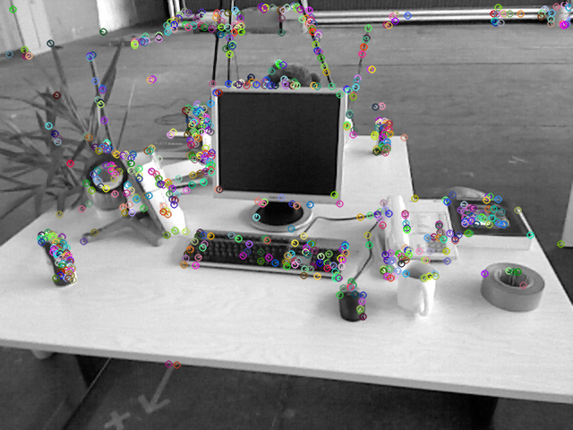
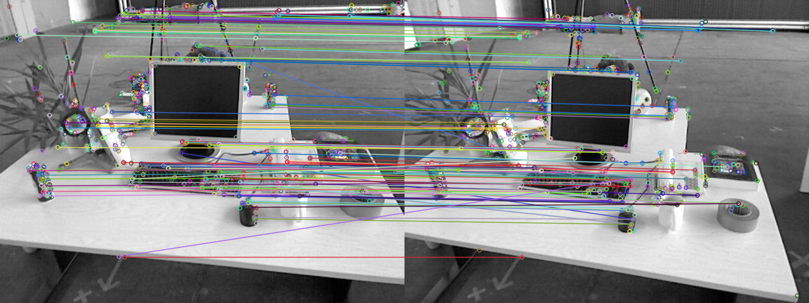
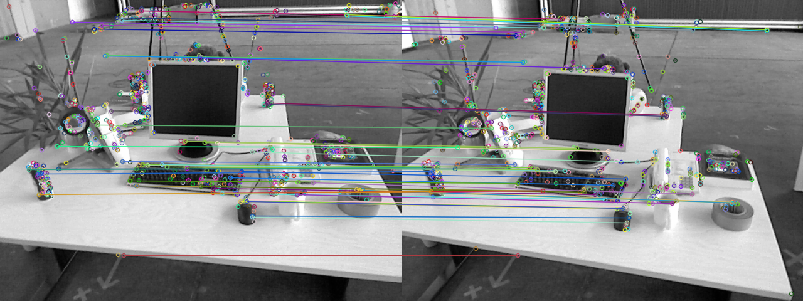
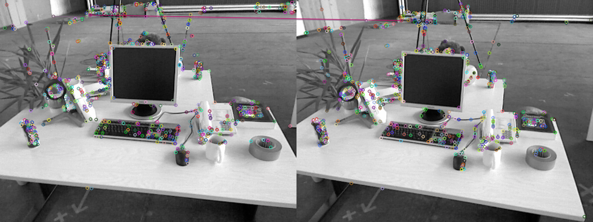
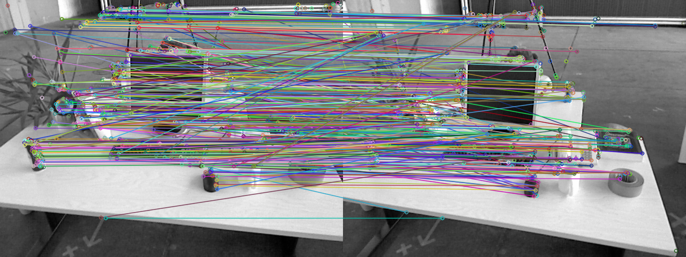
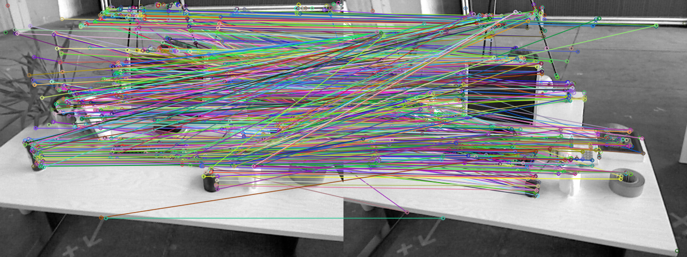
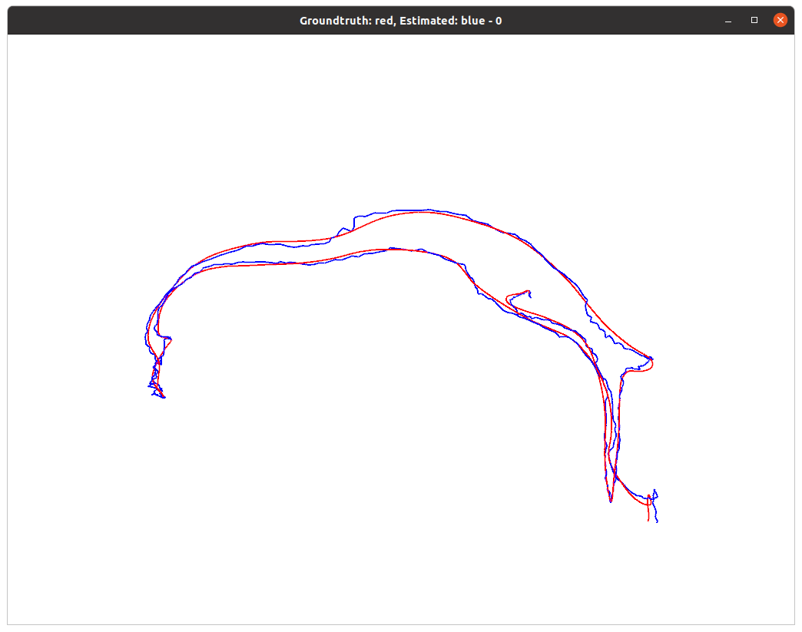
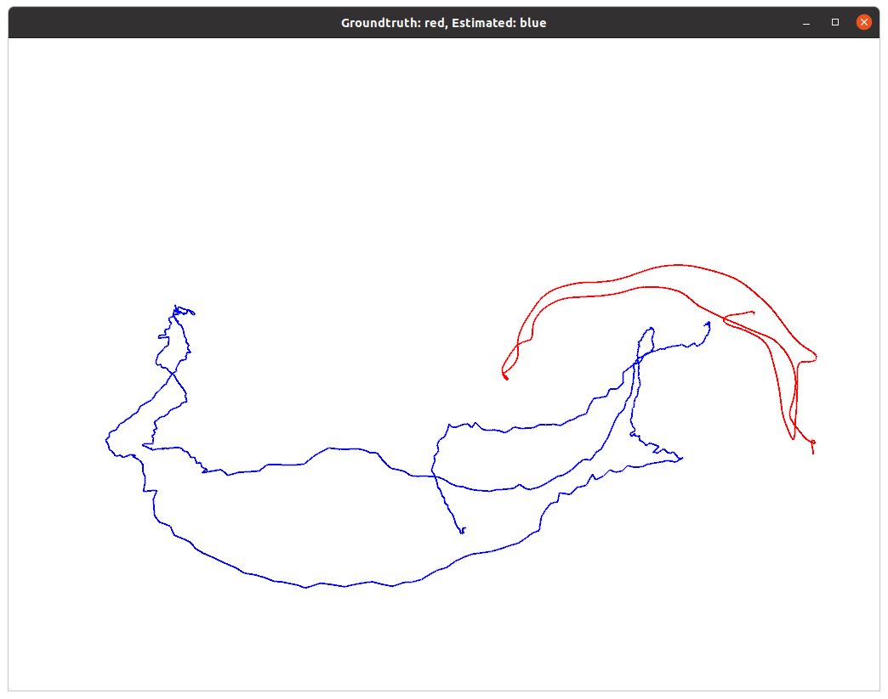

# HW5

## ORB 特征点

### ORB 提取

计算ORB的旋转：

```cpp
// -------------------------------------------------------------------------------------------------- //
int computeMoment(const cv::Mat &image, const int cx, const int cy,
    const int hl, const int p, const int q){
    // hl: half length of the patch
    int l = std::max(cx-hl, 0), r = std::min(cx+(hl-1), image.cols-1);
    int t = std::max(cy-hl, 0), b = std::min(cy+(hl-1), image.rows-1);
    int moment = 0;
    
    //https://stackoverflow.com/questions/25642532/opencv-pointx-y-represent-column-row-or-row-column
    for(int y = t; y <= b; ++y){
        for(int x = l; x <= r; ++x){
            if(p == 1 && q == 0){
                moment += image.at<uchar>(y, x) * x;
            }else if(p == 0 && q == 1){
                moment += image.at<uchar>(y, x) * y;
            }else if(p == 0 && q == 0){
                moment += image.at<uchar>(y, x);
            }else if(p == 1 && q == 1){
                moment += image.at<uchar>(y, x) * x * y;
            }
        }
    }

    return moment;
}

// compute the angle
void computeAngle(const cv::Mat &image, vector<cv::KeyPoint> &keypoints) {
    int half_patch_size = 8;
    for (auto &kp : keypoints) {
	    // START YOUR CODE HERE (~7 lines)
        int m10 = computeMoment(image, kp.pt.x, kp.pt.y, 8, 1, 0);
        int m01 = computeMoment(image, kp.pt.x, kp.pt.y, 8, 0, 1);
        int m00 = computeMoment(image, kp.pt.x, kp.pt.y, 8, 0, 0);
        // std::atan: return radian
        // cv::Point::angle: degree
        kp.angle = std::atan2(static_cast<double>(m10)/m00-kp.pt.y, 
            static_cast<double>(m01)/m00-kp.pt.x) / M_PI * 180.0;
        // kp.angle = std::atan(static_cast<double>(m01)/m10) / M_PI * 180.0; // compute kp.angle 
        // END YOUR CODE HERE
    }
    return;
}
```


### ORB 描述

ORB 描述的计算：

以下是一开始写出的代码：

```cpp
// compute the descriptor
void computeORBDesc(const cv::Mat &image, vector<cv::KeyPoint> &keypoints, vector<DescType> &desc) {
    for (auto &kp: keypoints) {
        DescType d(256, false);
        for (int i = 0; i < 256; i++) {
            // START YOUR CODE HERE (~7 lines)
            int cx = kp.pt.x, cy = kp.pt.y;
            int px = cx + ORB_pattern[i*4], py = cy + ORB_pattern[i*4+1];
            int qx = cx + ORB_pattern[i*4+2], qy = cy + ORB_pattern[i*4+3];
            double angle_rad = kp.angle / 180.0 * M_PI;
            int px_rot = std::round(std::cos(angle_rad) * px - std::sin(angle_rad) * py);
            int py_rot = std::round(std::sin(angle_rad) * px + std::cos(angle_rad) * py);
            int qx_rot = std::round(std::cos(angle_rad) * qx - std::sin(angle_rad) * qy);
            int qy_rot = std::round(std::sin(angle_rad) * qx + std::cos(angle_rad) * qy);
            if(px_rot < 0 || px_rot >= image.cols || py_rot < 0 || py_rot >= image.rows ||
               qx_rot < 0 || qx_rot >= image.cols || qy_rot < 0 || qy_rot >= image.rows){
                // if kp goes outside, set d.clear()
                d.clear();
                break;
            }
            d[i] = !(image.at<uchar>(py_rot, px_rot) > image.at<uchar>(qy_rot, qx_rot));
	        // END YOUR CODE HERE
        }
        desc.push_back(d);
    }

    int bad = 0;
    for (auto &d: desc) {
        if (d.empty()) bad++;
    }
    cout << "bad/total: " << bad << "/" << desc.size() << endl;
    return;
}
```

上面的代码犯了一个错：先把`ORB_pattern`的offset加到特征点坐标上再做旋转。应该是先对`ORB_pattern`做旋转，再把旋转后的offset加到特征点坐标上才对。

以下是修正后的代码：

```cpp
void computeORBDesc(const cv::Mat &image, vector<cv::KeyPoint> &keypoints, vector<DescType> &desc) {
    for (auto &kp: keypoints) {
        DescType d(256, false);
        for (int i = 0; i < 256; i++) {
            // START YOUR CODE HERE (~7 lines)
            int cx = kp.pt.x, cy = kp.pt.y;
            double angle_rad = kp.angle / 180.0 * M_PI;
            double cos_theta = std::cos(angle_rad), sin_theta = std::sin(angle_rad);
            int pox = std::round(cos_theta * ORB_pattern[i*4] - sin_theta * ORB_pattern[i*4+1]);
            int poy = std::round(sin_theta * ORB_pattern[i*4] + cos_theta * ORB_pattern[i*4+1]);
            int qox = std::round(cos_theta * ORB_pattern[i*4+2] - sin_theta * ORB_pattern[i*4+3]);
            int qoy = std::round(sin_theta * ORB_pattern[i*4+2] + cos_theta * ORB_pattern[i*4+3]);
            int px_rot = cx + pox;
            int py_rot = cy + poy;
            int qx_rot = cx + qox;
            int qy_rot = cy + qoy;
            if(px_rot < 0 || px_rot >= image.cols || py_rot < 0 || py_rot >= image.rows ||
               qx_rot < 0 || qx_rot >= image.cols || qy_rot < 0 || qy_rot >= image.rows){
                // if kp goes outside, set d.clear()
                d.clear();
                break;
            }
            d[i] = !(image.at<uchar>(py_rot, px_rot) > image.at<uchar>(qy_rot, qx_rot));
	        // END YOUR CODE HERE
        }
        desc.push_back(d);
    }

    int bad = 0;
    for (auto &d: desc) {
        if (d.empty()) bad++;
    }
    cout << "bad/total: " << bad << "/" << desc.size() << endl;
    return;
}
```

### 暴力匹配

暴力匹配：

```cpp
// brute-force matching
void bfMatch(const vector<DescType> &desc1, const vector<DescType> &desc2, vector<cv::DMatch> &matches) {
    int d_max = 50;

    // START YOUR CODE HERE (~12 lines)
    // find matches between desc1 and desc2. 
    size_t i, j;
    for(i = 0; i < desc1.size(); ++i){
        if(desc1[i].empty()) continue;
        int minj = -1, mind = std::numeric_limits<int>::max();
        for(j = 0; j < desc2.size(); ++j){
            if(desc2[j].empty()) continue;
            int d = 0;
            for(size_t k = 0; k < desc1[i].size(); ++k){
                d += (desc1[i][k] != desc2[j][k]);
            }
            if(d < mind){
                minj = j;
                mind = d;
            }
        }
        if(mind < d_max){
            matches.push_back(cv::DMatch(i, minj, mind));
        }
    }
    // END YOUR CODE HERE

    for (auto &m: matches) {
        cout << m.queryIdx << ", " << m.trainIdx << ", " << m.distance << endl;
    }
    return;
}
```

### 运行结果





```
bad/total: 43/638
keypoints: 595
bad/total: 7/595
extract ORB cost = 0.0126146 seconds. 
match ORB cost = 0.135926 seconds. 
matches: 106
done.
```

1. 为什么说 ORB 是一种二进制特征？

   如果用一个bit表示BRIEF描述里的一次像素间的比较，那么整个ORB特征便可以用256或128 bit的空间表示，每个bit都有其意义。

2. 为什么在匹配时使用 50 作为阈值，取更大或更小值会怎么样？

   `d_max`越小表示标准越严格，所以匹配对会变少；`d_max`越大表示标准越宽松，所以匹配对会变多。

   以下是取`d_max`为40及20的结果。

   

   

   以下是取`d_max`为800及100的结果。

   

   可以印证上面的结论。

3. 暴力匹配在你的机器上表现如何？你能想到什么减少计算量的匹配方法吗？  

   暴力匹配在我的机器上花了0.13秒。参考[OpenCV - Feature Matching](https://docs.opencv.org/master/dc/dc3/tutorial_py_matcher.html)，可以把ORB特征当成128维空间里的点，因此可以为空间中的所有点建立一个tree，然后使用KNN进行搜索。

## 从 E 恢复 R, t

对 E 作 SVD 分解

```cpp
// SVD and fix sigular values
// START YOUR CODE HERE
JacobiSVD<Matrix3d> svd(E, ComputeFullU | ComputeFullV);
Matrix3d U = svd.matrixU();
Matrix3d V = svd.matrixV();
Vector3d Sing = svd.singularValues();
```

处理 Σ 的奇异值

```cpp
Eigen::DiagonalMatrix<double, 3> S((Sing[0]+Sing[1])/2, (Sing[0]+Sing[1])/2, 0);
// END YOUR CODE HERE
```

共存在四个可能的解

```cpp
// set t1, t2, R1, R2 
// START YOUR CODE HERE
// compute rotation matrix from Sophus::SO3d?
// (x, y) -> (-y, x)
Matrix3d Rz_p90 = AngleAxisd(M_PI/2.0, Vector3d(0, 0, 1)).toRotationMatrix();
// (x, y) -> (y, -x)
Matrix3d Rz_n90 = AngleAxisd(-M_PI/2.0, Vector3d(0, 0, 1)).toRotationMatrix();
cout << "Rotate 90: " << endl << Rz_p90 << endl;
cout << "Rotate -90: " << endl << Rz_n90 << endl;
// t_wedge1 = t_wedge2 * (-1)
Matrix3d t_wedge1 = U * Rz_p90 * S * U.transpose(); //上尖尖
Matrix3d t_wedge2 = U * Rz_n90 * S * U.transpose();

Matrix3d R1 = U * Rz_p90.transpose() * V.transpose();
Matrix3d R2 = U * Rz_n90.transpose() * V.transpose();

cout << "R1 = " << endl << R1 << endl;
cout << "R2 = " << endl << R2 << endl;
cout << "t1 = " << Sophus::SO3d::vee(t_wedge1).transpose() << endl;
cout << "t2 = " << Sophus::SO3d::vee(t_wedge2).transpose() << endl;
// END YOUR CODE HERE
```

验证 t^R 应该与 E 只差一个乘法因子：

加入以下代码验证：

```cpp
Array33d arr_E(E);
Array33d arr_tR1(tR1);
Array33d arr_tR2(tR2);
Array33d arr_tR3(tR3);
Array33d arr_tR4(tR4);

cout << "t^R(1) = " << endl << tR1 << endl << "ratio w/ E:" << endl << arr_tR1 / arr_E << endl;
cout << "t^R(2) = " << endl << tR2 << endl << "ratio w/ E:" << endl << arr_tR2 / arr_E << endl;
cout << "t^R(3) = " << endl << tR3 << endl << "ratio w/ E:" << endl << arr_tR3 / arr_E << endl;
cout << "t^R(4) = " << endl << tR4 << endl << "ratio w/ E:" << endl << arr_tR4 / arr_E << endl;
```

输出为：

```
t^R(1) = 
 -0.0203619   -0.400711  -0.0332407
   0.393927   -0.035064    0.585711
-0.00678849   -0.581543  -0.0143826
ratio w/ E:
1 1 1
1 1 1
1 1 1
t^R(2) = 
 0.0203619   0.400711  0.0332407
 -0.393927   0.035064  -0.585711
0.00678849   0.581543  0.0143826
ratio w/ E:
-1 -1 -1
-1 -1 -1
-1 -1 -1
t^R(3) = 
 0.0203619   0.400711  0.0332407
 -0.393927   0.035064  -0.585711
0.00678849   0.581543  0.0143826
ratio w/ E:
-1 -1 -1
-1 -1 -1
-1 -1 -1
t^R(4) = 
 -0.0203619   -0.400711  -0.0332407
   0.393927   -0.035064    0.585711
-0.00678849   -0.581543  -0.0143826
ratio w/ E:
1 1 1
1 1 1
1 1 1
```

可以看到在四组估计出来的$t\text{^}R$中，有两个与基础矩阵一致，另外两个与基础矩阵差了一个系数-1。

## 用 G-N 实现 Bundle Adjustment 中的位姿估计

读取三维点和二维点坐标：

```cpp
// load points in to p3d and p2d 
// START YOUR CODE HERE
std::ifstream infile(p3d_file);
double x, y, z;
while (infile >> x >> y >> z){
    p3d.emplace_back(x, y, z);
}
infile = ifstream(p2d_file);
while (infile >> x >> y){
    p2d.emplace_back(x, y);
}

// END YOUR CODE HERE
```

计算重投影误差和Jacobian：

```cpp
// compute cost for p3d[I] and p2d[I]
// START YOUR CODE HERE 
// world coord -> camera coord: P'
Vector3d p3d_cam = T_esti.rotationMatrix() * p3d[i] + T_esti.translation(); //T_esti * p3d[i];?
// depth: p3d_cam[2], not p3d[i][2]!
Vector2d e = p2d[i] - (1/p3d_cam[2] * K * p3d_cam).block<2,1>(0,0);
cost += pow(e.norm(), 2);
// END YOUR CODE HERE

// compute jacobian
Matrix<double, 2, 6> J;
// START YOUR CODE HERE 
double Xp = p3d_cam.coeff(0), Yp = p3d_cam.coeff(1), Zp = p3d_cam.coeff(2);
J(0, 0) = fx / Zp;
J(0, 1) = 0;
J(0, 2) = -fx * Xp/ (Zp * Zp);
J(0, 3) = -fx * Xp * Yp / (Zp * Zp);
J(0, 4) = fx + fx * Xp * Xp / (Zp * Zp);
J(0, 5) = -fx * Yp / Zp;
J(1, 0) = 0;
J(1, 1) = fy / Zp;
J(1, 2) = -fy * Yp / (Zp * Zp);
J(1, 3) = -fy - fy * Yp * Yp / (Zp * Zp);
J(1, 4) = fy * Xp * Yp / (Zp * Zp);
J(1, 5) = fy * Xp / Zp;
J *= -1;
// END YOUR CODE HERE
```

求解更新量：

```cpp
// solve dx 
Vector6d dx;

// START YOUR CODE HERE 
dx = H.ldlt().solve(b);
// cout << "dx: " << dx.transpose() << endl;
// END YOUR CODE HERE
```

将更新量更新至之前的估计上：

```cpp
// update your estimation
// START YOUR CODE HERE 
// xi: [translation, rotation]
T_esti.translation() += dx.head(3);
// T_esti.rotationMatrix() returns const, it can't be updated!
T_esti.setRotationMatrix(Sophus::SE3d::exp(dx.tail(3)).rotationMatrix() * T_esti.rotationMatrix()); //?
// END YOUR CODE HERE
```

1. 如何定义重投影误差？

   对于单对点：$e_i = u_i - \frac{1}{s_i} K \exp(\xi^\text{^})P_i$

   综合所有点：$\frac{1}{2} \sum_{i=1}^n \Vert u_i - \frac{1}{s_i} K \exp(\xi^\text{^})P_i\Vert$

2. 该误差关于自变量的雅可比矩阵是什么？

   $\frac {\partial e}{\partial \delta \xi} = - \begin{bmatrix} \frac{f_x}{Z'} & 0 & -\frac{f_xX'}{Z'^2} & -\frac{f_xX'Y'}{Z'^2} & f_x + \frac{f_xX'^2}{Z'^2} & -\frac{f_xY'}{Z'} \\ 0 & \frac{f_y}{Z'} & -\frac{f_yY'}{Z'^2} & -f_y + \frac{f_yY'^2}{Z'^2} & \frac{f_yX'Y'}{Z'^2} & \frac{f_yX'}{Z'} \end{bmatrix}$

3. 解出更新量之后，如何更新至之前的估计上？  

   令更新量为`dx`，它是一个长度为6的向量，前三个元素代表平移，后三个代表旋转的李代数。

   令之前的估计为`T_esti`，它是一个4 * 4的变换矩阵，包含一个平移向量和一个旋转矩阵。平移向量的更新：把`dx`的前三个元素加到之前估计的平移向量上；旋转矩阵的更新：对`dx`里的$so(3)$使用指数映射转成旋转矩阵后，左乘到之前的旋转矩阵上。

## 用 ICP 实现轨迹对齐

使用SVD分解来对齐两个三维点云的函数：

```cpp
void pose_estimation_3d3d(const VecVector3f &pts1,
                          const VecVector3f &pts2,
                          Eigen::Matrix3f &R, Eigen::Vector3f &t) {
  Eigen::Vector3f p1 = Eigen::Vector3f::Zero(), p2 = Eigen::Vector3f::Zero();     // center of mass
  int N = pts1.size();
  for (int i = 0; i < N; i++) {
    p1 += pts1[i];
    p2 += pts2[i];
  }
  p1 /= N;
  p2 /= N;
  cout << "cloud 1 centroid: " << p1.transpose() << endl;
  cout << "cloud 2 centroid: " << p2.transpose() << endl;

  VecVector3f q1(N), q2(N); // remove the center
  for (int i = 0; i < N; i++) {
    q1[i] = pts1[i] - p1;
    q2[i] = pts2[i] - p2;
  }

  // compute q1*q2^T
  // W = sigma (q1i * q2i^T)
  Eigen::Matrix3f W = Eigen::Matrix3f::Zero();
  for (int i = 0; i < N; i++) {
    W += q1[i] * q2[i].transpose();
  }
  cout << "W=" << W << endl;

  // SVD on W
  Eigen::JacobiSVD<Eigen::Matrix3f> svd(W, Eigen::ComputeFullU | Eigen::ComputeFullV);
  Eigen::Matrix3f U = svd.matrixU();
  Eigen::Matrix3f V = svd.matrixV();

  cout << "U=" << U << endl;
  cout << "V=" << V << endl;

  // 用SVD求解R = U * V^T
  R = U * (V.transpose());
  // 如果R_的判別式小於0,則把它乘上-1,使它變為一個旋轉矩陣.
  // 還可以這樣?
  if (R.determinant() < 0) {
    R = -R;
  }
  /**
   * p1: target
   * p2: source
   * 取t = p1 - Rp2
   **/
  t = p1 - R * p2;

}
```

读取`compare.txt`并实际调用该函数：

```cpp
int main(int argc, char **argv) {

    vector<Sophus::SE3f, Eigen::aligned_allocator<Sophus::SE3f>> traj_est;
    vector<Sophus::SE3f, Eigen::aligned_allocator<Sophus::SE3f>> traj_gt;

    // load points in to p3d and p2d 
    // START YOUR CODE HERE
    std::ifstream infile(traj_file);
    // quaternion order: (s, v) or (v, s)
    double te, xe, ye, ze, qxe, qye, qze, qse;
    double tg, xg, yg, zg, qxg, qyg, qzg, qsg;
    while (infile >> te >> xe >> ye >> ze >> qxe >> qye >> qze >> qse
                  >> tg >> xg >> yg >> zg >> qxg >> qyg >> qzg >> qsg){
        traj_est.push_back(Sophus::SE3f(Eigen::Quaternionf(qse, qxe, qye, qze), Eigen::Vector3f(xe, ye, ze)));
        traj_gt.push_back(Sophus::SE3f(Eigen::Quaternionf(qsg, qxg, qyg, qze), Eigen::Vector3f(xg, yg, zg)));
    }

    // END YOUR CODE HERE
    assert(traj_est.size() == traj_gt.size());
    // cout << "There are " << traj_gt.size() << " points." << endl;

    DrawTwoTrajectories(traj_gt, traj_est);

    VecVector3f pts1, pts2;
    for(size_t i = 0; i < traj_gt.size(); ++i){
        Eigen::Vector3f traj_gt_pt = traj_gt[i].translation();
        Eigen::Vector3f traj_est_pt = traj_est[i].translation();
        pts1.push_back(traj_gt_pt);
        pts2.push_back(traj_est_pt);
    }
    Eigen::Matrix3f R;
    Eigen::Vector3f t;
    pose_estimation_3d3d(pts1, pts2, R, t);
    cout << "ICP via SVD results: " << endl;
    // p1 = R*p2+t
    cout << "R = " << R << endl;
    cout << "t = " << t.transpose() << endl;
    // p2 = R^(-1) * (p1-t) = R^(-1) * p1 - R^(-1) * t
    cout << "R_inv = " << R.transpose() << endl;
    cout << "t_inv = " << (-R.transpose() * t).transpose() << endl;

    Sophus::SE3f T = Sophus::SE3f(Sophus::Matrix3f(R), Sophus::Vector3f(t));
    vector<Sophus::SE3f, Eigen::aligned_allocator<Sophus::SE3f>> traj_est_aligned;
    for(Sophus::SE3f& pt : traj_est){
        traj_est_aligned.push_back((T * pt));
    }
    DrawTwoTrajectories(traj_gt, traj_est_aligned, 0);

    return 0;
}
```

输出如下：

```
cloud 1 centroid:  0.500963 0.0945366   1.45892
cloud 2 centroid:  -1.26923  0.330327 -0.246748
W= 476.886  31.8491 -128.091     
 88.5151 -39.3438  34.6775                   
-3.32442 -8.22009 -1.70678                                                                           
U=   0.988585    -0.15011   -0.012898            
   0.150525    0.987718   0.0419041                                                                  
-0.00644937   0.0433672   -0.999038                                                                  
V= 0.968776  0.221249  0.111903
0.0511905 -0.620096  0.782854                                                                        
-0.242596  0.752682   0.61206                                                                        
ICP via SVD results:                                                                                 
R =  0.923063  0.133592 -0.360707
 0.369046  -0.57197  0.732568                
-0.108448 -0.809323 -0.577265
t =   1.5394 0.932636  1.44618
R_inv =  0.923063  0.369046 -0.108448                                                                
 0.133592  -0.57197 -0.809323                                                                        
-0.360707  0.732568 -0.577265
t_inv = -1.60832  1.49822 0.706884
```

运行结果如下：

<p float="left">
  
  
</p>

