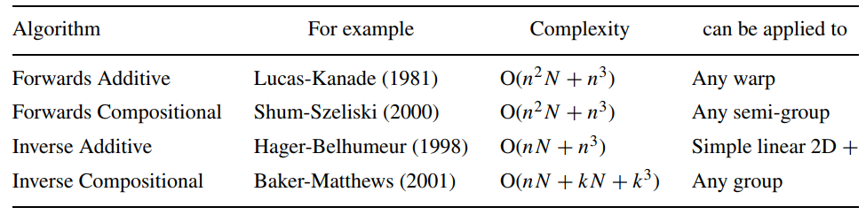

# HW6

## LK 光流

### 光流文献综述

1. 按此文的分类，光流法可分为哪几类？

   摘自论文原文：

   ```
   We categorize algorithms as either additive or compositional, and as either forwards or inverse.
   ```

   光流法可分为additive或compositional，亦可分为forward或inverse，2*2共4类。

2. 在 compositional 中，为什么有时候需要做原始图像的 wrap？该 wrap 有何物理意义？

   摘自论文，关于forward compositional方法的可用范围：

   ```
   The set of warps must therefore form a semi-group. This requirement is not very strong. Most warps used in computer vision, including homographies and 3D rotations (Shum and Szeliski, 2000), naturally form semi-groups.
   ```

   包括单应矩阵和三维旋转矩阵。

   摘自论文，关于inverse compositional方法的可用范围：

   ```
   The inverse compositional algorithm can therefore only be applied to sets of warps that form a group. Fortunately, most warps used in computer vision, including homographies and 3D rotations (Shum and Szeliski, 2000), do form groups. One notable exception are the piecewise affine warps used in Active Appearance Models (AAMs)  (Cootes et al., 1998), Active Blobs (Sclaroff and Isidoro, 1998), and Flexible Appearance Models (FAMs) (Baker and Matthews, 2001).
   ```

   包括单应矩阵和三维旋转矩阵，但piecewise affine warps则是例外。

   论文中还有以下表格：

   

   由此可知，如果要寻找的warp不在上述范围内，使用compositional方法无法对它进行优化。这时候一个做法是先对原始图像做一次warp，使得由变换后的原始图像到目标图像的warp落在上述范围内，这样一来，我们就可以使用compositional方法来寻找该warp最优的参数。

3. forward 和 inverse 有何差别？

   forward的代表LK光流法：$\sum \limits_x [I (W(x; p)) - T (x)]^2$。

   ```
   The goal of Lucas-Kanade is to align a template image T (x) to an input image I (x)
   ```
   
   假设原始图像$T$上的关键点坐标为$x$，LK光流法会寻找一个warp $W$，使得图像$I$上的$W(x; p)$点与该关键点的光度最为相似。
   
   inverse：调换$T$与$I$的角色。
   
   ```
   The key to efficiency is switching the role of the image and the template, as in Hager and Belhumeur (1998), where a change of variables is made to switch or invert the roles of the template and the image.
   ```

### forward-addtive Gauss-Newton 光流的实现

```cpp
void OpticalFlowSingleLevel(
        const Mat &img1,
        const Mat &img2,
        const vector<KeyPoint> &kp1,
        vector<KeyPoint> &kp2,
        vector<bool> &success,
        bool inverse
) {

    // parameters
    int half_patch_size = 4;
    int iterations = 10;
    bool have_initial = !kp2.empty();

    for (size_t i = 0; i < kp1.size(); i++) {
        auto kp = kp1[i];
        double dx = 0, dy = 0; // dx,dy need to be estimated
        if (have_initial) {
            dx = kp2[i].pt.x - kp.pt.x;
            dy = kp2[i].pt.y - kp.pt.y;
        }

        double cost = 0, lastCost = 0;
        bool succ = true; // indicate if this point succeeded

        // Gauss-Newton iterations
        /**
         * J^T * J * dx = - J^T * f
         **/
        for (int iter = 0; iter < iterations; iter++) {
            Eigen::Matrix2d H = Eigen::Matrix2d::Zero();
            Eigen::Vector2d b = Eigen::Vector2d::Zero();
            cost = 0;

            /**
             * kp.pt.x + dx - (half_patch_size-1) < 0
             * kp.pt.x + dx + half_patch_size >= img1.cols
             **/
            if (kp.pt.x + dx <= half_patch_size || kp.pt.x + dx >= img1.cols - half_patch_size ||
                kp.pt.y + dy <= half_patch_size || kp.pt.y + dy >= img1.rows - half_patch_size) {   // go outside
                succ = false;
                break;
            }

            // compute cost and jacobian
            for (int x = -half_patch_size; x < half_patch_size; x++)
                for (int y = -half_patch_size; y < half_patch_size; y++) {

                    // TODO START YOUR CODE HERE (~8 lines)
                    // (+x,+y): move from the patch's center to the specific point on a patch
                    double error = GetPixelValue(img1, kp.pt.x+x, kp.pt.y+y) -
                        GetPixelValue(img2, kp.pt.x+dx+x, kp.pt.y+dy+y);
                    Eigen::Vector2d J;  // Jacobian
                    if (inverse == false) {
                        // Forward Jacobian
                        /**
                         * J = [d(I2(x,y))/dx, d(I2(x,y))/dy]
                         **/
                        // J(0) = (GetPixelValue(img2, kp.pt.x+dx+x+1, kp.pt.y+dy+y) - GetPixelValue(img2, kp.pt.x+dx+x, kp.pt.y+dy+y)); //and then divided by 1?
                        // J(1) = (GetPixelValue(img2, kp.pt.x+dx+x, kp.pt.y+dy+y+1) - GetPixelValue(img2, kp.pt.x+dx+x, kp.pt.y+dy+y));
                        // compute Jacobian with 3 neighboring pixels gives better result
                        J(0) = 0.5 * (GetPixelValue(img2, kp.pt.x+dx+x+1, kp.pt.y+dy+y) - GetPixelValue(img2, kp.pt.x+dx+x-1, kp.pt.y+dy+y));
                        J(1) = 0.5 * (GetPixelValue(img2, kp.pt.x+dx+x, kp.pt.y+dy+y+1) - GetPixelValue(img2, kp.pt.x+dx+x, kp.pt.y+dy+y-1));
                    } else {
                        // Inverse Jacobian
                        // NOTE this J does not change when dx, dy is updated, so we can store it and only compute error
                        /**
                         * J is the graident of T = (Tx, Ty)
                         * J = [d(I1(x,y))/dx, d(I1(x,y))/dy], 1 x 2
                         **/
                        // J(0) = (GetPixelValue(img1, kp.pt.x+dx+x+1, kp.pt.y+dy+y) - GetPixelValue(img1, kp.pt.x+dx+x, kp.pt.y+dy+y)); //and then divided by 1?
                        // J(1) = (GetPixelValue(img1, kp.pt.x+dx+x, kp.pt.y+dy+y+1) - GetPixelValue(img1, kp.pt.x+dx+x, kp.pt.y+dy+y));
                        J(0) = 0.5 * (GetPixelValue(img1, kp.pt.x+dx+x+1, kp.pt.y+dy+y) - GetPixelValue(img1, kp.pt.x+dx+x-1, kp.pt.y+dy+y));
                        J(1) = 0.5 * (GetPixelValue(img1, kp.pt.x+dx+x, kp.pt.y+dy+y+1) - GetPixelValue(img1, kp.pt.x+dx+x, kp.pt.y+dy+y-1));
                    }

                    // compute H, b and set cost;
                    /**
                     * J is a 1 x 2 row vector
                     * H is a 2 x 2 matrix
                     * b is a 1 x 2 row vector
                     *
                     * in forward method:
                     * H is J^T * J
                     * b is (I1(x, y) - I2(x,y))*J
                     *
                     * in inverse method:
                     * H is J^T * J
                     * b is -I1(x, y) * I2(x, y) * J
                     **/
                    H += J * J.transpose();
                    /**
                     * inverse mode:
                     * it should be b -= ... here and (dx, dy) -= update,
                     * but two negatives make a positive,
                     * so it becomes b += ... and (dx, dy) += update
                     **/
                    b += error * J;
                    cost += error * error;
                    // TODO END YOUR CODE HERE
                }

            // compute update
            // TODO START YOUR CODE HERE (~1 lines)
            Eigen::Vector2d update;
            update = H.ldlt().solve(b);
            // TODO END YOUR CODE HERE

            if (isnan(update[0])) {
                // sometimes occurred when we have a black or white patch and H is irreversible
                cout << "update is nan" << endl;
                succ = false;
                break;
            }
            if (iter > 0 && cost > lastCost) {
                cout << "cost increased: " << cost << ", " << lastCost << endl;
                break;
            }

            // update dx, dy
            dx += update[0];
            dy += update[1];
            lastCost = cost;
            succ = true;
        }

        success.push_back(succ);

        // set kp2
        if (have_initial) {
            kp2[i].pt = kp.pt + Point2f(dx, dy);
        } else {
            KeyPoint tracked = kp;
            tracked.pt += cv::Point2f(dx, dy);
            kp2.push_back(tracked);
        }
    }

    int success_count = 0;
    for(int i = 0; i < success.size(); ++i){
        if(success[i]) success_count++;
    }
    cout << success_count << "/" << success.size() << endl;
}
```

1. 从最小二乘角度来看，每个像素的误差怎么定义？

   为了与论文中使用的符号一致，将$I_1$，$I_2$分别改用$T$，$I$表示。$(x_i, y_i)$用$\bold{x}$表示，$(\Delta x_i, \Delta y_i)$用$\bold{p}$表示。

   整体误差：$\min\limits_{\Delta x_i,\Delta y_i} \sum \limits_W \|T(x_i,y_i) - I(x_i + \Delta x_i, y_i + \Delta y_i)\|_2^2 = \min\limits_{\bold{p}} \sum \limits_W \|T(\bold{x}) - I(\bold{x}+\bold{p})\|_2^2$

   每个像素的误差：$\|T(x_i,y_i) - I(x_i + \Delta x_i, y_i + \Delta y_i)\|_2^2 = \|T(\bold{x}) - I(\bold{x}+\bold{p})\|_2^2$。

   对应代码中的：

   ```cpp
   double error = GetPixelValue(img1, kp.pt.x+x, kp.pt.y+y) -
                  GetPixelValue(img2, kp.pt.x+dx+x, kp.pt.y+dy+y);
   //...
   cost += error * error;
   ```

2. 误差相对于自变量的导数如何定义？  

   首先确定$T$及$I$都是有两个自变量（$\Delta  \bold{p}$的长度）及一个应变量（光度）的函数。

   误差函数为：$\|T(\bold{x}) - I(\bold{x} + \bold{p} + \Delta \bold{p})\|_2^2$。

   $T$不受$\Delta \bold{p}$影响，所以$\frac{\partial T(\bold{x})}{\partial \Delta \bold{p}} = 0$。

   高斯牛顿法一阶近似：$I(\bold{x} + \bold{p} + \Delta \bold{p}) \approx I(\bold{x} + \bold{p}) + J(\bold{x} + \bold{p}) \Delta \bold{p}$，其中$J(\bold{x} + \bold{p})= \nabla I(\bold{x} + \bold{p}) = (\frac {\partial {I(\bold{x + \bold{p}})}}{\partial x_i}, \frac {\partial {I(\bold{x} + \bold{p})}}{\partial y_i})$。

   误差：

   $\begin{align}\|T(\bold{x}) - I(\bold{x} + \bold{p} + \Delta \bold{p})\|_2^2 &\approx \|T(\bold{x}) - (I(\bold{x} + \bold{p}) + J(\bold{x} + \bold{p}) \Delta \bold{p})\|_2^2 \\&= T^2 - 2T(I + J\Delta\bold{p}) + (I^2 + 2IJ\Delta\bold{p} + \Delta\bold{p}^TJ^TJ\Delta\bold{p})\end{align}$

   $\frac{\partial \|T(\bold{x}) - I(\bold{x} + \bold{p}+ \Delta\bold{p})\|_2^2}{\partial \Delta\bold{p}} \approx - 2TJ + 2IJ + 2J^TJ\Delta\bold{p}$
   
   继续推导，令上式为0得到：$J^TJ\Delta\bold{p} = TJ - IJ = (T - I) J$，代表高斯牛顿法中的Hessian矩阵是由$J^TJ$近似，bias则为$(T-I)J$。
   
   可以对应到代码中的：
   
   ```cpp
   for (int x = -half_patch_size; x < half_patch_size; x++)
       for (int y = -half_patch_size; y < half_patch_size; y++) {
           H += J * J.transpose();
           b += error * J;
           cost += error * error;
       }
   }
   
   Eigen::Vector2d update;
   update = H.ldlt().solve(b);
   ```

### 反向法

- forward additive推导

  论文中forward additive方法要最小化的函数：

  $\sum \limits_\bold{x}  [I(\bold{W}(\bold{x};\bold{p} + \Delta \bold{p})) - T(\bold{x})]^2 = \sum \limits_\bold{x}  [I(\bold{W}(\bold{x};\bold{p})) + \nabla I \frac{\partial \bold{W}}{\partial \bold{p}}\Delta \bold{p} - T(\bold{x})]^2$，其中$\nabla I = (\frac{\partial I}{\partial x},\frac{\partial I}{\partial y})$。

  在本题中$\bold{W}(\bold{x}; \bold{p}) = \bold{x} + \bold{p}$，所以上式可以写成$\sum \limits_\bold{x}  [I(\bold{x}+\bold{p}) + \nabla I \Delta \bold{p} - T(\bold{x})]^2$。

- inverse additive推导

  将forward additive中的$\nabla I$替换成$\nabla T (\frac{\partial \bold{W}}{\partial \bold{x}})^{-1}$，$\Delta \bold{p}$替换成$-\Delta \bold{p}$，得到：

  $\sum \limits_\bold{x}  [T(\bold{x}) + \nabla T (\frac{\partial \bold{W}}{\partial \bold{x}})^{-1}\frac{\partial \bold{W}}{\partial \bold{p}}\Delta \bold{p} - I(\bold{W}(\bold{x};\bold{p}))]^2$，其中$\nabla T = (\frac{\partial T}{\partial x},\frac{\partial T}{\partial y})$。

  更新方式变为：$\bold{p} \leftarrow \bold{p} - \Delta \bold{p}$。

  继续推导高斯牛顿法：

  在本题中$\bold{W}(\bold{x}; \bold{p}) = \bold{x} + \bold{p}$，$\frac{\partial \bold{W}}{\partial \bold{x}} = \frac{\partial \bold{W}}{\partial \bold{p}} = I_{2 \times 2}$，故可将$\sum \limits_\bold{x}  [T(\bold{x}) + \nabla T (\frac{\partial \bold{W}}{\partial \bold{x}})^{-1}\frac{\partial \bold{W}}{\partial \bold{p}}\Delta \bold{p} - I(\bold{W}(\bold{x};\bold{p}))]^2$写成$\sum \limits_\bold{x}  [T(\bold{x}) + \nabla T \Delta \bold{p} - I(\bold{x}+\bold{p})]^2$。

  $[T(\bold{x}) + \nabla T \Delta \bold{p} - I(\bold{x}+\bold{p})]^2 = (T-I)^2 + (\Delta \bold{p})^T(\nabla T)^T \nabla T \Delta \bold{p} + 2 (T-I) \nabla T\Delta \bold{p}$

  $\frac{\partial[T(\bold{x}) + \nabla T \Delta \bold{p} - I(\bold{x}+\bold{p})]^2}{\partial\Delta \bold{p}} = \frac{\partial(T-I)^2 + (\Delta \bold{p})^T(\nabla T)^T \nabla T \Delta \bold{p} + 2 (T-I) \nabla T\Delta \bold{p}}{\partial\Delta \bold{p}} = 2(\nabla T)^T \nabla T \Delta \bold{p} + 2 (T-I) \nabla T$

  令上式为0得到：$\nabla T^T \nabla T\Delta \bold{p} = -(T-I) \nabla T$，Jacobian矩阵变为$\nabla T$。

  在代码中，为了实现方便，没有将$\Delta \bold{p}$替换成$-\Delta \bold{p}$，所以$\nabla T^T \nabla T\Delta \bold{p} = (T-I) \nabla T$，更新方式为$\bold{p} \leftarrow \bold{p} + \Delta \bold{p}$。

```cpp
if (inverse == false) {
    J(0) = 0.5 * (GetPixelValue(img2, kp.pt.x+dx+x+1, kp.pt.y+dy+y) - GetPixelValue(img2, kp.pt.x+dx+x-1, kp.pt.y+dy+y));
    J(1) = 0.5 * (GetPixelValue(img2, kp.pt.x+dx+x, kp.pt.y+dy+y+1) - GetPixelValue(img2, kp.pt.x+dx+x, kp.pt.y+dy+y-1));
} else {
    J(0) = 0.5 * (GetPixelValue(img1, kp.pt.x+dx+x+1, kp.pt.y+dy+y) - GetPixelValue(img1, kp.pt.x+dx+x-1, kp.pt.y+dy+y));
    J(1) = 0.5 * (GetPixelValue(img1, kp.pt.x+dx+x, kp.pt.y+dy+y+1) - GetPixelValue(img1, kp.pt.x+dx+x, kp.pt.y+dy+y-1));
}
```

### 推广至金字塔

```cpp
void OpticalFlowMultiLevel(
        const Mat &img1,
        const Mat &img2,
        const vector<KeyPoint> &kp1,
        vector<KeyPoint> &kp2,
        vector<bool> &success,
        bool inverse) {

    // parameters
    int pyramids = 4;
    double pyramid_scale = 0.5;
    double scales[] = {1.0, 0.5, 0.25, 0.125};

    // create pyramids
    vector<Mat> pyr1, pyr2; // image pyramids
    vector<vector<KeyPoint>> kp1_pyr;
    // TODO START YOUR CODE HERE (~8 lines)
    for (int i = 0; i < pyramids; i++) {
        cv::Mat img1_resized, img2_resized;
        cv::resize(img1, img1_resized, cv::Size(img1.cols * scales[i], img1.rows * scales[i]));
        cv::resize(img2, img2_resized, cv::Size(img2.cols * scales[i], img2.rows * scales[i]));
        pyr1.push_back(img1_resized);
        pyr2.push_back(img2_resized);

        vector<KeyPoint> kp1_resized = kp1;
        for(KeyPoint& kp : kp1_resized){
            kp.pt.x *= scales[i];
            kp.pt.y *= scales[i];
        }
        kp1_pyr.push_back(kp1_resized);
    }
    // TODO END YOUR CODE HERE

    // coarse-to-fine LK tracking in pyramids
    // TODO START YOUR CODE HERE
    vector<KeyPoint> kp2_single;
    vector<bool> success_single;
    for (int i = pyramids-1; i >= 0; i--) {
        // enlarge the keypoints
        for(KeyPoint& kp : kp2_single){
            kp.pt.x /= pyramid_scale;
            kp.pt.y /= pyramid_scale;
        }
        success_single.clear();
        OpticalFlowSingleLevel(pyr1[i], pyr2[i], kp1_pyr[i], kp2_single, success_single, inverse);
        //update "success" vector
        if(success.empty()){
            success = success_single;
        }else{
            int success_count = 0;
            for(int i = 0; i < success.size(); ++i){
                success[i] = success[i] & success_single[i];
            }
        }
    }
    kp2 = kp2_single;

    // TODO END YOUR CODE HERE
    // don't forget to set the results into kp2
}
```

1. 所谓 coarse-to-fine 是指怎样的过程？

   由分辨率最低的图像开始做一次光流法后，得到较粗糙的解后，把解映射到较精细的图像上，再做一次光流法，一步一步直到原始图像为止。

2. 光流法中的金字塔用途和特征点法中的金字塔有何差别？

   参考[图像金字塔在基于特征点SLAM中的作用，以及ORB-SLAM中的应用详解，如何解决特征点尺度不变性](https://blog.csdn.net/u011341856/article/details/103707313)，特征点法中的图像金字塔是用来模拟相机与待观测物距离的变化。

   光流法中将高分辨率的图像多次缩小，构成图像金字塔。这是因为在高分辨率的图像中，物体的移动距离大，中间的光度变化可能忽上忽下，使用梯度下降法难以收敛到最优解。缩小图像后，物体的移动距离变小，寻找$dx,dy$也就变得容易许多。

#### 结果

以下是多层光流法的结果，最后的设置为：Jacobian使用两侧像素计算（使用$(x+1,y)$和$(x-1,y-1)$处的光度差计算$x$方向的梯度）、像素值内插。做作业的过程中尝试了只使用相邻像素计算Jacobian（使用$(x+1,y)$和$(x,y)$处的光度差计算$x$方向的梯度）及不做像素值内插，三种实验的结果如下。

1. Jacobian使用相邻像素计算


2. 像素值不内插


3. Jacobian使用两侧像素计算，像素值内插


可见Jacobian的计算方式对追踪结果影响甚大。

### 讨论

1. 我们优化两个图像块的灰度之差真的合理吗？哪些时候不够合理？你有解决办法吗？

   在环境的光照不变的情况下，优化两个图像块的灰度之差是合理的；但是如果环境中的光度发生变化，或是相机自动曝光补偿，该假设就变得不合理。一种解决办法是将图像上每个像素的灰度都减去平均值，对相对光度之差进行优化。

2. 图像块大小是否有明显差异？取 16x16 和 8x8 的图像块会让结果发生变化吗？

   以下分别是8 x 8，16 x 16，32 x 32 patch多层光流的结果：

   <p float="left">
     
      
     
   </p>
   
   可以看到随着图像块变大，点从边缘逐渐向内减少，效果则没有明显变化。
   
   这可与以下代码相呼应：
   
   ```cpp
   if (kp.pt.x + dx <= half_patch_size || kp.pt.x + dx >= img1.cols - half_patch_size ||
       kp.pt.y + dy <= half_patch_size || kp.pt.y + dy >= img1.rows - half_patch_size) {   // go outside
       succ = false;
       break;
   }
   ```


3. 金字塔层数对结果有怎样的影响？缩放倍率呢？

   以下分别是1，2，4，6层的结果：

   

   

   

   

   以下分别是scale设为0.3，0.5，0.8的结果：

   

   

   

## 直接法

### 单层直接法

$\bold{T}_{\text{cur,ref}} = \frac{1}{N} \sum\limits_{i=1}^N\sum\limits_{W_i} \|I_{\text{ref}}(\pi(\bold{p}_i)) - I_{\text{cur}}(\pi(\bold{T}_{\text{cur,ref}}\bold{p}_i))\|_2^2$

1. 该问题中的误差项是什么？

   单个点所造成的误差为：$I_{\text{ref}}(\pi(\bold{p}_i)) - I_{\text{cur}}(\pi(\bold{T}_{\text{cur,ref}}\bold{p}_i))$。

   即代码中的：

   ```cpp
   double error = GetPixelValue(img1, px_ref[i][0]+x, px_ref[i][1]+y) - 
                  GetPixelValue(img2, u+x, v+y);
   ```

2. 误差相对于自变量的雅可比维度是多少？如何求解？

   误差函数的自变量为$6 \times 1$向量，应变量为$1 \times 1$的纯量，所以Jacobian为$1 \times 6$的向量。

   $\begin{align}J &= -\frac{\partial \bold{I}_2}{\partial \bold{u}}\frac{\partial \bold{u}}{\partial \delta\bold{\xi}} \\&= -\begin{bmatrix}\bold{I}_2(x+1, y)-\bold{I}_2(x, y) & \bold{I}_2(x, y+1)- \bold{I}_2(x, y)\end{bmatrix}\\&*\begin{bmatrix}\frac{f_x}{Z} & 0 & -\frac{f_xX}{Z^2} & -\frac{f_xXY}{Z^2} & f_x + \frac{f_xX^2}{Z^2} & -\frac{f_xY}{Z} \\ 0 & \frac{f_y}{Z} & -\frac{f_yY}{Z^2} & -f_y-\frac{f_yY^2}{Z^2} & \frac{f_yXY}{Z^2} & \frac{f_yX}{Z}\end{bmatrix}\end{align}$

3. 窗口可以取多大？是否可以取单个点？  

   从误差的一阶近似开始，继续推导高斯牛顿法：

   $e(\delta T \bigoplus T) \approx e - \frac{\partial I_2}{\partial u}\frac{\partial u }{\partial q}\frac{\partial q}{\partial \xi} \delta \xi$

   $\Rightarrow e^Te \approx e^2 -2e\frac{\partial I_2}{\partial u}\frac{\partial u }{\partial q}\frac{\partial q}{\partial \xi} \delta \xi + (\delta \xi)^T(\frac{\partial I_2}{\partial u}\frac{\partial u }{\partial q}\frac{\partial q}{\partial \xi})^T(\frac{\partial I_2}{\partial u}\frac{\partial u }{\partial q}\frac{\partial q}{\partial \xi} \delta \xi)$

   $\Rightarrow \frac{\partial e^Te}{\partial \delta \xi} \approx -2e\frac{\partial I_2}{\partial u}\frac{\partial u }{\partial q}\frac{\partial q}{\partial \xi} + 2(\frac{\partial I_2}{\partial u}\frac{\partial u }{\partial q}\frac{\partial q}{\partial \xi})^T(\frac{\partial I_2}{\partial u}\frac{\partial u }{\partial q}\frac{\partial q}{\partial \xi}) \delta \xi = 0$

   $\Rightarrow (\frac{\partial I_2}{\partial u}\frac{\partial u }{\partial q}\frac{\partial q}{\partial \xi})^T(\frac{\partial I_2}{\partial u}\frac{\partial u }{\partial q}\frac{\partial q}{\partial \xi}) \delta \xi = e(\frac{\partial I_2}{\partial u}\frac{\partial u }{\partial q}\frac{\partial q}{\partial \xi})$

   $\Rightarrow J^TJ\delta \xi = -J^Te$

   光流法中每个像素有光度约束为：$J^TJ\Delta\bold{p} = (T - I) J$，是为一个方程对应两个未知数（$\Delta\bold{p}$），即欠定。如果要求该像素旁边的一个像素也受此约束，就会变为两个方程对应两个未知数，即适定方程组。
   
   在这里，一个方程对应六个未知数（$\Delta \xi$），在只有单个关键点的情况下，需要大小为6以上的窗口。
   
   可以取单个关键点，但是窗口大小需至少为6。
   
   （但是实验发现就算设为单点，窗口大小1，仍然有解？）

### 单层直接法

```cpp
void DirectPoseEstimationSingleLayer(
        const cv::Mat &img1,
        const cv::Mat &img2,
        const VecVector2d &px_ref,
        const vector<double> depth_ref,
        Sophus::SE3d &T21,
        int img_idx
) {

    // parameters
    int half_patch_size = 4;
    int iterations = 100;

    double cost = 0, lastCost = 0;
    int nGood = 0;  // good projections
    /**
     * Eigen::Vector2d::Zero() is required,
     * later we will use
     * if (p_cur[0] > 0 && p_cur[1] > 0)
     * to determine if a keypoint should be plotted
     **/
    VecVector2d goodProjection(px_ref.size(), Eigen::Vector2d::Zero());

    for (int iter = 0; iter < iterations; iter++) {
        nGood = 0;

        // Define Hessian and bias
        Matrix6d H = Matrix6d::Zero();  // 6x6 Hessian
        Vector6d b = Vector6d::Zero();  // 6x1 bias
        cost = 0;

        for (size_t i = 0; i < px_ref.size(); i++) {

            // compute the projection in the second image
            // TODO START YOUR CODE HERE
            // 3d point in first camera coordinate
            double Z1 = depth_ref[i];
            double X1 = (px_ref[i][0] - cx)/fx * Z1;
            double Y1 = (px_ref[i][1] - cy)/fy * Z1;
            // 3d point in second camera coordinate
            Eigen::Vector3d P2 = T21 * Eigen::Vector3d(X1, Y1, Z1);
            double X2 = P2[0], Y2 = P2[1], Z2 = P2[2];
            if (Z2 < 0)   // depth invalid
                continue;
            double Z22 = Z2 * Z2;
            // projection in the second image
            float u = fx*X2/Z2+cx, v = fy*Y2/Z2+cy;
            if(u-half_patch_size < 0 || u+half_patch_size-1 >= img2.cols ||
               v-half_patch_size < 0 || v+half_patch_size-1 >= img2.rows){
                continue;
            }
            nGood++;
            goodProjection[i] = Eigen::Vector2d(u, v);

            // and compute error and jacobian
            for (int x = -half_patch_size; x < half_patch_size; x++)
                for (int y = -half_patch_size; y < half_patch_size; y++) {
                    double error = GetPixelValue(img1, px_ref[i][0]+x, px_ref[i][1]+y) - 
                                   GetPixelValue(img2, u+x, v+y);
                    Matrix26d J_pixel_xi;   // pixel to \xi in Lie algebra
                    Eigen::Vector2d J_img_pixel;    // image gradients
                    // J_img_pixel(0) = GetPixelValue(img2, u+x+1, v+y) - GetPixelValue(img2, u+x, v+y);
                    // J_img_pixel(1) = GetPixelValue(img2, u+x, v+y+1) - GetPixelValue(img2, u+x, v+y);
                    J_img_pixel(0) = 0.5 * (GetPixelValue(img2, u+x+1, v+y) - GetPixelValue(img2, u+x-1, v+y));
                    J_img_pixel(1) = 0.5 * (GetPixelValue(img2, u+x, v+y+1) - GetPixelValue(img2, u+x, v+y-1));

                    // 一個窗口內的所有像素共用深度?
                    /**
                     * [fx/Z    0 -fx*X/Z^2    -fx*X*Y/Z^2 fx+fx*X^2/Z^2 -fx*Y/Z]
                     * [   0 fy/Z -fy*Y/Z^2 -fy-fy*Y^2/Z^2    fx*X*Y/Z^2  fy*X/Z]
                     **/
                    J_pixel_xi(0, 0) = fx/Z2;
                    J_pixel_xi(0, 1) = 0;
                    J_pixel_xi(0, 2) = -fx*X2/Z22;
                    J_pixel_xi(0, 3) = -fx*X2*Y2/Z22;
                    J_pixel_xi(0, 4) = fx + fx*X2*X2/Z22;
                    J_pixel_xi(0, 5) = -fx*Y2/Z2;
                    J_pixel_xi(1, 0) = 0;
                    J_pixel_xi(1, 1) = fy/Z2;
                    J_pixel_xi(1, 2) = -fy*Y2/Z22;
                    J_pixel_xi(1, 3) = -fy-fy*Y2*Y2/Z22;
                    J_pixel_xi(1, 4) = fy*X2*Y2/Z22;
                    J_pixel_xi(1, 5) = fy*X2/Z2;

                    // total jacobian
                    Vector6d J = Vector6d::Zero();
                    // J = - J_img_pixel.transpose() * J_pixel_xi;
                    J = - (J_img_pixel.transpose() * J_pixel_xi).transpose();

                    H += J * J.transpose();
                    b += -error * J;
                    cost += error * error;
                }
            // END YOUR CODE HERE
        }

        // solve update and put it into estimation
        // TODO START YOUR CODE HERE
        Vector6d update;
        update = H.ldlt().solve(b);
        // END YOUR CODE HERE

        cost /= nGood;

        if (isnan(update[0])) {
            // sometimes occurred when we have a black or white patch and H is irreversible
            cout << "update is nan" << endl;
            break;
        }
        if (iter > 0 && cost > lastCost) {
            cout << "cost increased: " << cost << ", " << lastCost << endl;
            break;
        }
        T21 = Sophus::SE3d::exp(update) * T21;
        lastCost = cost;
        cout << "cost = " << cost << ", good = " << nGood << endl;
    }
    cout << "good projection: " << nGood << endl;
    cout << "T21 = \n" << T21.matrix() << endl;

    // in order to help you debug, we plot the projected pixels here
    cv::Mat img1_show, img2_show;
    cv::cvtColor(img1, img1_show, cv::COLOR_GRAY2BGR);
    cv::cvtColor(img2, img2_show, cv::COLOR_GRAY2BGR);
    for (auto &px: px_ref) {
        cv::rectangle(img1_show, cv::Point2f(px[0] - 2, px[1] - 2), cv::Point2f(px[0] + 2, px[1] + 2),
                      cv::Scalar(0, 250, 0));
    }
    for (auto &px: goodProjection) {
        cv::rectangle(img2_show, cv::Point2f(px[0] - 2, px[1] - 2), cv::Point2f(px[0] + 2, px[1] + 2),
                      cv::Scalar(0, 250, 0));
    }
    // cv::imwrite("direct_ref.png", img1_show);
    // boost::format fmt_others("direct_%06d.png");
    // cv::imwrite((fmt_others % img_idx).str(), img2_show);
    // cv::imshow("reference", img1_show);

    // plot the projected pixels here
    cv::cvtColor(img2, img2_show, cv::COLOR_GRAY2BGR);
    for (size_t i = 0; i < px_ref.size(); ++i) {
        auto p_ref = px_ref[i];
        auto p_cur = goodProjection[i];
        if (p_cur[0] > 0 && p_cur[1] > 0) {
            cv::circle(img2_show, cv::Point2f(p_cur[0], p_cur[1]), 2, cv::Scalar(0, 250, 0), 2);
            cv::line(img2_show, cv::Point2f(p_ref[0], p_ref[1]), cv::Point2f(p_cur[0], p_cur[1]),
                     cv::Scalar(0, 250, 0));
        }
    }
    if(img2.rows == 376){
        cv::imshow("current", img2_show);
        cv::waitKey();
    }
}
```


### 多层直接法

```cpp
void DirectPoseEstimationMultiLayer(
        const cv::Mat &img1,
        const cv::Mat &img2,
        const VecVector2d &px_ref,
        const vector<double> depth_ref,
        Sophus::SE3d &T21
) {

    // parameters
    int pyramids = 4;
    double pyramid_scale = 0.5;
    double scales[] = {1.0, 0.5, 0.25, 0.125};

    // create pyramids
    vector<cv::Mat> pyr1, pyr2; // image pyramids
    // TODO START YOUR CODE HERE
    for (int i = 0; i < pyramids; i++) {
        cv::Mat img1_resized, img2_resized;
        cv::resize(img1, img1_resized, cv::Size(img1.cols * scales[i], img1.rows * scales[i]));
        cv::resize(img2, img2_resized, cv::Size(img2.cols * scales[i], img2.rows * scales[i]));
        pyr1.push_back(img1_resized);
        pyr2.push_back(img2_resized);
    }
    // END YOUR CODE HERE

    double fxG = fx, fyG = fy, cxG = cx, cyG = cy;  // backup the old values
    for (int level = pyramids - 1; level >= 0; level--) {
        VecVector2d px_ref_pyr; // set the keypoints in this pyramid level
        for (auto &px: px_ref) {
            px_ref_pyr.push_back(scales[level] * px);
        }

        // TODO START YOUR CODE HERE
        // scale fx, fy, cx, cy in different pyramid levels
        fx = fxG * scales[level];
        fy = fyG * scales[level];
        cx = cxG * scales[level];
        cy = cyG * scales[level];
        // don't need to scale depth?

        // END YOUR CODE HERE
        DirectPoseEstimationSingleLayer(pyr1[level], pyr2[level], px_ref_pyr, depth_ref, T21);
    }

}
```


参考答案：图像 000001的位姿平移部分应该接近$t_1 = [0.005876, -0.01024,  -0.725]^T$，图像和 000005的应该接近$t_5 = [0.0394, -0.0592, -3.9907]^T$，误差不大于0.5米。

以下是我算出来的结果：$t_1 = [-0.0205316, 0.028854, -0.724258]^T$，$t_5 = [0.0192043, -0.0103055, -3.79336]^T$。

### 延伸讨论（选做）

1. 直接法是否可以类似光流，提出 inverse, compositional 的概念？它们有意义吗？
2. 请思考上面算法哪些地方可以缓存或加速？
3. 在上述过程中，我们实际假设了哪两个 patch 不变？
4. 为何可以随机取点？而不用取角点或线上的点？那些不是角点的地方，投影算对了吗？
5. 请总结直接法相对于特征点法的异同与优缺点  

## 使用光流计算视差（选做）

