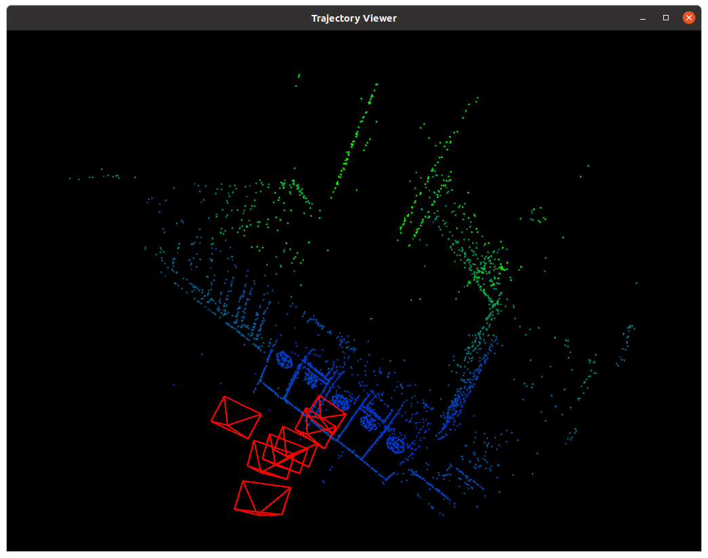

# HW7

## Bundle Adjustment
### 文献阅读

1. 为何说 Bundle Adjustment is slow 是不对的？

   摘自论文：

   ```
   “Optimization / bundle adjustment is slow”: Such statements often appear in papers introducing yet another heuristic Structure from Motion (SFM) iteration. The claimed slowness is almost always due to the unthinking use of a general-purpose optimization routine that completely ignores the problem structure and sparseness. Real bundle routines are much more efficient than this, and usually considerably more efficient and flexible than the newly suggested method (x6, 7). That is why bundle adjustment remains the dominant structure refinement technique for real applications, after 40 years of research.
   ```

   那些说BA慢的人通常是忽略了它们问题的结构及稀疏性，直接使用general-purpose的优化算法。如果考虑了问题的结构及稀疏性，BA将能很有效率地被运行。

2. BA 中有哪些需要注意参数化的地⽅？ Pose 和 Point 各有哪些参数化⽅式？有何优缺点。

   摘自论文：

   ```
   The bundle adjustment parameter space is generally a high-dimensional nonlinear manifold — a large Cartesian product of projective 3D feature, 3D rotation, and camera calibration manifolds, perhaps with nonlinear constraints, etc.
   ```

   BA 中有需要参数化的有projective 3D feature，三维旋转，以及相机的标定参数。

   ```
   If a 3D (X Y Z)^T parametrization (or equivalently a homogeneous affine (X Y Z 1)^T one) is used for very distant 3D points, large X; Y; Z displacements are needed to change the image significantly. I.e., in (X Y Z) space the cost function becomes very flat and steps needed for cost adjustment become very large for distant points. In comparison, with a homogeneous projective parametrization (X Y Z W )^T, the behaviour near infinity is natural, finite and well-conditioned so long as the normalization keeps the homogeneous 4-vector finite at infinity (by sending W -> 0 there).
   ```

   Point，即三维点坐标。除了$[x, y, z]^T$的表达方式外，还有homogeneous projective parametrization $[x, y, z, w]^T$的表达方式。如果使用$[x, y, z]^T$表达很遥远的三维点，想要更新图像时将会需要很大的位移。

   如果使用$[x, y, z, w]^T$的表达方式，我们可以透过把$w$设为接近0的值来表达很远的点，更新也就变得容易许多。

   Pose，即相机位姿，由旋转和平移两部分组成。平移部分与上述Point小节讨论的一致。

   ```
   Rotations: Similarly, experience suggests that quasi-global 3 parameter rotation parametrizations such as Euler angles cause numerical problems unless one can be certain to avoid their singularities and regions of uneven coverage. Rotations should be parametrized using either quaternions subject to ||q||^2 = 1, or local perturbations R δR or δR R of an existing rotation R, where δR can be any wellbehaved 3 parameter small rotation approximation, e.g. δR = (I + [ δr ]×), the Rodriguez formula, local Euler angles, etc.
   ```

   旋转部分可表示为欧拉角，范数为1的四元数或旋转矩阵。欧拉角在某些地方会有奇异点或uneven coverage的问题。旋转矩阵自由度过多。四元数则不够直观。

3. *本⽂写于 2000 年，但是⽂中提到的很多内容在后⾯⼗⼏年的研究中得到了印证。你能看到哪些
   ⽅向在后续⼯作中有所体现？请举例说明。  

   论文第5章Network Structure即目前SLAM中的图优化模型（g2o）。

### BAL-dataset

```cpp
#include <iostream>
#include <opencv2/core/core.hpp>
#include <opencv2/features2d/features2d.hpp>
#include <opencv2/highgui/highgui.hpp>
#include <opencv2/calib3d/calib3d.hpp>
#include <Eigen/Core>
#include <g2o/core/base_vertex.h>
#include <g2o/core/base_binary_edge.h>
#include <g2o/core/sparse_optimizer.h>
#include <g2o/core/block_solver.h>
#include <g2o/core/solver.h>
#include <g2o/core/optimization_algorithm_gauss_newton.h>
#include <g2o/core/optimization_algorithm_levenberg.h>
#include <g2o/solvers/dense/linear_solver_dense.h>
#include <g2o/types/sba/types_six_dof_expmap.h> //g2o::CameraParameters
#include <g2o/core/parameter.h> //g2o::Parameter
#include <g2o/core/robust_kernel.h> //g2o::RobustKernelHuber
#include <g2o/core/robust_kernel_impl.h>
#include <sophus/se3.hpp>
#include <chrono>

using namespace std;
using namespace cv;

// BA by g2o
typedef vector<Eigen::Vector2d, Eigen::aligned_allocator<Eigen::Vector2d>> VecVector2d;
typedef vector<Eigen::Vector3d, Eigen::aligned_allocator<Eigen::Vector3d>> VecVector3d;

typedef struct {
    int cam_id;
    int point_id;
    Eigen::Vector2d p2d;
}observation;

typedef struct camera{
    Sophus::SO3d R;
    Eigen::Vector3d t;
    double f;
    double k1;
    double k2;

    camera() {
        t = Eigen::Vector3d::Zero();
        f = 0;
        k1 = 0;
        k2 = 0;
    };

    Eigen::Vector2d proj(const Eigen::Vector3d& p3d) const{
        /**
         * https://grail.cs.washington.edu/projects/bal/
         * P  =  R * X + t       (conversion from world to camera coordinates)
         * p  = -P / P.z         (perspective division)
         * p' =  f * r(p) * p    (conversion to pixel coordinates)
         * r(p) = 1.0 + k1 * ||p||^2 + k2 * ||p||^4.
         **/
        Eigen::Vector3d cam_p3d = R * p3d + t;
        cam_p3d /= cam_p3d(2);
        cam_p3d *= -1; // BAL coordinate system
        Eigen::Vector2d p2d = cam_p3d.head(2);
        double r2 = p2d(0) * p2d(0) + p2d(1) * p2d(1);
        double r4 = r2 * r2;
        p2d = f * (1 + k1 * r2 + k2 * r4) * p2d;
        return p2d;
    }
}camera;

void bundleAdjustmentG2O(
    const vector<camera> &cams,
    const vector<Eigen::Vector3d> &points,
    const vector<observation> &obvs,
    vector<Sophus::SE3d> &poses,
    vector<Eigen::Vector3d> &positions
);

int main(int argc, char **argv) {
    int num_cams, num_points, num_obvs;
    vector<observation> obvs;
    vector<camera> cams;
    vector<Eigen::Vector3d> points;
    std::ifstream infile("problem-93-61203-pre.txt");
    std::string line;
    int line_id = 0;
    int cam_cnt = 0, point_cnt = 0;
    while (std::getline(infile, line, '\n')){
        std::istringstream iss(line);
        if(line_id == 0){
            cout << "0: " << line_id << endl;
            iss >> num_cams >> num_points >> num_obvs;
            obvs.resize(num_obvs);
            cams.resize(num_cams);
            points.resize(num_points);
            line_id++;
        }else if(line_id >= 1 && line_id <= num_obvs){
            observation obv;
            iss >> obv.cam_id >> obv.point_id >> obv.p2d(0) >> obv.p2d(1);
            obvs[line_id-1] = obv;
            line_id++;
        }else if(line_id >= num_obvs+1 && line_id <= num_obvs+num_cams*9){
            camera cam;
            Eigen::Vector3d rv;
            iss >> rv(0);
            std::getline(infile, line, '\n'); iss = std::istringstream(line);
            iss >> rv(1);
            std::getline(infile, line, '\n'); iss = std::istringstream(line);
            iss >> rv(2);
            cam.R = Sophus::SO3d::exp(Eigen::Vector3d(rv));
            std::getline(infile, line, '\n'); iss = std::istringstream(line);
            iss >> cam.t(0);
            std::getline(infile, line, '\n'); iss = std::istringstream(line);
            iss >> cam.t(1);
            std::getline(infile, line, '\n'); iss = std::istringstream(line);
            iss >> cam.t(2);
            std::getline(infile, line, '\n'); iss = std::istringstream(line);
            iss >> cam.f;
            std::getline(infile, line, '\n'); iss = std::istringstream(line);
            iss >> cam.k1;
            std::getline(infile, line, '\n'); iss = std::istringstream(line);
            iss >> cam.k2;
            cams[(line_id-(num_obvs+1))/9] = cam;
            cam_cnt = (line_id-(num_obvs+1))/9;
            line_id += 9;
        }else if(line_id >= num_obvs+num_cams*9+1 && line_id <= num_obvs+num_cams*9+num_points*3){
            Eigen::Vector3d point;
            iss >> point(0);
            std::getline(infile, line, '\n'); iss = std::istringstream(line);
            iss >> point(1);
            std::getline(infile, line, '\n'); iss = std::istringstream(line);
            iss >> point(2);
            points[(line_id-(num_obvs+num_cams*9+1))/3] = point;
            point_cnt = (line_id-(num_obvs+num_cams*9+1))/3;
            line_id += 3;
        }
    }

    cout << "cam: " << cam_cnt << endl;
    cout << "point: " << point_cnt << endl;

    cout << "cams: " << cams.size() << endl;
    cout << "points: " << points.size() << endl;
    cout << "obvs: " << obvs.size() << endl;

    cout << "calling bundle adjustment by g2o" << endl;
    vector<Sophus::SE3d> poses_g2o;
    vector<Eigen::Vector3d> positions_g2o;
    chrono::steady_clock::time_point t1 = chrono::steady_clock::now();
    bundleAdjustmentG2O(cams, points, obvs, poses_g2o, positions_g2o);
    chrono::steady_clock::time_point t2 = chrono::steady_clock::now();
    chrono::duration<double> time_used = chrono::duration_cast<chrono::duration<double>>(t2 - t1);
    cout << "solve pnp by g2o cost time: " << time_used.count() << " seconds." << endl;
    return 0;
}

/// vertex and edges used in g2o ba
// 9個自由度,用camera儲存
class VertexCamera : public g2o::BaseVertex<9, camera> {
public:
    EIGEN_MAKE_ALIGNED_OPERATOR_NEW;

    virtual void setToOriginImpl() override {
        // cout << "pose setToOriginImpl" << endl;
        _estimate = camera();
    }

    /// left multiplication on SE3
    virtual void oplusImpl(const double *update) override {
        // cout << "pose oplusImpl" << endl;
        // 擾動模型:求解李代數小量se(3),然後將它轉成李群表示,之後左乘到估計的pose上
        Sophus::SO3d update_R = Sophus::SO3d::exp(Eigen::Vector3d(update[0], update[1], update[2]));
        Eigen::Vector3d update_t = Eigen::Vector3d(update[3], update[4], update[5]);
        _estimate.R = update_R * _estimate.R;
        _estimate.t += update_t;
        _estimate.f += update[6];
        _estimate.k1 += update[7];
        _estimate.k2 += update[8];
    }

    virtual bool read(istream &in) override {}

    virtual bool write(ostream &out) const override {}
};

class VertexLandmark : public g2o::BaseVertex<3, Eigen::Vector3d> {
public:
    EIGEN_MAKE_ALIGNED_OPERATOR_NEW;

    virtual void setToOriginImpl() override {
        // cout << "landmark setToOriginImpl" << endl;
        _estimate = Eigen::Vector3d::Zero();
    }

    /// left multiplication on SE3
    virtual void oplusImpl(const double *update) override {
        // cout << "landmark oplusImpl" << endl;
        // 擾動模型:求解李代數小量se(3),然後將它轉成李群表示,之後左乘到估計的pose上
        Eigen::Vector3d update_eigen;
        update_eigen << update[0], update[1], update[2];
        _estimate = update_eigen + _estimate;
    }

    virtual bool read(istream &in) override {}

    virtual bool write(ostream &out) const override {}
};

// <函數輸出值(觀測值)的個數,函數輸出值(觀測值)的類型,待估計變量(頂點)的類型>
class EdgeProjection : public g2o::BaseBinaryEdge<2, Eigen::Vector2d, VertexCamera, VertexLandmark> {
public:
    EIGEN_MAKE_ALIGNED_OPERATOR_NEW;

    EdgeProjection() {}

    virtual void computeError() override {
        // cout << "computeError" << endl;
        const VertexCamera *vc = static_cast<VertexCamera *> (_vertices[0]);
        const VertexLandmark *vl = static_cast<VertexLandmark *> (_vertices[1]);
        camera cam = vc->estimate();
        Eigen::Vector3d p3d = vl->estimate();
        Eigen::Vector2d pos_pixel = cam.proj(p3d);
        _error = _measurement - pos_pixel;
        // cout << "computeError end" << endl;
    }

    virtual bool read(istream &in) override {}

    virtual bool write(ostream &out) const override {}
};

void bundleAdjustmentG2O(
    const vector<camera> &cams,
    const vector<Eigen::Vector3d> &points,
    const vector<observation> &obvs,
    vector<Sophus::SE3d> &poses,
    vector<Eigen::Vector3d> &positions) {

    cout << "cams: " << cams.size() << endl;
    cout << "points: " << points.size() << endl;
    cout << "obvs: " << obvs.size() << endl;

    // 构建图优化，先设定g2o
    typedef g2o::BlockSolver<g2o::BlockSolverTraits<9, 3>> BlockSolverType;    // camera is 9, landmark is 3
    typedef g2o::LinearSolverDense<BlockSolverType::PoseMatrixType> LinearSolverType; // 线性求解器类型
    // 梯度下降方法，可以从GN, LM, DogLeg 中选
    /**
     * use g2o::OptimizationAlgorithmGaussNewton will lead to divergence
     * use g2o::OptimizationAlgorithmLevenberg will lead to convergence
     **/
    auto solver = new g2o::OptimizationAlgorithmLevenberg(
        g2o::make_unique<BlockSolverType>(g2o::make_unique<LinearSolverType>()));
    g2o::SparseOptimizer optimizer;         // 图模型
    optimizer.setAlgorithm(solver);     // 设置求解器
    optimizer.setVerbose(true);             // 打开调试输出

    // vertex
    cout << "adding cam vertex" << endl;
    vector<VertexCamera*> vertex_cameras(cams.size());
    for(size_t i = 0; i < cams.size(); ++i){
        VertexCamera *vertex_camera = new VertexCamera(); // camera vertex_camera
        vertex_camera->setId(i);
        vertex_camera->setEstimate(cams[i]);
        optimizer.addVertex(vertex_camera);
        vertex_cameras[i] = vertex_camera;
    }

    cout << "adding point vertex" << endl;
    vector<VertexLandmark*> vertex_landmarks(points.size());
    for(size_t i = 0; i < points.size(); ++i){
        VertexLandmark *vertex_landmark = new VertexLandmark();
        vertex_landmark->setId(cams.size() + i);
        vertex_landmark->setEstimate(points[i]);
        /**
         * this solves:
         * terminate called after throwing an instance of 'std::bad_alloc'
         * what():  std::bad_alloc
         * Aborted (core dumped)
         **/
        vertex_landmark->setMarginalized(true);
        optimizer.addVertex(vertex_landmark);
        vertex_landmarks[i] = vertex_landmark;
    }

    // // camera parameters
    // for(size_t i = 0; i < cams.size(); ++i){
    //     g2o::Parameter* camera = new DistortedCameraParameters(cams[i].f, Eigen::Vector2d::Zero(), cams[i].k1, cams[i].k2);
    //     camera->setId(i);
    //     optimizer.addParameter(camera);
    // }

    // edges
    cout << "adding edge" << endl;
    vector<EdgeProjection*> edges(obvs.size());
    int index = 1;
    for (size_t i = 0; i < obvs.size(); ++i) {
        EdgeProjection *edge = new EdgeProjection();
        // edge->setId(index);
        edge->setVertex(0, vertex_cameras[obvs[i].cam_id]);
        edge->setVertex(1, vertex_landmarks[obvs[i].point_id]);
        edge->setMeasurement(obvs[i].p2d);
        edge->setInformation(Eigen::Matrix2d::Identity());
        // edge->setParameterId(0, 0);
        // 核函数
        edge->setRobustKernel(new g2o::RobustKernelHuber());
        optimizer.addEdge(edge);
        edges[i] = edge;
        index++;
    }

    cout << "optimize..." << endl;
    chrono::steady_clock::time_point t1 = chrono::steady_clock::now();
    optimizer.setVerbose(true);
    optimizer.initializeOptimization();
    optimizer.optimize(10);
    chrono::steady_clock::time_point t2 = chrono::steady_clock::now();
    chrono::duration<double> time_used = chrono::duration_cast<chrono::duration<double>>(t2 - t1);
    cout << "optimization costs time: " << time_used.count() << " seconds." << endl;
    // for(VertexCamera* vertex_camera : vertex_cameras){
    //     cout << "pose estimated by g2o =\n" << vertex_camera->estimate().matrix() << endl;
    // }
}

```

需要注意的地方有：

1. 相机的参数有9个，使用`camera`数据结构来储存。图优化的顶点`VertexCamera`的底层数据结构即`camera`。

2. 需要对路标点做边缘化，即代码中的`vertex_landmark->setMarginalized(true);`，否则会出现以下错误：

   ```
   terminate called after throwing an instance of 'std::bad_alloc'
   what():  std::bad_alloc
   Aborted (core dumped)
   ```

3. 优化方式使用`g2o::OptimizationAlgorithmGaussNewton`会发散，改用`g2o::OptimizationAlgorithmLevenberg`才会收敛。

运行log：

```
0: 0
cam: 92
point: 61202
cams: 93
points: 61203
obvs: 287451
calling bundle adjustment by g2o
cams: 93
points: 61203
obvs: 287451
adding cam vertex
adding point vertex
adding edge
optimize...
iteration= 0     chi2= 904352.547030     time= 1.22305   cumTime= 1.22305        edges= 287451   schur= 1        lambda= 471172.798963   levenbergIter= 1
iteration= 1     chi2= 585510.340346     time= 1.05053   cumTime= 2.27358        edges= 287451   schur= 1        lambda= 157057.599654   levenbergIter= 1
iteration= 2     chi2= 423706.121521     time= 1.06804   cumTime= 3.34162        edges= 287451   schur= 1        lambda= 52352.533218    levenbergIter= 1
iteration= 3     chi2= 331464.500731     time= 1.04178   cumTime= 4.3834         edges= 287451   schur= 1        lambda= 17450.844406    levenbergIter= 1
iteration= 4     chi2= 277106.959839     time= 1.06436   cumTime= 5.44776        edges= 287451   schur= 1        lambda= 5816.948135     levenbergIter= 1
iteration= 5     chi2= 242366.297255     time= 1.08016   cumTime= 6.52793        edges= 287451   schur= 1        lambda= 1938.982712     levenbergIter= 1
iteration= 6     chi2= 220567.023525     time= 1.04326   cumTime= 7.57119        edges= 287451   schur= 1        lambda= 646.327571      levenbergIter= 1
iteration= 7     chi2= 208587.058342     time= 1.08841   cumTime= 8.6596         edges= 287451   schur= 1        lambda= 215.442524      levenbergIter= 1
iteration= 8     chi2= 203154.135010     time= 1.12042   cumTime= 9.78002        edges= 287451   schur= 1        lambda= 71.814175       levenbergIter= 1
iteration= 9     chi2= 200364.239867     time= 1.07832   cumTime= 10.8583        edges= 287451   schur= 1        lambda= 23.938058       levenbergIter= 1
optimization costs time: 11.4331 seconds.
solve pnp by g2o cost time: 11.9245 seconds.
```


## 直接法的 Bundle Adjustment
### 数学模型

$\min\sum\limits_{j=1}^{7}\sum\limits_{i=1}^{N}\sum\limits_{W}\|I(p_i)-I_j(\pi(\bold{K}\bold{T_j}\bold{p_i}))\|_2^2$

1. 如何描述任意⼀点投影在任意⼀图像中形成的 error？

   $\sum\limits_{W}\|I(p_i)-I_j(\pi(\bold{K}\bold{T}_j\bold{p}_i))\|_2^2$

2. 每个 error 关联⼏个优化变量？

   相机内参在代码中是给定的，不需要优化。

   每个$\text{error}_{ji}$关联的变量有变换矩阵$\bold{T}_j$和三维点坐标$\bold{p}_i$。

3. error 关于各变量的雅可⽐是什么？

   使用$\xi$表示变换矩阵$\bold{T}_j$（此处省略下标$j$），$\bold{p}$同样省略下标$i$。

   记$\bold{p}' = (\bold{T}\bold{p})_{1:3} = (\exp(\bold{\xi}^\text{^})\bold{p})_{1:3}$，相机内参$K$包含$f_x,f_y,c_x,c_y$。

   $\frac{\partial \text{e}}{\partial \delta\bold{\xi}} = -\begin{bmatrix}\frac{f_x}{Z'} & 0 & -\frac{f_xX'}{Z'^2} & -\frac{f_xX'Y'}{Z'^2} & f_x + \frac{f_xX'^2}{Z'^2} & -\frac{f_xY'}{Z'} \\ 0 & \frac{f_y}{Z'} & -\frac{f_yY'}{Z'^2} & -f_y - \frac{f_yY'^2}{Z'^2} & \frac{f_yX'Y'}{Z'^2} & \frac
   {f_yX'}{Z'}\end{bmatrix}$
   
   $\frac{\partial \text{e}}{\partial \bold{p}} = -\begin{bmatrix}\frac{f_x}{Z'} & 0 & -\frac{f_xX'}{Z'^2} \\ 0 & \frac{f_y}{Z'} & -\frac{f_yY'}{Z'^2}\end{bmatrix}$

### 实现

```cpp
//
// Created by xiang on 1/4/18.
// this program shows how to perform direct bundle adjustment
//
#include <iostream>

using namespace std;

#include <g2o/core/base_unary_edge.h>
#include <g2o/core/base_binary_edge.h>
#include <g2o/core/base_vertex.h>
#include <g2o/core/block_solver.h>
#include <g2o/core/optimization_algorithm_levenberg.h>
#include <g2o/solvers/dense/linear_solver_dense.h>
#include <g2o/core/robust_kernel.h>
#include <g2o/core/robust_kernel_impl.h>
#include <g2o/types/sba/types_six_dof_expmap.h>
#include <g2o/types/slam3d/vertex_pointxyz.h> // g2o::VertexPointXYZ

#include <Eigen/Core>
// include before sophus to avoid fmt problem
#include <pangolin/pangolin.h>
#include <sophus/se3.hpp>
#include <opencv2/opencv.hpp>

#include <boost/format.hpp>

typedef vector<Sophus::SE3d, Eigen::aligned_allocator<Sophus::SE3d>> VecSE3d;
typedef vector<Eigen::Vector3d, Eigen::aligned_allocator<Eigen::Vector3d>> VecVec3d;

// global variables
string pose_file = "./poses.txt";
string points_file = "./points.txt";

// intrinsics
float fx = 277.34;
float fy = 291.402;
float cx = 312.234;
float cy = 239.777;

// bilinear interpolation
inline float GetPixelValue(const cv::Mat &img, float x, float y) {
    if(x < 0) x = 0;
    if(x > img.cols-1) x = img.cols-1;
    if(y < 0) y = 0;
    if(y > img.rows-1) y = img.rows-1;
    uchar *data = &img.data[int(y) * img.step + int(x)];
    float xx = x - floor(x);
    float yy = y - floor(y);
    return float(
            (1 - xx) * (1 - yy) * data[0] +
            xx * (1 - yy) * data[1] +
            (1 - xx) * yy * data[img.step] +
            xx * yy * data[img.step + 1]
    );
}

// g2o vertex that use sophus::SE3d as pose
class VertexSophus : public g2o::BaseVertex<6, Sophus::SE3d> {
public:
    EIGEN_MAKE_ALIGNED_OPERATOR_NEW

    VertexSophus() {}

    ~VertexSophus() {}

    bool read(std::istream &is) {}

    bool write(std::ostream &os) const {}

    virtual void setToOriginImpl() {
        _estimate = Sophus::SE3d();
    }

    virtual void oplusImpl(const double *update_) {
        Eigen::Map<const Eigen::Matrix<double, 6, 1>> update(update_);
        setEstimate(Sophus::SE3d::exp(update) * estimate());
    }
};

// TODO edge of projection error, implement it
// 16x1 error, which is the errors in patch
typedef Eigen::Matrix<double,16,1> Vector16d;
/**
 * g2o issue 674
 * g2o::VertexSBAPointXYZ -> g2o::VertexPointXYZ
 **/
class EdgeDirectProjection : public g2o::BaseBinaryEdge<16, Vector16d, g2o::VertexPointXYZ, VertexSophus> {
public:
    EIGEN_MAKE_ALIGNED_OPERATOR_NEW;

    EdgeDirectProjection(float *color, cv::Mat &target) {
        this->origColor = color;
        this->targetImg = target;
    }

    ~EdgeDirectProjection() {}

    virtual void computeError() override {
        // TODO START YOUR CODE HERE
        // compute projection error ...
        const g2o::VertexPointXYZ *vertex_point = static_cast<g2o::VertexPointXYZ *> (_vertices[0]);
        const VertexSophus *vertex_pose = static_cast<VertexSophus *> (_vertices[1]);
        Sophus::SE3d T = vertex_pose->estimate();
        Eigen::Vector3d p3d = vertex_point->estimate();
        Eigen::Vector3d cam_p3d = T * p3d;
        Eigen::Vector2d cam_p2d((fx * cam_p3d(0)+cx)/cam_p3d[2], (fy * cam_p3d(1)+cy)/cam_p3d[2]);
        Vector16d proj_colors;
        int idx = 0;
        for(int y = cam_p2d(0)-2; y <= cam_p2d(0)+1; ++y){
            for(int x = cam_p2d(1)-2; x <= cam_p2d(1)+1; ++x){
                proj_colors[idx++] = GetPixelValue(targetImg, x, y);
            }
        }
        _error = _measurement - proj_colors;
        // END YOUR CODE HERE
    }

    // Let g2o compute jacobian for you

    virtual bool read(istream &in) {}

    virtual bool write(ostream &out) const {}

private:
    cv::Mat targetImg;  // the target image
    float *origColor = nullptr;   // 16 floats, the color of this point
};

// plot the poses and points for you, need pangolin
void Draw(const VecSE3d &poses, const VecVec3d &points);

int main(int argc, char **argv) {

    // read poses and points
    VecSE3d poses;
    VecVec3d points;
    ifstream fin(pose_file);

    while (!fin.eof()) {
        double timestamp = 0;
        fin >> timestamp;
        if (timestamp == 0) break;
        double data[7];
        for (auto &d: data) fin >> d;
        poses.push_back(Sophus::SE3d(
                Eigen::Quaterniond(data[6], data[3], data[4], data[5]),
                Eigen::Vector3d(data[0], data[1], data[2])
        ));
        if (!fin.good()) break;
    }
    fin.close();


    vector<float *> color;
    fin.open(points_file);
    while (!fin.eof()) {
        double xyz[3] = {0};
        for (int i = 0; i < 3; i++) fin >> xyz[i];
        if (xyz[0] == 0) break;
        points.push_back(Eigen::Vector3d(xyz[0], xyz[1], xyz[2]));
        float *c = new float[16];
        for (int i = 0; i < 16; i++) fin >> c[i];
        color.push_back(c);

        if (fin.good() == false) break;
    }
    fin.close();

    std::cout << "poses: " << poses.size() << ", points: " << points.size() << endl;

    // read images
    vector<cv::Mat> images;
    boost::format img_fmt("./%d.png");
    for (int i = 0; i < 7; i++) {
        images.push_back(cv::imread((img_fmt % i).str(), 0));
    }

    // build optimization problem
    typedef g2o::BlockSolver<g2o::BlockSolverTraits<6, 3>> DirectBlock;  // 求解的向量是6＊1的
    // DirectBlock::LinearSolverType *linearSolver = new g2o::LinearSolverDense<DirectBlock::PoseMatrixType>();
    typedef g2o::LinearSolverDense<DirectBlock::PoseMatrixType> LinearSolverType;
    // DirectBlock *solver_ptr = new DirectBlock(linearSolver);
    // g2o::OptimizationAlgorithmLevenberg *solver = new g2o::OptimizationAlgorithmLevenberg(solver_ptr); // L-M
    g2o::OptimizationAlgorithmLevenberg *solver = new g2o::OptimizationAlgorithmLevenberg(
        g2o::make_unique<DirectBlock>(g2o::make_unique<LinearSolverType>()));
    g2o::SparseOptimizer optimizer;
    optimizer.setAlgorithm(solver);
    optimizer.setVerbose(true);

    // TODO add vertices, edges into the graph optimizer
    // START YOUR CODE HERE
    cout << "adding vertex" << endl;
    vector<g2o::VertexPointXYZ*> vertex_points(points.size());
    for(size_t i = 0; i < points.size(); ++i){
        g2o::VertexPointXYZ *vertex_point = new g2o::VertexPointXYZ();
        vertex_point->setId(i);
        vertex_point->setEstimate(points[i]);
        vertex_point->setMarginalized(true);
        optimizer.addVertex(vertex_point);
        vertex_points[i] = vertex_point;
    }

    vector<VertexSophus*> vertex_poses(poses.size());
    for(size_t i = 0; i < poses.size(); ++i){
        VertexSophus *vertex_pose = new VertexSophus();
        vertex_pose->setId(points.size() + i);
        vertex_pose->setEstimate(poses[i]);
        optimizer.addVertex(vertex_pose);
        vertex_poses[i] = vertex_pose;
    }

    vector<EdgeDirectProjection*> edges(poses.size() * points.size());
    int index = 1;
    for (size_t j = 0; j < poses.size(); ++j) {
        for (size_t i = 0; i < points.size(); ++i) {
            EdgeDirectProjection *edge = new EdgeDirectProjection(color[i], images[j]);
            // edge->setId(index);
            // project point i to image j
            edge->setVertex(0, vertex_points[i]);
            edge->setVertex(1, vertex_poses[j]);
            Vector16d gt;
            for(size_t k = 0; k < 16; ++k) gt << (double)color[i][k];
            edge->setMeasurement(gt);
            edge->setInformation(Eigen::Matrix<double,16,16>::Identity());
            // edge->setParameterId(0, 0);
            // 核函数
            edge->setRobustKernel(new g2o::RobustKernelHuber());
            optimizer.addEdge(edge);
            edges[j * points.size() + i] = edge;
            index++;
        }
    }
    // END YOUR CODE HERE

    // perform optimization
    cout << "optimize..." << endl;
    chrono::steady_clock::time_point t1 = chrono::steady_clock::now();
    optimizer.setVerbose(true);
    optimizer.initializeOptimization(0);
    optimizer.optimize(200);
    chrono::steady_clock::time_point t2 = chrono::steady_clock::now();
    chrono::duration<double> time_used = chrono::duration_cast<chrono::duration<double>>(t2 - t1);
    cout << "optimization costs time: " << time_used.count() << " seconds." << endl;

    // TODO fetch data from the optimizer
    // START YOUR CODE HERE
    for(size_t i = 0; i < vertex_poses.size(); ++i){
        // cout << "pose estimated by g2o =\n" << vertex_pose->estimate().matrix() << endl;
        poses[i] = vertex_poses[i]->estimate();
    }
    for(size_t i = 0; i < vertex_points.size(); ++i){
        // cout << "pose estimated by g2o =\n" << vertex_points[i]->estimate() << endl;
        points[i] = vertex_points[i]->estimate();
    }
    // END YOUR CODE HERE

    // plot the optimized points and poses
    Draw(poses, points);

    // delete color data
    for (auto &c: color) delete[] c;
    return 0;
}

void Draw(const VecSE3d &poses, const VecVec3d &points) {
    if (poses.empty() || points.empty()) {
        cerr << "parameter is empty!" << endl;
        return;
    }

    // create pangolin window and plot the trajectory
    pangolin::CreateWindowAndBind("Trajectory Viewer", 1024, 768);
    glEnable(GL_DEPTH_TEST);
    glEnable(GL_BLEND);
    glBlendFunc(GL_SRC_ALPHA, GL_ONE_MINUS_SRC_ALPHA);

    pangolin::OpenGlRenderState s_cam(
            pangolin::ProjectionMatrix(1024, 768, 500, 500, 512, 389, 0.1, 1000),
            pangolin::ModelViewLookAt(0, -0.1, -1.8, 0, 0, 0, 0.0, -1.0, 0.0)
    );

    pangolin::View &d_cam = pangolin::CreateDisplay()
            .SetBounds(0.0, 1.0, pangolin::Attach::Pix(175), 1.0, -1024.0f / 768.0f)
            .SetHandler(new pangolin::Handler3D(s_cam));


    while (pangolin::ShouldQuit() == false) {
        glClear(GL_COLOR_BUFFER_BIT | GL_DEPTH_BUFFER_BIT);

        d_cam.Activate(s_cam);
        glClearColor(0.0f, 0.0f, 0.0f, 0.0f);

        // draw poses
        float sz = 0.1;
        int width = 640, height = 480;
        for (auto &Tcw: poses) {
            glPushMatrix();
            Sophus::Matrix4f m = Tcw.inverse().matrix().cast<float>();
            glMultMatrixf((GLfloat *) m.data());
            glColor3f(1, 0, 0);
            glLineWidth(2);
            glBegin(GL_LINES);
            glVertex3f(0, 0, 0);
            glVertex3f(sz * (0 - cx) / fx, sz * (0 - cy) / fy, sz);
            glVertex3f(0, 0, 0);
            glVertex3f(sz * (0 - cx) / fx, sz * (height - 1 - cy) / fy, sz);
            glVertex3f(0, 0, 0);
            glVertex3f(sz * (width - 1 - cx) / fx, sz * (height - 1 - cy) / fy, sz);
            glVertex3f(0, 0, 0);
            glVertex3f(sz * (width - 1 - cx) / fx, sz * (0 - cy) / fy, sz);
            glVertex3f(sz * (width - 1 - cx) / fx, sz * (0 - cy) / fy, sz);
            glVertex3f(sz * (width - 1 - cx) / fx, sz * (height - 1 - cy) / fy, sz);
            glVertex3f(sz * (width - 1 - cx) / fx, sz * (height - 1 - cy) / fy, sz);
            glVertex3f(sz * (0 - cx) / fx, sz * (height - 1 - cy) / fy, sz);
            glVertex3f(sz * (0 - cx) / fx, sz * (height - 1 - cy) / fy, sz);
            glVertex3f(sz * (0 - cx) / fx, sz * (0 - cy) / fy, sz);
            glVertex3f(sz * (0 - cx) / fx, sz * (0 - cy) / fy, sz);
            glVertex3f(sz * (width - 1 - cx) / fx, sz * (0 - cy) / fy, sz);
            glEnd();
            glPopMatrix();
        }

        // points
        glPointSize(2);
        glBegin(GL_POINTS);
        for (size_t i = 0; i < points.size(); i++) {
            glColor3f(0.0, points[i][2]/4, 1.0-points[i][2]/4);
            glVertex3d(points[i][0], points[i][1], points[i][2]);
        }
        glEnd();

        pangolin::FinishFrame();
        usleep(5000);   // sleep 5 ms
    }
}
```

需要注意的地方有：

1. 在调用`GetPixelValue`函数时，需注意坐标是否越界，否则会出现`Segmentation fault (core dumped)`的问题。对应以下代码：

   ```cpp
   inline float GetPixelValue(const cv::Mat &img, float x, float y) {
       if(x < 0) x = 0;
       if(x > img.cols-1) x = img.cols-1;
       if(y < 0) y = 0;
       if(y > img.rows-1) y = img.rows-1;
       //...
   }
   ```

2. `g2o::VertexSBAPointXYZ`改为`g2o::VertexPointXYZ`

3. 加入`vertex_point->setMarginalized(true);`可大大缩减求解$H\Delta x = b$耗时。

运行log：

```
poses: 7, points: 4118
adding vertex
optimize...
iteration= 0     chi2= 16572988.639765   time= 0.494989  cumTime= 0.494989       edges= 28826    schur= 1        lambda= 324142744244.137695     levenbergIter= 10
optimization costs time: 0.539408 seconds.
```

结果：



可以看到七个红色长方形代表七张图片拍照的位置，以及重建出来的点云。

1. 能否不要以$[x, y, z]^T$的形式参数化每个点？

   参考Bundle Adjustment – A Modern Synthesis论文：

   ```
   If a 3D (X Y Z)^T parametrization (or equivalently a homogeneous affine (X Y Z 1)^T
   one) ... 
   In comparison, with a homogeneous projective parametrization (X Y Z W )^T ...
   ```

   三维点除了$[x, y, z]^T$的表达方式外，还有homogeneous projective parametrization $[x, y, z, w]^T$的表达方式。

2. 取 4x4 的 patch 好吗？取更⼤的 patch 好还是取⼩⼀点的 patch 好？

   取4x4的patch结果如上，可以看到效果还是不错的。取更大的patch会导致更多边缘点被排除，取小一点的patch可能会导致方程不稳定。

3. 从本题中，你看到直接法与特征点法在 BA 阶段有何不同？

   特征点法的目标是最小化重投影后的二维点的误差，直接法的目标是最小化patch内像素的光度误差。

4. 由于图像的差异，你可能需要鲁棒核函数，例如 Huber。此时 Huber 的阈值如何选取？  

   参考[g2o::RobustKernelHuber Class Reference](http://g2o.xuezhisd.top/classg2o_1_1RobustKernelHuber.html)，以下是`g2o::RobustKernelHuber`类的说明：

   ```
   Huber Cost Function.
   
   Loss function as described by Huber See http://en.wikipedia.org/wiki/Huber_loss_function
   
   If e^(1/2) < d rho(e) = e
   
   else
   
             1/2    2
   rho(e) = 2 d e - d
   ```

   其中的`d`即阈值，是在初始化时传入的：

   ```cpp
   explicit RobustKernel(double delta);
   ```

   `rho`时`RobustKernelHuber::robustify`函数的出参：

   ```cpp
   void RobustKernelHuber::robustify(double e, Vector3D& rho) const
   {
       double dsqr = _delta * _delta;
       if (e <= dsqr) { // inlier
           rho[0] = e;
           rho[1] = 1.;
           rho[2] = 0.;
       } else { // outlier
           double sqrte = sqrt(e); // absolut value of the error
           rho[0] = 2*sqrte*_delta - dsqr; // rho(e)   = 2 * delta * e^(1/2) - delta^2
           rho[1] = _delta / sqrte;        // rho'(e)  = delta / sqrt(e)
           rho[2] = - 0.5 * rho[1] / e;    // rho''(e) = -1 / (2*e^(3/2)) = -1/2 * (delta/e) / e
       }
   }
   ```

   在error function`e`小于阈值`_delta*_delta`时，`rho[0]`设为`e`；否则设为`2*sqrt(e)*_delta-_delta*_delta`。用直观的说法就是，在`e`小于阈值时，呈线性增长；否则以平方根的速度增长。

   参考[How to choose delta parameter in Huber Loss function?](https://stats.stackexchange.com/questions/465937/how-to-choose-delta-parameter-in-huber-loss-function)，超过阈值的数据点的梯度会减小，代表我们希望缩减该数据点的影响力。所以我们通常将Huber loss的阈值选为我们所信任的数据点的残差。

