# HW8

## 开源方案比较

### ORB_SLAM3

https://github.com/UZ-SLAMLab/ORB_SLAM3

稀疏，单目/双目。

编译ORB-SLAM3：

[Compile time error fix: `cv::Matx / float`](https://github.com/UZ-SLAMLab/ORB_SLAM3/pull/312)

```sh
Configuring and building Thirdparty/DBoW2 ...
mkdir: cannot create directory ‘build’: File exists
-- Configuring done
-- Generating done
-- Build files have been written to: /home/ubt/Documents/installation/ORB_SLAM3/Thirdparty/DBoW2/build
[100%] Built target DBoW2
Configuring and building Thirdparty/g2o ...
mkdir: cannot create directory ‘build’: File exists
-- BUILD TYPE:Release
-- Compiling on Unix
-- Configuring done
-- Generating done
-- Build files have been written to: /home/ubt/Documents/installation/ORB_SLAM3/Thirdparty/g2o/build
[100%] Built target g2o
Uncompress vocabulary ...
Configuring and building ORB_SLAM3 ...
mkdir: cannot create directory ‘build’: File exists
Build type: Release
-- Using flag -std=c++11.
OPENCV VERSION:
4.2.0
CMake Warning at CMakeLists.txt:49 (find_package):
  By not providing "Findrealsense2.cmake" in CMAKE_MODULE_PATH this project
  has asked CMake to find a package configuration file provided by
  "realsense2", but CMake did not find one.

  Could not find a package configuration file provided by "realsense2" with
  any of the following names:

    realsense2Config.cmake
    realsense2-config.cmake

  Add the installation prefix of "realsense2" to CMAKE_PREFIX_PATH or set
  "realsense2_DIR" to a directory containing one of the above files.  If
  "realsense2" provides a separate development package or SDK, be sure it has
  been installed.


-- BUILD TYPE:Release
-- Compiling on Unix
-- Configuring done
-- Generating done
-- Build files have been written to: /home/ubt/Documents/installation/ORB_SLAM3/build
[ 37%] Built target g2o
[ 70%] Built target ORB_SLAM3
[ 73%] Built target rgbd_tum
[ 75%] Built target mono_tum
[ 78%] Built target stereo_inertial_euroc
[ 80%] Built target mono_kitti
[ 82%] Built target stereo_kitti
[ 85%] Built target stereo_euroc
[ 87%] Built target stereo_tum_vi
[ 90%] Built target mono_euroc
[ 92%] Built target mono_inertial_tum_vi
[ 95%] Built target mono_tum_vi
[ 97%] Built target mono_inertial_euroc
[100%] Built target stereo_inertial_tum_vi
```

### DSO

https://github.com/JakobEngel/dso

半稠密，单目。

使用常规对C++ project的编译方式编译即可使用。

### RTAB-Map

https://github.com/introlab/rtabmap_ros

稠密，双目。

安装方式如下：

```sh
sudo apt install ros-noetic-rtabmap-ros
```

###       cartographer-project

https://github.com/cartographer-project/cartographer_ros

激光雷达+IMU。

## 数据集

### KITTI Visual Odometry / SLAM Evaluation 2012

http://www.cvlibs.net/datasets/kitti/eval_odometry.php

### EuRoC MAV

https://projects.asl.ethz.ch/datasets/doku.php?id=kmavvisualinertialdatasets

[EuRoC数据集简介与使用](https://blog.csdn.net/colorsky100/article/details/85331711)

`MH01/mav0/state_groundtruth_estimate0/data.csv`

前8个栏位：

```
#timestamp	 p_RS_R_x [m]	 p_RS_R_y [m]	 p_RS_R_z [m]	 q_RS_w []	 q_RS_x []	 q_RS_y []	 q_RS_z []
```

### TUM Visual-Inertial Dataset

https://vision.in.tum.de/data/datasets/visual-inertial-dataset

[TUM VIO数据集介绍与尝试 The TUM VI Benchmark for Evaluating Visual-Inertial Odometry论文翻译](https://blog.csdn.net/qq_41839222/article/details/86180964)

格式：

TUM，EuRoC：

```
timestamp x y z q_x q_y q_z q_w
```

KITTI：

```
a b c d
e f g h
i j k l
0 0 0 1
```

```
a b c d e f g h i j k l
```

### TUM Monocular Visual Odometry Dataset

https://vision.in.tum.de/data/datasets/mono-dataset?redirect=1

## 评测指标

https://zhuanlan.zhihu.com/p/105428199

https://www.zhihu.com/question/318307846

ATE：全局绝对误差，需要先对齐两个轨迹（R,T）。如果是单目相机，具有尺度不确定性，会多一个s。先对估计的轨迹对齐到真实轨迹后，计算各帧的误差，再用各帧的误差计算RMSE。

RPE：先挑选一个时间差$\Delta$。计算估计及真实轨迹中相隔$\Delta$的两帧的误差，即相对误差，再用所有$n-\Delta$帧的相对误差计算RMSE。

rmse,mean,median,std,min,max,sse

## 评测工具

### evo

https://github.com/MichaelGrupp/evo

安装方式如下：

```sh
python3 -m pip install evo --upgrade evo
```

```sh
evo_ape kitti KITTI_00_gt.txt KITTI_00_ORB.txt -va --plot --plot_mode xz --save_results results/ORB.zip
```

### 其他

https://github.com/utiasSTARS/pykitti

https://github.com/Huangying-Zhan/kitti-odom-eval

## ORB_SLAM3 + EuRoC

对EuRoC MH01数据集运行`ORB_SLAM3/Examples/euroc_examples.sh`脚本：

```sh
#!/bin/bash
pathDatasetEuroc='../Datasets/EuRoC' #Example, it is necesary to change it by the dataset path

#------------------------------------
# Monocular Examples
echo "Launching MH01 with Monocular sensor"
./Monocular/mono_euroc ../Vocabulary/ORBvoc.txt ./Monocular/EuRoC.yaml "$pathDatasetEuroc"/MH01 ./Monocular/EuRoC_TimeStamps/MH01.txt dataset-MH01_mono

#------------------------------------
# Stereo Examples
echo "Launching MH01 with Stereo sensor"
./Stereo/stereo_euroc ../Vocabulary/ORBvoc.txt ./Stereo/EuRoC.yaml "$pathDatasetEuroc"/MH01 ./Stereo/EuRoC_TimeStamps/MH01.txt dataset-MH01_stereo

#------------------------------------
# Monocular-Inertial Examples
echo "Launching MH01 with Monocular-Inertial sensor"
./Monocular-Inertial/mono_inertial_euroc ../Vocabulary/ORBvoc.txt ./Monocular-Inertial/EuRoC.yaml "$pathDatasetEuroc"/MH01 ./Monocular-Inertial/EuRoC_TimeStamps/MH01.txt dataset-MH01_monoi

#------------------------------------
# Stereo-Inertial Examples
echo "Launching MH01 with Stereo-Inertial sensor"
./Stereo-Inertial/stereo_inertial_euroc ../Vocabulary/ORBvoc.txt ./Stereo-Inertial/EuRoC.yaml "$pathDatasetEuroc"/MH01 ./Stereo-Inertial/EuRoC_TimeStamps/MH01.txt dataset-MH01_stereoi

```

输出以下八个轨迹文件：

```
f_dataset-MH01_mono.txt
kf_dataset-MH01_mono.txt
f_dataset-MH01_stereo.txt
kf_dataset-MH01_stereo.txt
f_dataset-MH01_monoi.txt
kf_dataset-MH01_monoi.txt
f_dataset-MH01_stereoi.txt
kf_dataset-MH01_stereoi.txt
```

对TUM VI数据集运行`ORB_SLAM3/Examples/tum_vi_examples.sh`脚本：

```sh
#!/bin/bash
pathDatasetTUM_VI='../Datasets/TUM_VI' #Example, it is necesary to change it by the dataset path

#------------------------------------
# Monocular Examples
echo "Launching Room 1 with Monocular sensor"
./Monocular/mono_tum_vi ../Vocabulary/ORBvoc.txt Monocular/TUM_512.yaml "$pathDatasetTUM_VI"/dataset-room1_512_16/mav0/cam0/data Monocular/TUM_TimeStamps/dataset-room1_512.txt dataset-room1_512_mono

#------------------------------------
# Stereo Examples
echo "Launching Room 1 with Stereo sensor"
./Stereo/stereo_tum_vi ../Vocabulary/ORBvoc.txt Stereo/TUM_512.yaml "$pathDatasetTUM_VI"/dataset-room1_512_16/mav0/cam0/data "$pathDatasetTUM_VI"/dataset-room1_512_16/mav0/cam1/data Stereo/TUM_TimeStamps/dataset-room1_512.txt dataset-room1_512_stereo

#------------------------------------
# Monocular-Inertial Examples
echo "Launching Corridor 1 with Monocular-Inertial sensor"
./Monocular-Inertial/mono_inertial_tum_vi ../Vocabulary/ORBvoc.txt Monocular-Inertial/TUM_512.yaml "$pathDatasetTUM_VI"/dataset-corridor1_512_16/mav0/cam0/data Monocular-Inertial/TUM_TimeStamps/dataset-corridor1_512.txt Monocular-Inertial/TUM_IMU/dataset-corridor1_512.txt dataset-corridor1_512_monoi

# MultiSession Monocular Examples

#------------------------------------
# Stereo-Inertial Examples

echo "Launching Room 1 with Stereo-Inertial sensor"
./Stereo-Inertial/stereo_inertial_tum_vi ../Vocabulary/ORBvoc.txt Stereo-Inertial/TUM_512.yaml "$pathDatasetTUM_VI"/dataset-room1_512_16/mav0/cam0/data "$pathDatasetTUM_VI"/dataset-room1_512_16/mav0/cam1/data Stereo-Inertial/TUM_TimeStamps/dataset-room1_512.txt Stereo-Inertial/TUM_IMU/dataset-room1_512.txt dataset-room1_512_stereoi

# MultiSession Stereo-Inertial Examples

```

在运行单目的例子时碰到了检测不出特征点的问题，按照[Monocular (without inertial) examples fail with 0.4](https://github.com/UZ-SLAMLab/ORB_SLAM3/issues/302)的方法修改源码，重新编译后，便可正常运作。实际运行过程中，发现单目相机会有一段较长的初始化过程（约10秒左右）。

输出以下几个文件：

```
f_dataset-room1_512_mono.txt
kf_dataset-room1_512_mono.txt
f_dataset-room1_512_monoi.txt
kf_dataset-room1_512_monoi.txt
f_dataset-room1_512_stereo.txt
kf_dataset-room1_512_stereo.txt
f_dataset-room1_512_stereoi.txt
kf_dataset-room1_512_stereoi.txt
TrackingTimeStats.txt
SessionInfo.txt
TrackLocalMapStats.txt
LocalMapTimeStats.txt
LBA_Stats.txt
ExecTimeMean.txt
```

`MH01/mav0/state_groundtruth_estimate0/data.csv`

先将数据由euroc格式转为tum格式：

```sh
# in <evo_dir>/test/data
evo_traj euroc data.csv --save_as_tum
evo_traj tum f_dataset-MH01_mono.txt --save_as_tum
# timestamp e+18 -> e+9
```

查看轨迹：

```sh
evo_traj tum f_dataset-MH01_mono.tum --ref=data.tum --align --correct_scale --verbose -p
```

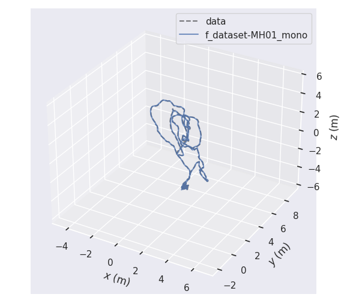

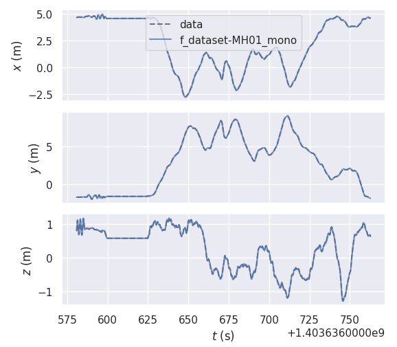

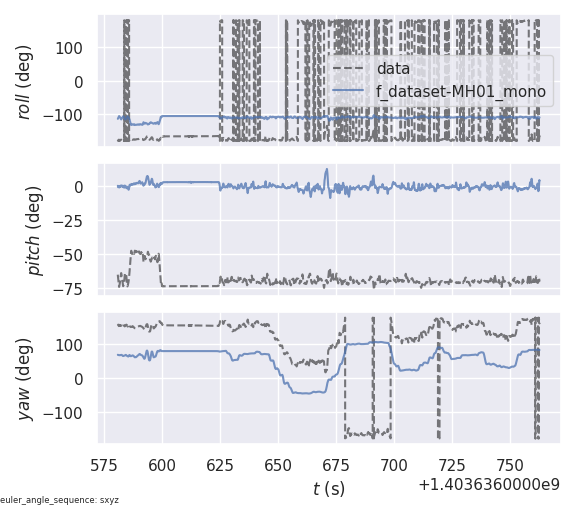

因为是单目相机，所以加了` --align --correct_scale`，用来对齐两条轨迹，并缩放至适当的尺度。

计算ape及rpe：

```sh
evo_ape tum data.tum f_dataset-MH01_mono.tum -va --align --correct_scale --plot --plot_mode xz --save_results results/ORB3_MH.zip
```

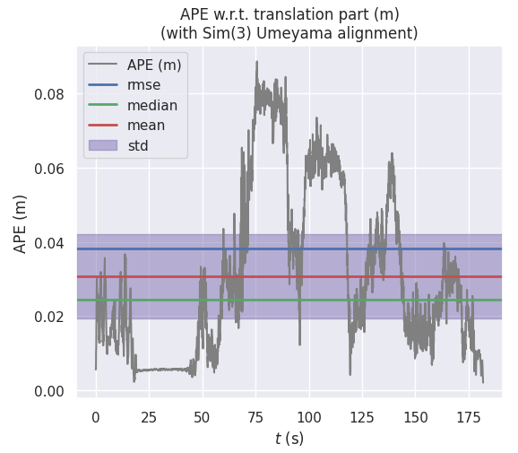

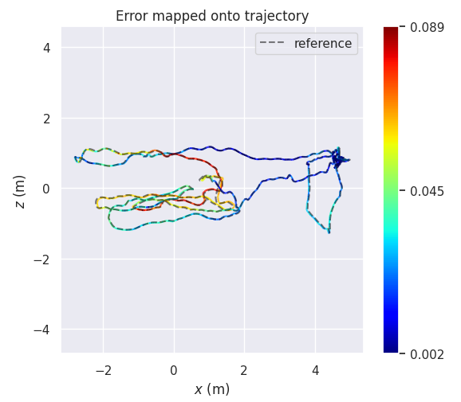

```sh
evo_rpe tum data.tum f_dataset-MH01_mono.tum -va --align --correct_scale --plot --plot_mode xz --save_results results/ORB3_MH.zip
```

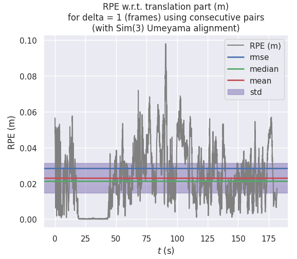

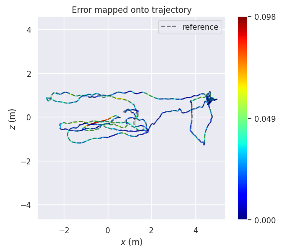

## ORB_SLAM3 + TUM VI

```sh
evo_traj euroc dataset-room1_512.csv --save_as_tum
```

```
f_dataset-room1_512_mono.txt
# timestamp e+18 -> e+9
```

```sh
evo_traj tum f_dataset-room1_512_mono.txt --ref=dataset-room1_512.tum --align --correct_scale --verbose -p
```

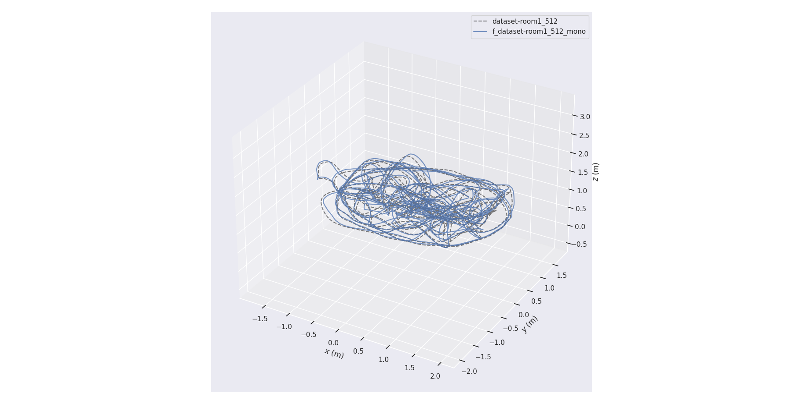

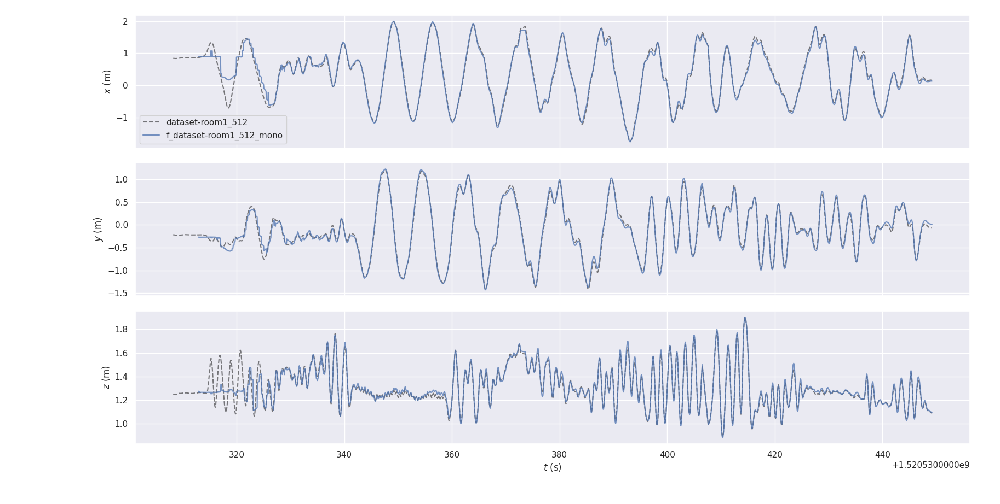

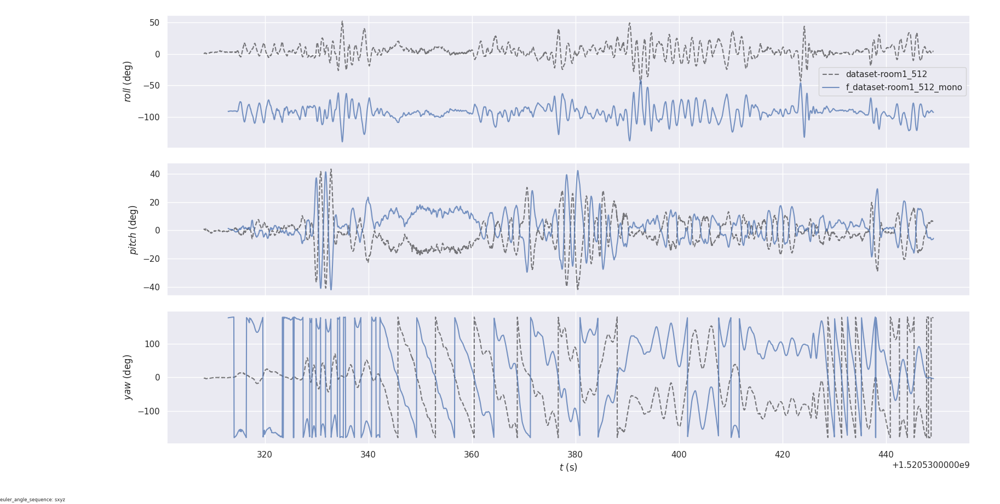

```sh
evo_ape tum dataset-room1_512.tum f_dataset-room1_512_mono.txt -va --align --correct_scale --plot --plot_mode xz --save_results results/ORB3_room1_512_mono.zip
```

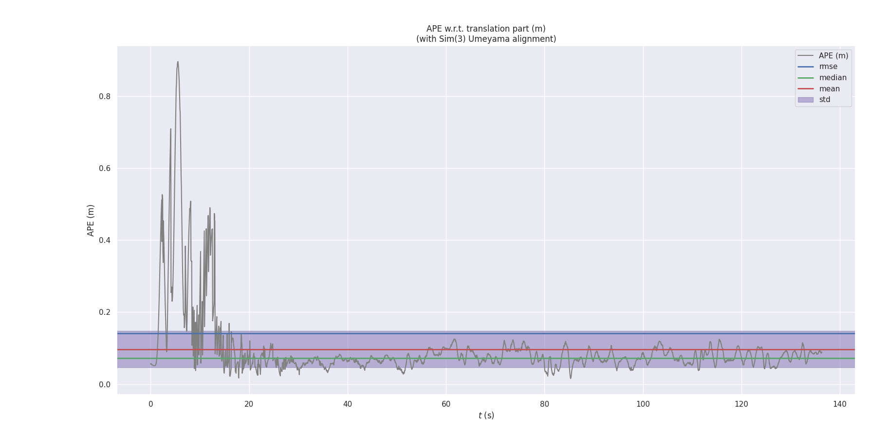

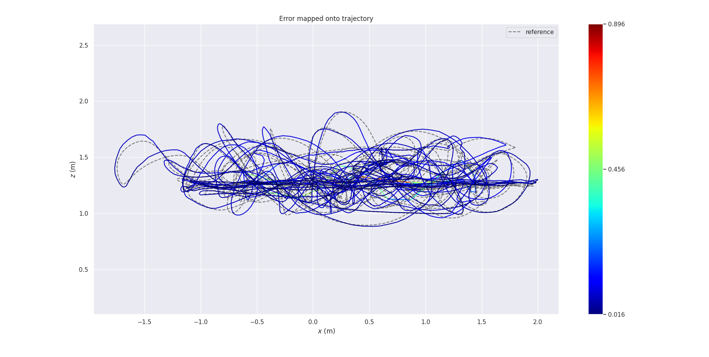

```sh
evo_rpe tum dataset-room1_512.tum f_dataset-room1_512_mono.txt -va --align --correct_scale --plot --plot_mode xz --save_results results/RB3_room1_512_mono.zip
```

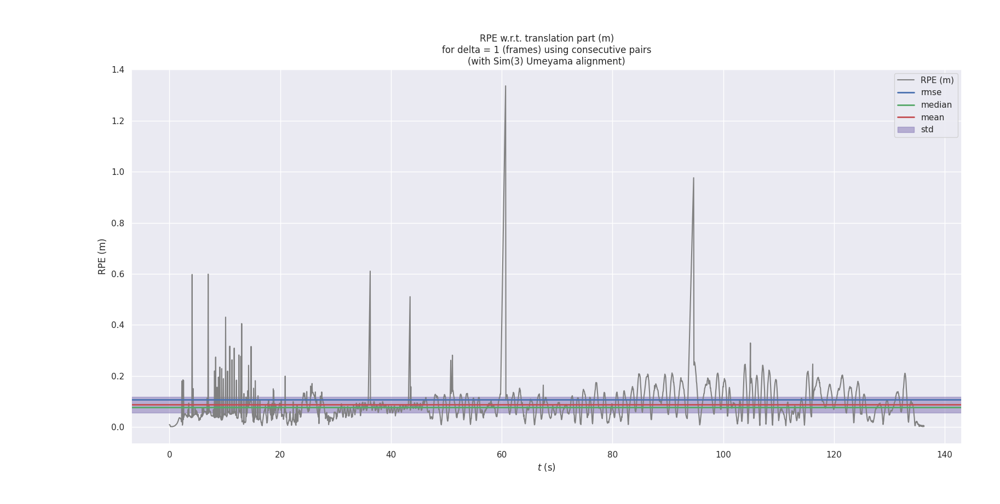

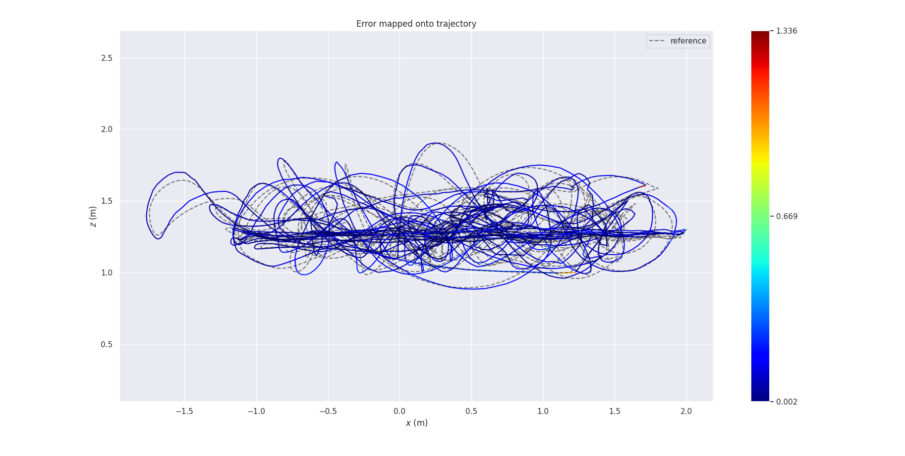

## DSO + TUM Mono

```sh
# in <dso_dir>/build
bin/dso_dataset \
    files=~/Downloads/sequence_01/images.zip \
    calib=~/Downloads/sequence_01/camera.txt \
    gamma=~/Downloads/sequence_01/pcalib.txt \
    vignette=~/Downloads/sequence_01/vignette.png \
    preset=0 \
    mode=0
```

camera.txt

```
0.349153000000000	0.436593000000000	0.493140000000000	0.499021000000000	0.933271000000000
1280 1024
0.4 0.53 0.5 0.5 0
640 480
```

[代码](https://github.com/JakobEngel/dso/blob/master/src/util/Undistort.cpp#L310)中称该相机模型为ATAN，根据https://github.com/uzh-rpg/rpg_svo/issues/57，实际上就是FOV相机模型。

`~/Documents/installation/dso/build/sequence_01.txt`

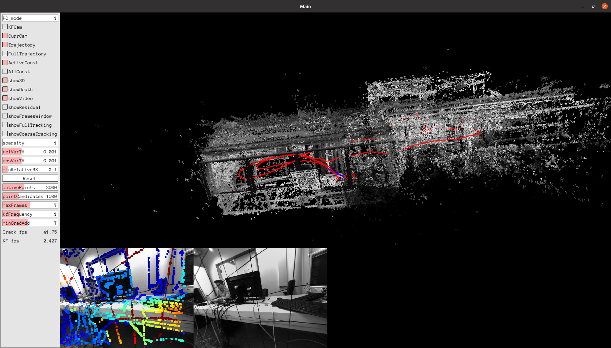

## DSO + EuRoC

```sh
bin/dso_dataset \
    files=~/Downloads/MH01/mav0/cam0/data \
    calib=~/Downloads/MH01/mav0/cam0/mycamera.txt \
    preset=0 \
    mode=1
```

`MH01/mav0/cam0/sensor.yaml`

```
# Camera specific definitions.
rate_hz: 20
resolution: [752, 480]
camera_model: pinhole
intrinsics: [458.654, 457.296, 367.215, 248.375] #fu, fv, cu, cv
distortion_model: radial-tangential
distortion_coefficients: [-0.28340811, 0.07395907, 0.00019359, 1.76187114e-05]
```

`mycamera.txt`

```
RadTan 458.654 457.296 367.215 248.375 -0.28340811 0.07395907 0.00019359 1.76187114e-05
752 480
crop # full is not implemented
752 480
```

`~/Documents/installation/dso/build/MH01.txt`

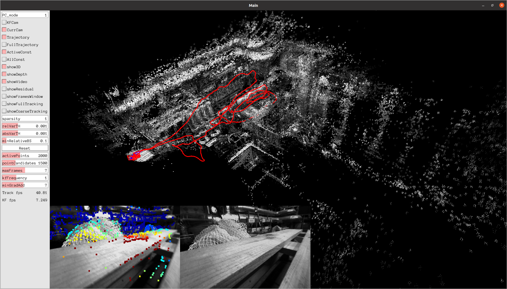

## RTAB-MAP + demo_stereo_outdoor

```sh
roslaunch rtabmap_ros demo_stereo_outdoor.launch
rosbag play --clock ~/Downloads/stereo_outdoorA.bag
rosbag play --clock ~/Downloads/stereo_outdoorB.bag
```

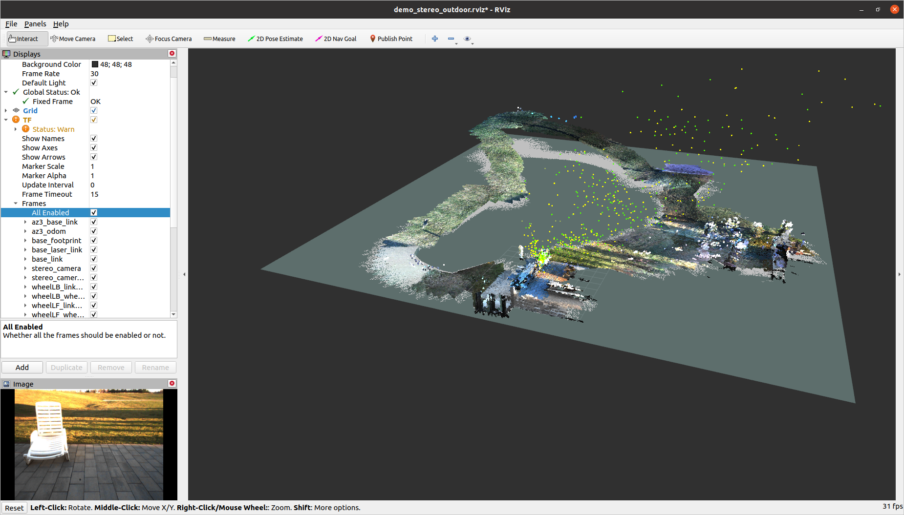

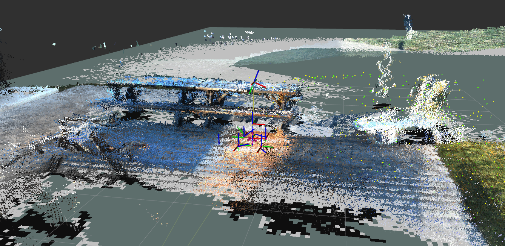

## RTAB-MAP + EuRoC

```sh
roslaunch rtabmap_ros euroc_datasets.launch MH_seq:=true
rosbag play --clock ~/Downloads/MH_01_easy.bag
```

碰到如下错误：

```
ERROR: cannot launch node of type [imu_complementary_filter/complementary_filter_node]: imu_complementary_filter
```

安装[imu_tools](http://wiki.ros.org/imu_tools)解决：

```sh
sudo apt install ros-noetic-imu-tools
```

不过后来又出现以下警告：

```
[ WARN] [1628996975.378117904, 1403636608.989486722]: /rtabmap/rtabmap: Did not receive data since 5 seconds! Make sure the input topics are published ("$ rostopic hz my_topic") and the timestamps in their header are set. If topics are coming from different computers, make sure the clocks of the computers are synchronized ("ntpdate"). Parameter "approx_sync" is false, which means that input topics should have all the exact timestamp for the callback to be called.
```

参考[On noetic I get "Did not receive data since 5 seconds" but it worked on melodic](https://github.com/introlab/rtabmap_ros/issues/494)，这似乎是rtab-map在noetic上的问题。

## cartographer + demo_backpack_3d

```sh
# in catkin_ws
source install_isolated/setup.bash
wget -P ~/Downloads https://storage.googleapis.com/cartographer-public-data/bags/backpack_3d/with_intensities/b3-2016-04-05-14-14-00.bag
```

```sh
source install_isolated/setup.bash
roslaunch cartographer_ros demo_backpack_3d.launch bag_filename:=${HOME}/Downloads/b3-2016-04-05-14-14-00.bag
```

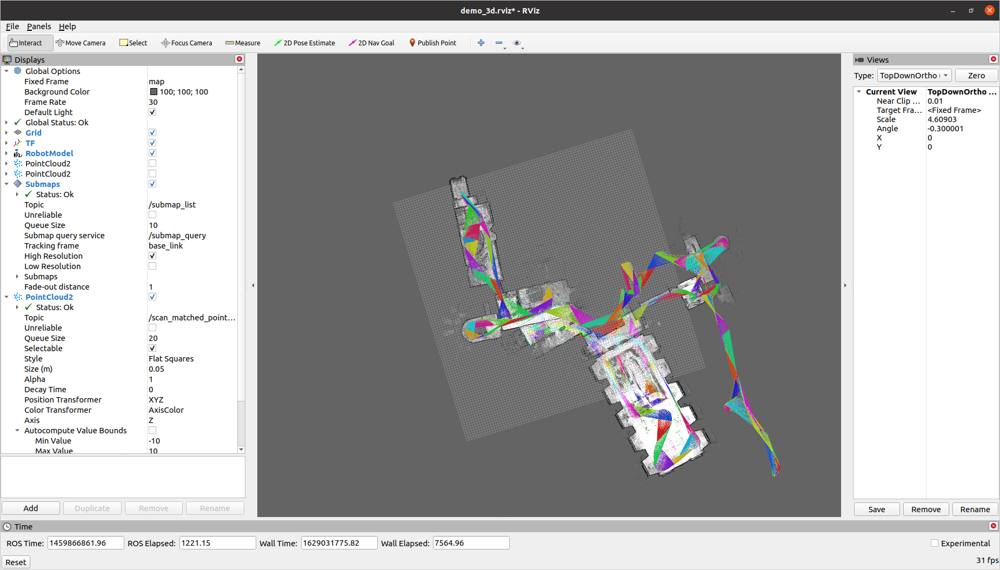

## cartographer + demo_pr2

```sh
source install_isolated/setup.bash
roslaunch cartographer_ros demo_pr2.launch bag_filename:=${HOME}/Downloads/2011-08-03-20-03-22.bag
```

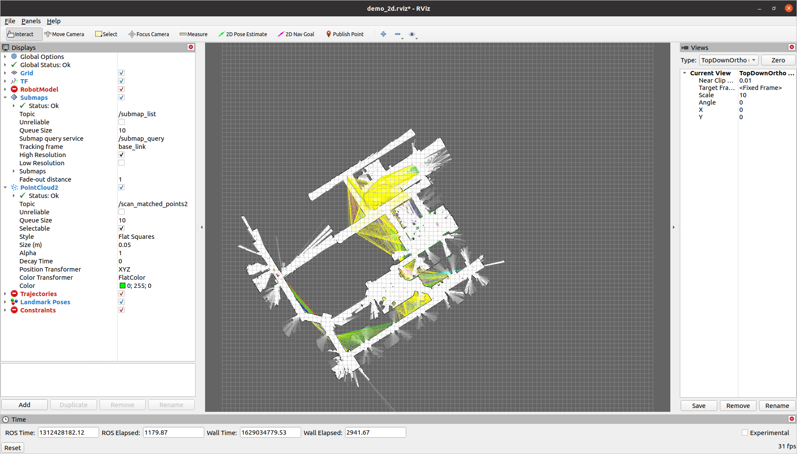