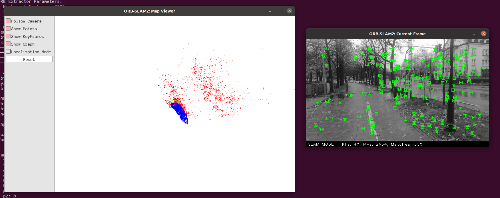
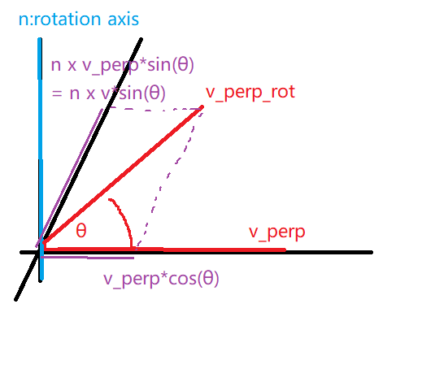
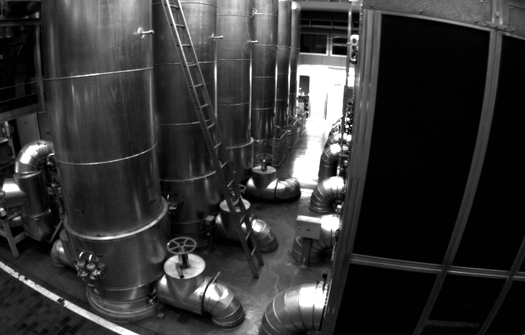
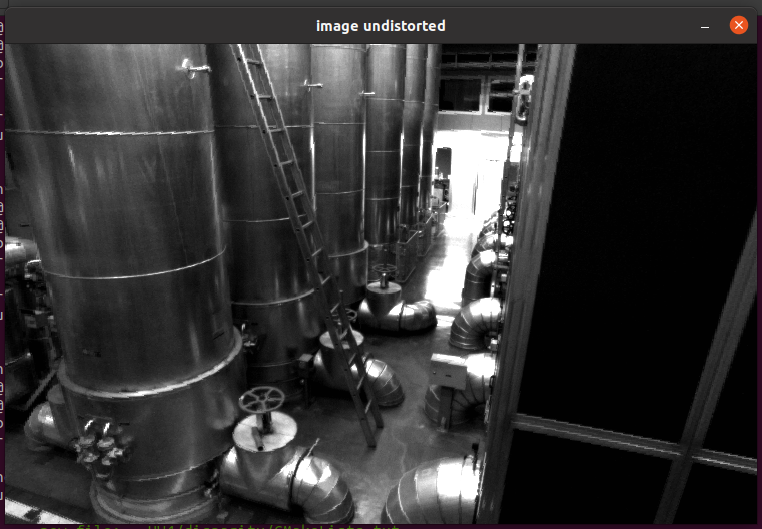
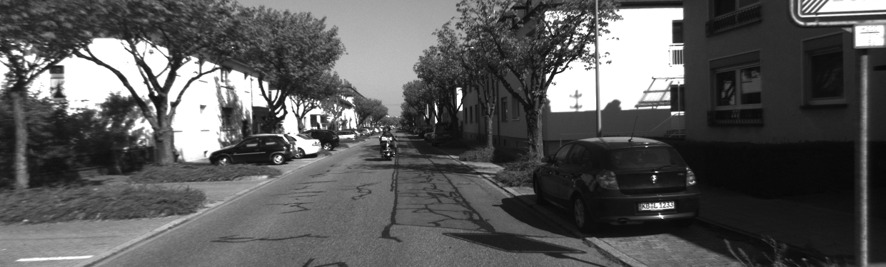
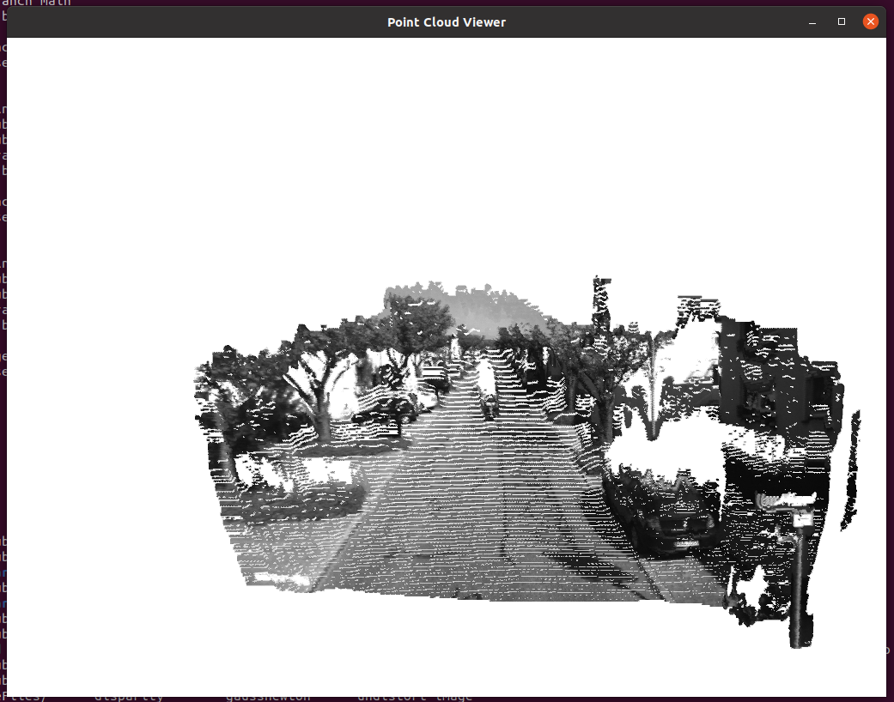
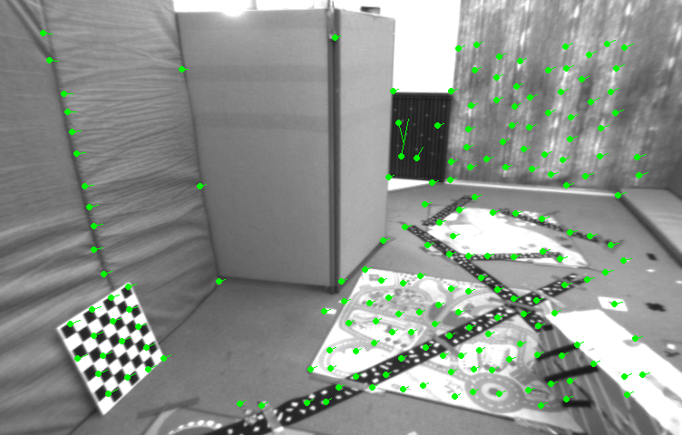
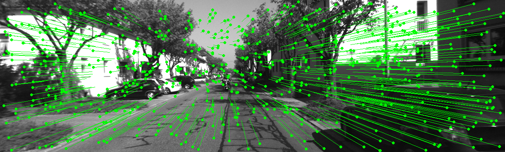

# shenlan-visual-slam
My assignments for the course visual slam by shenlanxueyuan

## HW1
Myslam, myvideo code: [keineahnung2345/ORB_SLAM2](https://github.com/keineahnung2345/ORB_SLAM2/commit/74a441e2afbc3c579042f06a5794b0ad1f79c4a6).

## HW2
Proof of Rodrigues' rotation formula.

## HW3
Groundtruth and esitmated trajectories.

## HW4
Undistort:

 

   
    
 

Disparity:

 

   
    
    
 

## HW5
Feature point: ORB

## HW6
Optical flow

Direct method

